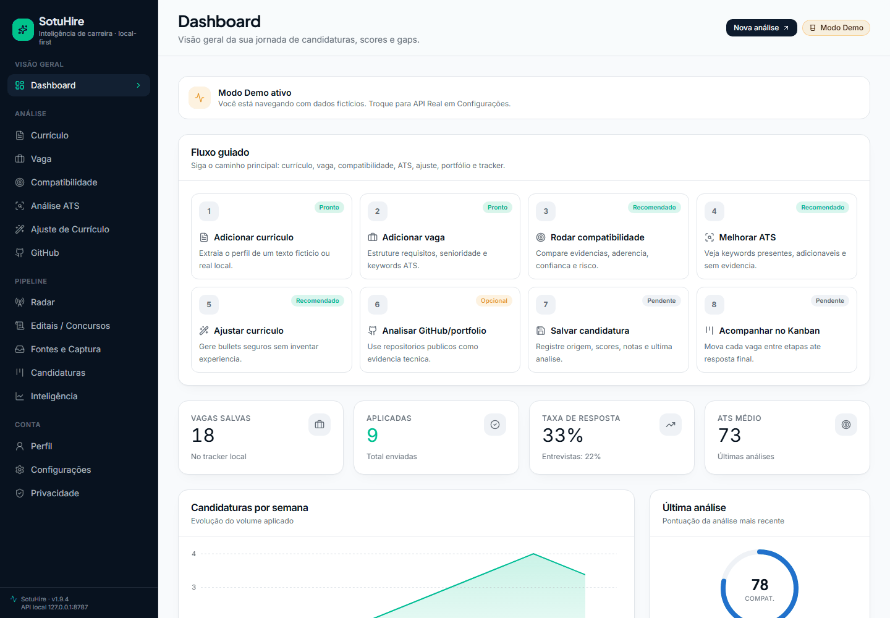
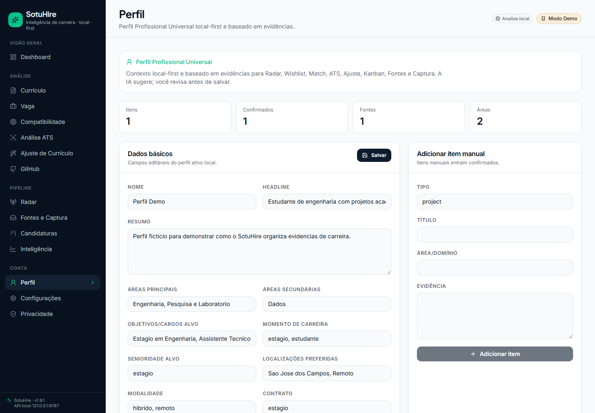
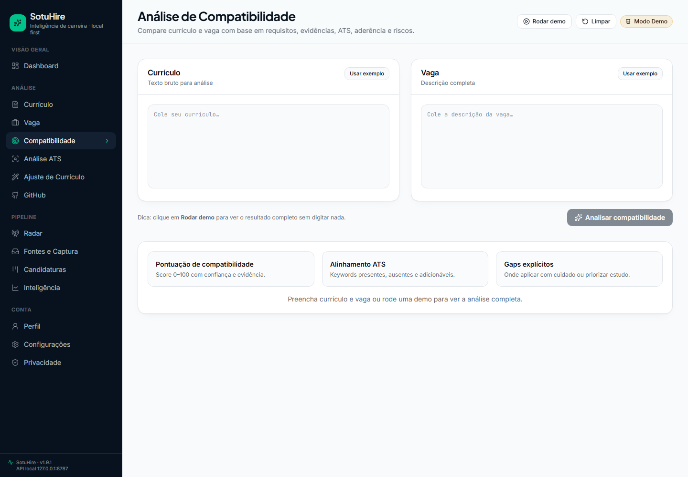
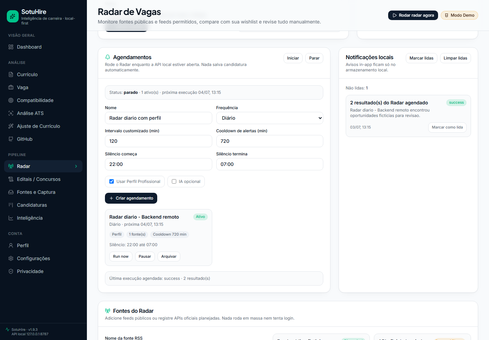
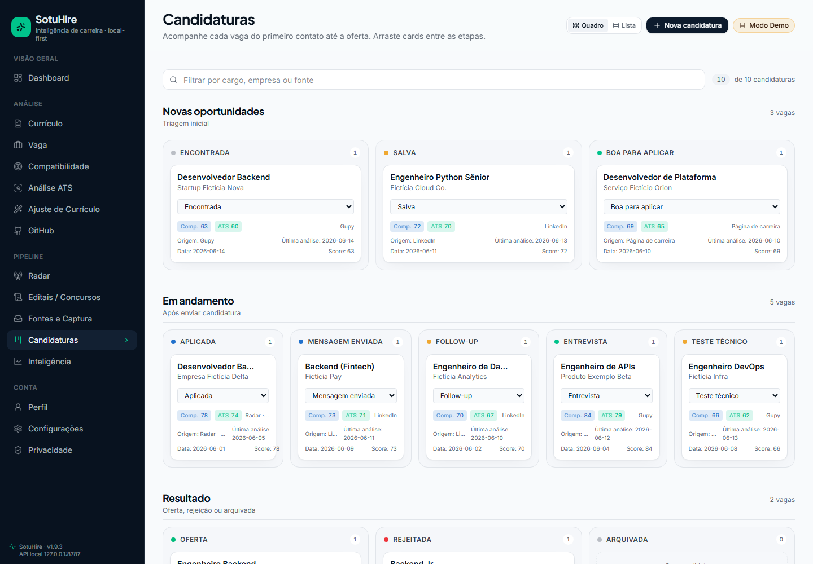
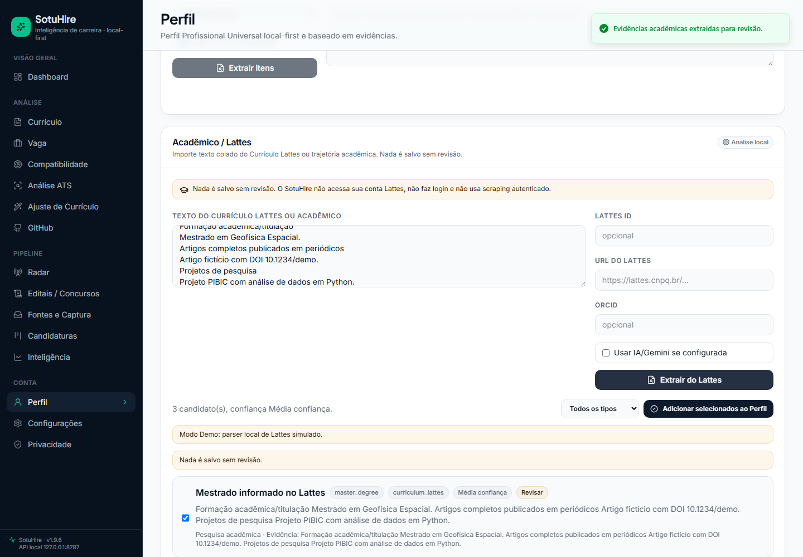
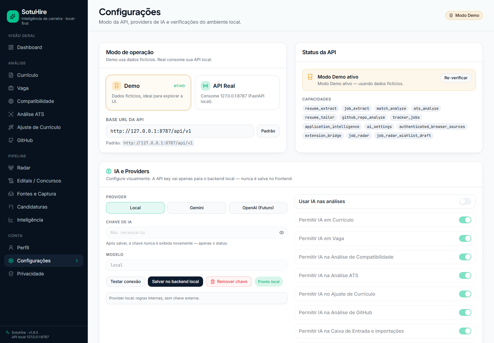
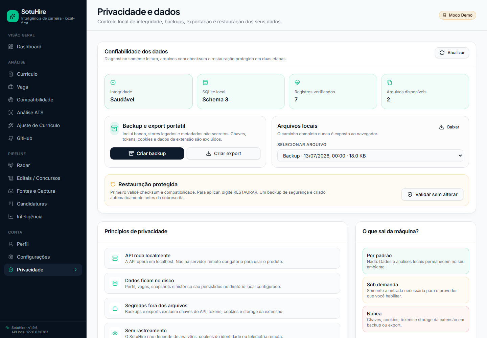
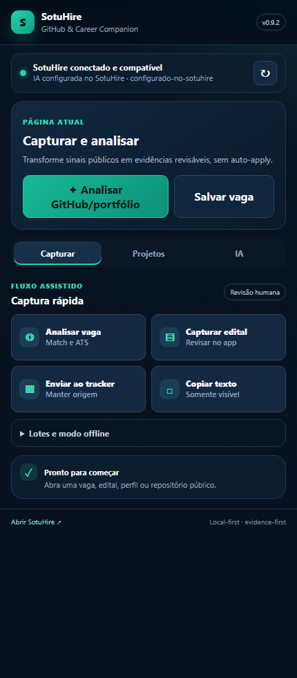
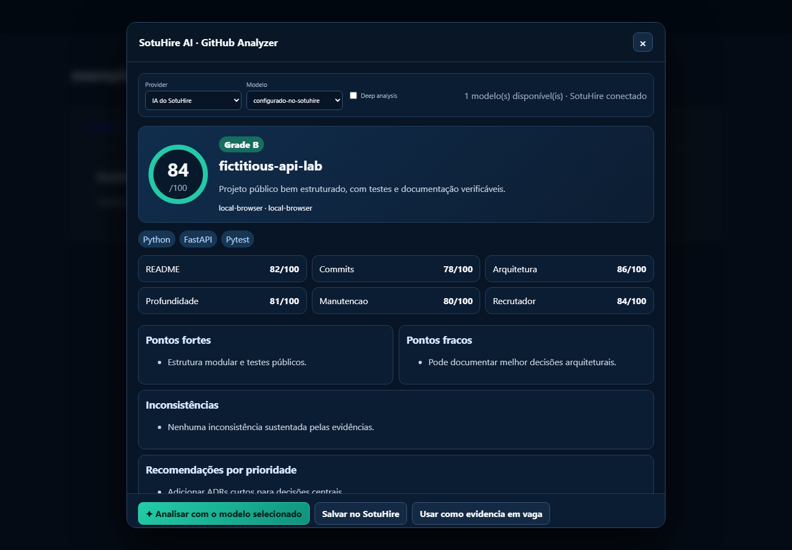

# SotuHire

[](https://github.com/Soturine/SotuHire/actions/workflows/ci.yml)
[](https://soturine.github.io/SotuHire/)
[](https://github.com/Soturine/SotuHire/releases/tag/v1.9.6)
[](https://www.python.org/)
[](LICENSE)

## Visão geral

SotuHire é um assistente de carreira local-first, multiárea e orientado por evidências. Ele reúne currículo, trajetória acadêmica, portfólio, preferências, oportunidades, editais e histórico de candidaturas para ajudar a pessoa usuária a entender o próprio perfil e tomar decisões melhores sem entregar o controle a uma automação opaca.

O produto funciona como uma camada de continuidade entre o **Perfil Profissional Universal**, o **Career Context**, as análises de currículo e vaga, o Radar, o Tracker, o Lattes, os editais e a extensão do navegador. Dados confirmados mantêm origem e referência; itens incertos continuam como candidatos revisáveis. A IA é opcional: Gemini e OpenAI podem enriquecer análises, enquanto o caminho local permanece disponível como base e fallback explícito.

A abordagem é local-first: banco, stores legados, snapshots e backups ficam no computador da pessoa usuária. Nenhuma candidatura, inscrição, pagamento ou envio de documento é realizado automaticamente. O SotuHire também não é apenas um “analisador de currículo”: ele preserva o que foi analisado, conecta evidências ao histórico e permite acompanhar como perfil, oportunidades e resultados evoluem.

## Para quem serve

O SotuHire foi pensado para trajetórias profissionais diversas, inclusive quando GitHub não faz parte da área:

- estudantes, estagiários, técnicos, tecnólogos e pessoas sem experiência formal;
- engenharias, indústria, manutenção, laboratório, qualidade e operações;
- saúde, direito e outras profissões com registros ou conselhos profissionais;
- educação, pesquisa, iniciação científica, pós-graduação, docência e Currículo Lattes;
- artes, design, arquitetura, comunicação, portfólio e produção cultural;
- administração, finanças, atendimento, comercial, turismo e serviços;
- transição de carreira, retorno ao mercado e mudança de área;
- concursos, processos seletivos públicos, residências, bolsas e outros editais.

## O que o SotuHire faz

### Perfil Profissional Universal

Centraliza objetivos, formação, experiências, projetos, competências, idiomas, registros, preferências e restrições. Evidências vindas de currículo, Lattes, GitHub, extensão ou IA entram como candidatos e só se tornam fatos confirmados após revisão humana.

### Currículo Mestre

Extrai e organiza currículos TXT, PDF e DOCX, mantém uma base reutilizável e prepara a fundação para variantes por vaga. A interoperabilidade com JSON Resume permite exportar fatos confirmados e importar dados como candidatos revisáveis.

### Vaga, Match, ATS e Tailor

- **Vaga:** estrutura cargo, organização, localidade, requisitos, palavras-chave e riscos.
- **Match:** compara requisitos e evidências sem converter ausência de informação em experiência inventada.
- **ATS:** separa termos presentes, sustentados por evidência e ausentes.
- **Tailor:** sugere uma variante de currículo usando somente conteúdo que pode ser comprovado.

### Lattes e Acadêmico

Interpreta texto do Currículo Lattes e de trajetórias acadêmicas para identificar formação, pesquisa, publicações, docência, extensão, bolsas, eventos e produção técnica ou artística. O fluxo não faz login nem scraping autenticado do Lattes.

### Editais e Concursos

Organiza órgão, banca, cargos, requisitos, etapas, documentos, datas, taxa e conteúdo programático. O Exam Fit compara requisitos com evidências confirmadas e pode gerar checklist e plano inicial de estudo. O edital oficial sempre prevalece.

### Radar, Wishlist e Notificações

Permite descrever oportunidades desejadas, consultar fontes públicas configuradas, executar buscas revisáveis e agendar ciclos locais com quiet hours, cooldown e notificações. Não há inscrição nem candidatura automática.

### Tracker e Kanban

Mantém candidaturas em modo rápido — cargo, organização, URL e status — ou completo, com snapshots, análises, contatos, entrevistas, follow-up e resultado. O histórico preserva a vaga e o currículo realmente usados quando esses conteúdos estão disponíveis.

### GitHub e Portfólio

Analisa perfis e repositórios públicos, incluindo README, linguagens, estrutura, commits, atividade, práticas de engenharia e apresentação do projeto. As conclusões viram sugestões de evidência, não fatos salvos automaticamente.

### Fontes e Captura

Recebe texto, links, CSV, JSON, feeds públicos e capturas assistidas. A identidade canônica reduz duplicatas entre URL manual, Radar, extensão e portais diferentes, preservando as referências de origem.

### Extensão do navegador

Captura vaga, edital, projeto GitHub e lotes visíveis; analisa repositórios dentro do GitHub; mantém fila offline com retry e export/import; e conversa com o Local Companion ou com a API local. Pode operar sem o frontend aberto e possui modo próprio de IA opcional.

### IA, memória e rastreabilidade

Gemini, OpenAI e o caminho local usam contratos estruturados. Execuções importantes registram provider e modelo solicitado/usado, prompt, fallback, evidências, avisos e necessidade de revisão — nunca a chave. A memória/RAG local recupera somente o contexto relevante para cada finalidade.

### Snapshots, backup e export

Vagas, currículos, variantes, editais e análises podem gerar snapshots imutáveis. O painel de Privacidade executa data health, cria backup ou export portátil, valida arquivos por checksum e só restaura após confirmação explícita.

## Como as partes se conectam

```text
Perfil + evidências revisadas
            ↓
      Career Context
            ↓
Match · ATS · Tailor · Radar · Editais · GitHub
            ↓
  Tracker + snapshots + histórico
            ↓
 feedback humano e atualização do Perfil
```

Cada fluxo recebe apenas o contexto necessário. Evidências sensíveis são omitidas de providers externos por padrão, e conteúdo não confirmado não deve ser apresentado como fato seguro.

## Preview



| Perfil Profissional Universal | Match |
| --- | --- |
|  |  |

| Radar | Tracker |
| --- | --- |
|  |  |

| Lattes e Acadêmico | Editais e Concursos |
| --- | --- |
|  |  |

| Configuração de IA | Dados e privacidade |
| --- | --- |
|  |  |

| Popup da extensão | Análise dentro do GitHub |
| --- | --- |
|  |  |

Mais telas: [galeria e roteiro de demonstração](docs/09-portfolio/demo-script.md).

## Modos de uso

| Modo | O que executa | Persistência |
| --- | --- | --- |
| **Demo** | Frontend com personas e respostas coerentes, sem exigir backend | Estado da sessão do navegador |
| **API Real** | React conectado à FastAPI local | SQLite e stores locais |
| **Site sem extensão** | Todos os fluxos web, inclusive captura manual e fontes públicas | Local |
| **Extensão independente** | Captura e análise própria; Companion pode receber dados sem React aberto | Service worker, fila e stores locais |
| **Extensão integrada** | Handshake, contexto seguro, importação para Perfil, Vaga, Edital, GitHub e Tracker | Local Companion + API local |

## Instalação

Requisitos:

- Python 3.11 ou 3.12;
- Node.js 22 e npm para o frontend;
- Git;
- Chrome, Edge ou outro navegador Chromium para a extensão;
- chave Gemini ou OpenAI somente se desejar IA externa.

Clone e crie o ambiente:

```bash
git clone https://github.com/Soturine/SotuHire.git
cd SotuHire
python -m venv .venv
```

### Windows PowerShell

```powershell
.\.venv\Scripts\Activate.ps1
python -m pip install --upgrade pip
pip install -e .[dev]
cd apps/web
npm ci
cd ../..
```

### Linux e macOS

```bash
source .venv/bin/activate
python -m pip install --upgrade pip
pip install -e ".[dev]"
cd apps/web
npm ci
cd ../..
```

## Como executar

Use terminais separados para API e frontend.

API local:

```bash
python scripts/run_api.py
```

Frontend:

```bash
cd apps/web
npm run dev
```

Abra `http://127.0.0.1:5173`. O seletor no app alterna entre Demo e API Real; a API usa `http://127.0.0.1:8787/api/v1` por padrão.

Local Companion para a extensão:

```bash
python -m modules.local_api.server
```

Documentação local:

```bash
mkdocs serve
```

Validação principal:

```bash
ruff check .
ruff format --check .
pytest
pyright
mkdocs build --strict
cd apps/web
npm run lint
npm run typecheck
npm run build
npm run test:e2e
```

## Configuração de IA

O SotuHire continua utilizável sem chave externa. Para habilitar IA:

1. abra **Configurações → IA**;
2. escolha **Gemini**, **OpenAI** ou **Local**;
3. use o link do próprio app para abrir a página oficial do provider;
4. cole a chave no backend local;
5. atualize o catálogo, escolha o modelo e execute **Testar conexão**;
6. selecione um preset ou habilite apenas os fluxos desejados.

Os catálogos de modelo são consultados de verdade, possuem cache e podem ser atualizados; o modelo escolhido é enviado ao provider. Se o provider falhar, a resposta informa provider/modelo efetivamente usados e o motivo do fallback.

No site, a chave é armazenada somente no backend local e não é devolvida ao React. Ela não deve ir para Git, documentação, screenshot, log, `localStorage`, `sessionStorage`, backup ou export. Testes externos são opt-in; a suíte padrão usa mocks.

## Extensão

### Instalar em modo de desenvolvimento

1. execute `python scripts/package_extension.py` para validar e gerar o ZIP, ou use a pasta `browser-extension/` diretamente;
2. abra `chrome://extensions` ou `edge://extensions`;
3. habilite **Modo do desenvolvedor**;
4. clique em **Carregar sem compactação** e selecione `browser-extension/`.

### Funcionamento

- prioriza `schema.org/JobPosting`, depois metadados estruturados, seletores semânticos e texto visível;
- cria capturas e snapshots de vaga, edital e projeto;
- mantém fila com estado, número de tentativas, erro, próximo retry, limite e deduplicação;
- permite exportar/importar a fila sem incluir chaves;
- usa handshake para informar versões, capacidades e compatibilidade;
- consulta apenas um resumo seguro do Perfil/Career Context;
- funciona com Local Companion mesmo quando o frontend está fechado.

Para análise GitHub, é possível usar processamento local, a IA configurada no SotuHire, Gemini próprio ou OpenAI próprio. A chave própria fica em sessão por padrão; persistência no cofre IndexedDB do service worker exige consentimento. Ela nunca usa `chrome.storage.sync`, não entra no content script ou na página e pode ser removida a qualquer momento.

Detalhes de instalação, permissões e diagnóstico: [guia da extensão](browser-extension/README.md).

## Dados e privacidade

Por padrão, os dados ficam em `data/`:

- `data/sotuhire.db`: entidades relacionais, snapshots, candidaturas e rastros seguros de IA;
- `data/**/*.json` e `data/**/*.jsonl`: stores legados mantidos para compatibilidade e migração;
- `data/backups/`: arquivos ZIP checksummed;
- `data/secrets/`: configuração local de provider, sempre excluída de backup e Git.

Defina `SOTUHIRE_DATA_DIR` para usar outro diretório local. Antes de migrar dados antigos:

```bash
python scripts/migrate_local_data.py --dry-run
python scripts/migrate_local_data.py --apply
python scripts/migrate_local_data.py --verify
```

Os arquivos JSON/JSONL antigos não são apagados. O `--apply` cria backup antes da transação e registra a migração. Para saúde, backup, export e restauração:

```bash
python scripts/check_data_health.py
python scripts/backup_data.py
python scripts/backup_data.py --export
python scripts/restore_data.py data/backups/ARQUIVO.zip
python scripts/restore_data.py data/backups/ARQUIVO.zip --apply
```

A primeira chamada de restore é dry-run. No frontend, a aplicação da restauração exige confirmação textual e cria um novo backup preventivo.

O SotuHire não realiza auto-apply, candidatura automática, inscrição automática, pagamento, boleto, envio de documentos, bypass de CAPTCHA ou decisão crítica final apenas por IA.

## Arquitetura

- [Visão geral](docs/02-architecture/overview.md)
- [Mapa de integração dos módulos](docs/02-architecture/module-integration-map.md)
- [Matriz verificável de capacidades](docs/02-architecture/integration-capability-matrix.md)
- [Career Context Engine](docs/02-architecture/career-context-engine.md)
- [Linhagem e deduplicação](docs/02-architecture/data-lineage-and-deduplication.md)
- [Repositories e persistência](docs/02-architecture/storage-repository-architecture.md)
- [Schema SQLite e migrações](docs/02-architecture/sqlite-schema-and-migrations.md)
- [Snapshots de candidatura](docs/02-architecture/application-snapshots.md)
- [Backup, restore e data health](docs/02-architecture/backup-restore-and-data-health.md)
- [Orquestração de IA](docs/04-ai/ai-orchestration-and-confidence.md)
- [Extensão e Perfil](docs/02-architecture/extension-profile-bridge.md)
- [Segurança e privacidade](docs/06-engineering/security-privacy.md)

## Documentação

- **Comece aqui:** [índice documental](docs/documentation-index.md) e [documentação publicada](https://soturine.github.io/SotuHire/)
- **Produto:** [visão](docs/01-product/vision.md), [estratégia multiárea](docs/01-product/multi-domain-product-strategy.md) e [roadmap](docs/01-product/roadmap.md)
- **Dados:** [arquitetura de storage](docs/02-architecture/storage-repository-architecture.md), [schema e migrações](docs/02-architecture/sqlite-schema-and-migrations.md) e [matriz de integração](docs/02-architecture/integration-capability-matrix.md)
- **IA:** [catálogo de prompts](docs/04-ai/prompt-catalog.md), [plano de avaliação](docs/04-ai/ai-evaluation-plan.md) e [RAG local](docs/04-ai/career-memory-rag.md)
- **Fontes e extensão:** [fontes de dados](docs/05-data-sources/job-sources.md) e [guia da extensão](browser-extension/README.md)
- **Frontend:** [guia do app React, modos Demo/API Real e testes](apps/web/README.md)
- **Testes:** [QA](docs/06-engineering/qa-testing.md), [CI/CD](docs/06-engineering/ci-cd.md) e [golden datasets](docs/09-testing/golden-datasets.md)
- **Portfólio:** [roteiro de demonstração](docs/09-portfolio/demo-script.md) e [case study](docs/09-portfolio/portfolio-case-study.md)
- **Histórico:** [CHANGELOG](CHANGELOG.md) e [releases](docs/releases/)

## Roadmap

As próximas frentes são avaliação e rastreabilidade de IA, ingestão e edição avançada de documentos, conectores públicos oficiais com taxonomias profissionais e, depois, workflows de carreira sempre submetidos à aprovação humana. Consulte o [roadmap atual](docs/01-product/roadmap.md) para critérios, riscos e itens fora de escopo.

## Contribuição

1. abra uma issue descrevendo problema, evidência e comportamento esperado;
2. crie uma branch curta e focada;
3. adicione ou atualize testes e documentação;
4. rode as validações locais relevantes;
5. abra um pull request sem dados pessoais, chaves ou artefatos locais.

Mudanças devem preservar o modo Demo, a API Real, o fallback local, a revisão humana e os limites de segurança do produto.

## Licença

Distribuído sob a [Apache License 2.0](LICENSE).

---

Release atual: [v1.9.6](https://github.com/Soturine/SotuHire/releases/tag/v1.9.6) · [Notas da release](docs/releases/v1.9.6.md) · [Tag](https://github.com/Soturine/SotuHire/tree/v1.9.6)
