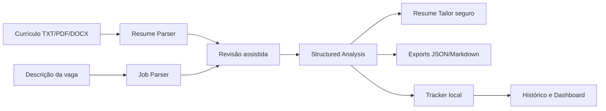
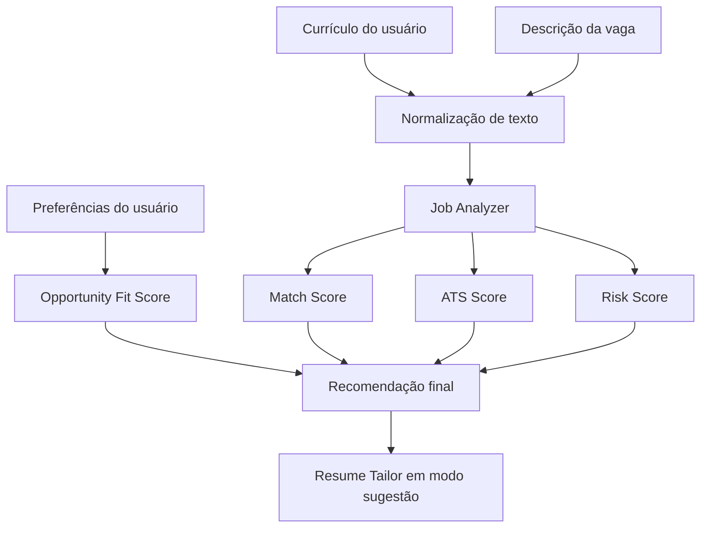

# SotuHire

> Assistente inteligente de carreira para análise de currículo, compatibilidade com vagas, otimização ATS, radar de oportunidades, coleta controlada de vagas e apoio à candidatura — **sem candidatura automática em massa**.

O **SotuHire** é um projeto de portfólio focado em **IA aplicada, NLP, scraping responsável, engenharia de software, regras de negócio, QA, Clean Code e produto real**.

A ideia é ajudar uma pessoa candidata a responder uma pergunta simples, mas difícil na prática:

> “Essa vaga vale meu tempo? Meu currículo combina? O que eu preciso ajustar antes de aplicar?”

O projeto começou como um “achador de vagas”, mas o escopo correto é maior: um **copiloto de carreira**. Ele pode receber currículo, analisar vagas formais, interpretar posts de recrutadores, ranquear oportunidades, explicar aderência e preparar materiais de candidatura para revisão humana.

## SotuHire v0.4.1 — UI/UX Hotfix + Parser Fixes

A versão atual corrige o fluxo guiado da v0.4.0 para deixá-lo legível, automático e mais próximo de produto:

```text
Suba um currículo TXT/PDF/DOCX + cole a vaga -> revise os dados detectados -> analise -> exporte -> salve no tracker.
```

### O que mudou

- interface guiada com abas, cards, sidebar e modos rápido/avançado;
- parser automático de currículo e descrição de vaga;
- revisão assistida antes da análise;
- análise estruturada com mock/local por padrão e Gemini opcional;
- fallback local quando chave ou SDK externo não estão disponíveis;
- Resume Tailor com bullets, resumo, ordem, keywords, warnings e evidências;
- downloads em JSON e Markdown;
- tracker e histórico locais com confirmação de privacidade;
- dashboard com médias, recomendações e riscos.
- tema escuro consistente, com contraste explícito para labels, inputs, métricas e tabs;
- dados detectados apresentados em cards e chips, com edição opcional;
- primeiro upload de currículo processado automaticamente;
- parsers realistas para contatos, links, formação, experiências, projetos, vaga e benefícios.

O histórico não salva o texto bruto do currículo. A aplicação continua sem auto-apply, envio automático, scraping agressivo, PyTorch obrigatório ou Concurso Mode funcional.

### Fluxo v0.4



## SotuHire v0.1 — MVP Core

**SotuHire = copiloto de carreira com IA para analisar currículo, vaga, ATS, prioridades pessoais e estratégia de candidatura.**

A v0.1 entrega um núcleo local, leve, determinístico e testável. O usuário cola o texto do currículo e da vaga, informa preferências básicas e recebe Match Score, ATS Score simples, Opportunity Fit Score, Risk Score, recomendação, pontos fortes, gaps, palavras-chave ausentes e sugestões seguras de adaptação.

O Resume Tailor da v0.1 funciona em **modo sugestão**. Ele pode reorganizar, resumir e aproximar o vocabulário do currículo ao da vaga, mas toda sugestão precisa permanecer apoiada por evidências fornecidas pelo usuário.

### Princípios inegociáveis

```text
O SotuHire não faz auto-apply em massa.
O SotuHire não burla CAPTCHA.
O SotuHire não raspa dados privados/logados de forma agressiva.
O SotuHire trabalha com revisão humana.
```

Também não fazem parte da v0.1: scraping real, extensão Chrome, PyTorch, fine-tuning, multi-agent complexo, Concurso Mode funcional, envio automático para recrutador e geração final de DOCX/PDF.

### Features da v0.1

- entrada manual de currículo e descrição da vaga;
- preferências de modalidade, localização, salário, contrato e senioridade;
- Match Score determinístico por palavras-chave relevantes;
- ATS Score simples com problemas explicáveis;
- Opportunity Fit Score baseado nas prioridades do usuário;
- Risk Score simples e flags de risco;
- recomendação `apply`, `apply_with_adjustments`, `save_for_later` ou `ignore`;
- pontos fortes, gaps e palavras-chave ausentes;
- resumo direcionado apoiado pelo texto fornecido;
- Resume Tailor em modo sugestão com regra anti-invenção;
- schemas Pydantic para contratos de entrada e saída;
- interface Streamlit com regras de negócio fora da UI;
- testes com pytest e qualidade com Ruff.

### Arquitetura do MVP



As funções puras vivem em `modules/`; a interface `app.py` apenas coleta entradas e apresenta o resultado. O MVP não depende de provedor de IA externo para executar a análise básica.

## O que o SotuHire faz

O sistema deve evoluir em módulos:

1. **Resume Parser**  
   Lê currículo em PDF/DOCX e extrai texto, seções, skills, experiências, formação, projetos e links. Também deve evoluir para lidar com currículo ATS, Currículo Lattes, LinkedIn, GitHub e portfólio como fontes diferentes de perfil profissional.

2. **ATS Analyzer**  
   Avalia se o currículo está legível para sistemas ATS e aponta problemas como formatação excessiva, seções fracas, falta de palavras-chave e baixa clareza.

3. **Job Matcher**  
   Compara o currículo com uma descrição de vaga e calcula:
   - Match Score;
   - ATS Score;
   - Seniority Fit;
   - Risk Score;
   - recomendação final.

4. **Business Rules Engine**  
   Aplica regras determinísticas antes da IA, como bloqueio de vagas sênior, detecção de termos críticos, priorização de estágio/júnior e filtros por localidade/modalidade.

5. **Application Assistant**  
   Gera mensagem curta para recrutador, resposta para formulário, carta curta e sugestões de ajuste no currículo.

6. **Job Tracker**  
   Salva oportunidades analisadas e acompanha status: salva, analisada, aplicada, entrevista, rejeitada, oferta.

7. **Scraping & Source Connectors**  
   Coleta oportunidades em fontes permitidas e públicas, respeitando limites técnicos, termos de uso, `robots.txt`, rate limit e privacidade.

8. **Hidden Jobs Radar**  
   Detecta vagas escondidas em textos informais, como posts públicos, newsletters, páginas de carreira, comunidades e mensagens copiadas pelo usuário.

## O que o SotuHire NÃO deve ser

O SotuHire **não** deve virar um robô agressivo de candidatura.

Não é objetivo:

- aplicar automaticamente em massa;
- enviar currículo sem revisão humana;
- fazer login em contas do usuário para contornar limites;
- burlar CAPTCHA, paywall, autenticação ou bloqueios;
- extrair dados pessoais em massa;
- simular comportamento humano para driblar plataformas;
- gerar spam para recrutadores.

O objetivo é:

> encontrar, organizar, analisar, explicar, preparar e deixar o usuário decidir.


## Currículo ATS, Lattes e perfis profissionais

O SotuHire deve tratar fontes de perfil de forma separada:

- **currículo ATS** para candidaturas corporativas e plataformas de vagas;
- **Currículo Lattes** para histórico acadêmico, pesquisa, iniciação científica, publicações e projetos;
- **LinkedIn** para narrativa profissional e networking;
- **GitHub** para evidência técnica;
- **portfólio** para apresentação visual e contexto dos projetos.

O objetivo não é usar tudo diretamente no currículo final. O sistema deve converter essas fontes em um `CandidateProfile` estruturado e recomendar o que destacar conforme a vaga.

## Fluxo principal do MVP

```text
1. Usuário envia currículo
2. Usuário cola descrição da vaga ou texto de post
3. Sistema extrai texto do currículo
4. Sistema normaliza a vaga
5. Regras determinísticas identificam riscos
6. IA gera análise estruturada em JSON
7. UI mostra score, recomendação, gaps e mensagens
8. Usuário revisa e decide se aplica
```

## MVPs

### v0.1 — Análise manual de currículo + vaga

- texto de currículo colado pelo usuário;
- colagem manual da descrição da vaga;
- preferências básicas do usuário;
- Match Score, ATS Score, Opportunity Fit Score e Risk Score;
- relatório estruturado com Pydantic;
- Resume Tailor em modo sugestão e sem invenção;
- interface Streamlit;
- testes pytest e validação Ruff.

### v0.2 — JSON estruturado e UI melhor

- Pydantic schemas;
- validação de resposta da IA;
- `st.metric`, `st.progress`, cards e tabelas;
- fallback para resposta inválida;
- separação entre Match Score, ATS Score e Risk Score.

### v0.3 — Regras de negócio

- detecção de senioridade;
- termos impeditivos;
- termos prioritários;
- filtros por modalidade/localidade;
- testes unitários.

### v0.4 — QA e qualidade de código

- `pytest`;
- `ruff check`;
- `ruff format`;
- GitHub Actions;
- fixtures de teste;
- mocks para IA.

### v0.5 — Persistência local

- SQLite;
- histórico de análises;
- status da candidatura;
- filtros e exportação.

### v0.6 — Scraping responsável

- conectores para fontes públicas;
- normalização de vagas;
- deduplicação;
- rate limit;
- respeito a `robots.txt`;
- logs de origem.

### v0.7 — Hidden Jobs Radar

- análise de posts copiados manualmente;
- classificação de textos como oportunidade real ou não;
- extração de cargo, empresa, local, contato e requisitos;
- priorização de oportunidades informais.

### v0.8 — Extensão assistiva

- extensão de navegador para enviar a vaga aberta ao SotuHire;
- sem auto-apply;
- sem scraping autenticado em massa;
- apenas leitura assistida do conteúdo que o usuário já abriu.


## Portais brasileiros e fontes planejadas

Além de fontes globais como Greenhouse, Lever e Ashby, o SotuHire deve mapear fontes brasileiras importantes:

- LinkedIn;
- Gupy;
- InfoJobs;
- Indeed Brasil;
- CIEE;
- Companhia de Estágios;
- InHire;
- Vagas.com;
- Catho;
- Cia de Talentos;
- Nube;
- 99jobs;
- Eureca;
- Trabalha Brasil;
- BNE;
- Remotar;
- Programathor;
- páginas públicas de empresas;
- newsletters e comunidades com entrada manual.

Cada fonte deve ter política própria: algumas começam como entrada manual, algumas podem virar conectores públicos e outras devem permanecer apenas assistivas por exigirem login ou apresentarem risco de automação indevida.

## Stack inicial

- Python;
- Streamlit;
- Pydantic;
- python-dotenv;
- pandas;
- pytest;
- Ruff;

Dependências de scraping, documentação e ML futuro ficam separadas da instalação padrão. Gemini Structured Outputs é uma evolução planejada para análises tipadas; PyTorch e ML pesado permanecem fora do MVP.

## Qualidade

O projeto deve seguir:

- Clean Code;
- SOLID sem exagero;
- regras de negócio explícitas;
- testes para lógica determinística;
- validação de schema;
- lint e format com Ruff;
- separação entre UI, domínio, IA e fontes de dados;
- simplicidade no MVP;
- evolução incremental.

## Estrutura de documentação

```text
docs/
├── 00-audit/
├── 01-product/
├── 02-architecture/
├── 03-business-rules/
├── 04-ai/
├── 05-data-sources/
├── 06-engineering/
├── 07-development/
└── 08-benchmark/
```

## Comandos principais

```bash
python -m venv .venv
.venv\Scripts\activate
pip install -r requirements.txt
streamlit run app.py
```

Qualidade:

```bash
ruff check .
ruff format .
python -m pytest -q
```

Documentação:

```bash
mkdocs serve
```

## Posicionamento

O diferencial do SotuHire é ser um projeto de **engenharia aplicada a carreira**, não apenas um prompt em uma tela.

Ele junta:

- IA generativa;
- NLP;
- ATS;
- matching semântico;
- scraping responsável;
- regras de negócio;
- dashboard;
- QA;
- privacidade;
- explicabilidade.

## Status

**SotuHire v0.4.1 — hotfix de UI/UX, fluxo automático e parsers realistas.**

O app atual executa análise local e explicável, extrai dados de currículos/vagas, permite revisão assistida, exporta resultados e mantém histórico local. Gemini é opcional; o fallback determinístico continua sendo o caminho seguro padrão.

Próximo passo recomendado após validar a v0.1:

```text
Validar heurísticas e parsers com fixtures fictícias mais diversas e evoluir a experiência do tracker.
```

## Privacidade e compliance

- currículos reais, exportações pessoais, bancos locais e segredos não devem ser versionados;
- a v0.1 processa apenas conteúdo fornecido conscientemente pelo usuário;
- não existe auto-apply, bypass de CAPTCHA ou scraping agressivo;
- qualquer integração futura deve respeitar termos da fonte, limites técnicos e revisão humana;
- sugestões do Resume Tailor precisam manter rastreabilidade até o currículo mestre, GitHub, Lattes, LinkedIn ou outra evidência fornecida.

Leia também [Security & Privacy](docs/06-engineering/security-privacy.md) e [Compliance & Ethics](docs/05-data-sources/compliance-and-ethics.md).

## Inspiração e benchmarks

O produto observa ferramentas de ATS, resume matching, trackers e assistentes de candidatura para aprender padrões úteis sem copiar práticas agressivas. As referências e decisões estão registradas em:

- [Players e inspirações](docs/08-benchmark/players-and-inspirations.md);
- [Projetos de referência](docs/08-benchmark/reference-projects.md);
- [LA Jobs AI Claude](docs/08-benchmark/la-jobs-ai-claude.md).

## Documentação principal da v0.1

- [Escopo do MVP](docs/01-product/mvp-scope.md)
- [Roadmap](docs/01-product/roadmap.md)
- [Implementação v0.1](docs/07-development/mvp-v0.1-implementation.md)
- [Regras do Resume Tailor](docs/03-business-rules/resume-tailor-rules.md)
- [Regras do Opportunity Fit](docs/03-business-rules/opportunity-fit-rules.md)
- [Gemini Structured Output](docs/04-ai/gemini-structured-output.md)
- [JSON Resume e Pydantic](docs/04-ai/json-resume-and-pydantic.md)
- [Auditoria de prontidão v0.1](docs/00-audit/v0.1-readiness-audit.md)
- [Metadados do repositório](docs/07-development/repository-metadata.md)

## Próximos passos

1. validar scores e recomendações com exemplos fictícios diversos;
2. adicionar fixtures PDF/DOCX sem dados pessoais;
3. evoluir tracker e dashboard com filtros e tendências;
4. evoluir para RAG simples de carreira com evidências rastreáveis;
5. preparar Search Intelligence sem scraping agressivo.

## Documentação v0.4

- [UX e automação v0.2](docs/07-development/v0.2-ux-automation.md)
- [IA estruturada e exports v0.3](docs/07-development/v0.3-structured-ai-and-export.md)
- [Tracker, histórico e dashboard v0.4](docs/07-development/v0.4-tracker-history-dashboard.md)
- [Hotfix de UI e parsers v0.4.1](docs/07-development/v0.4.1-ui-parser-hotfix.md)
- [Arquitetura de parsers](docs/02-architecture/parsers.md)
- [Storage e histórico](docs/02-architecture/storage-and-history.md)
- [Auditoria v0.4](docs/00-audit/v0.4-readiness-audit.md)

---

## Expansão planejada: SotuHire como copiloto completo de carreira

A visão atual do SotuHire foi ampliada para ir além de currículo + vaga. O projeto passa a ser documentado como um **copiloto completo de carreira para tecnologia**, com módulos independentes e evolutivos:

- **Resume Analyzer**: leitura de currículo ATS, currículo tradicional e Currículo Lattes.
- **Job Match Engine**: comparação entre perfil e vaga.
- **Search Intelligence**: geração de queries inteligentes para Google/Bing/DuckDuckGo e buscas por domínio.
- **Hidden Jobs Radar**: detecção de oportunidades em posts e textos informais.
- **Responsible Scraping**: coleta pública, limitada, com cache, rate limit e respeito a regras de fonte.
- **Job Tracker / Kanban**: histórico de candidaturas, follow-up e métricas.
- **Profile Score Engine**: LinkedIn Score, ATS Score, Portfolio Score, Lattes Score e Readiness Score.
- **GitHub/Portfolio Analyzer**: análise de GitHub, GitLab, Kaggle, Hugging Face, npm, PyPI, portfólios e demos.
- **RAG Memory**: memória de carreira para recuperar evidências relevantes do usuário.
- **Browser Extension Assistant**: extensão assistiva para analisar página aberta com confirmação humana.
- **Alert Engine**: alertas de vagas relevantes via UI, e futuramente Telegram/e-mail.

### Novos docs importantes

- [Rotina Inteligente de Busca](docs/01-product/job-search-routine.md)
- [Search Intelligence](docs/05-data-sources/search-intelligence.md)
- [Fontes Alternativas de Vagas](docs/05-data-sources/alternative-job-boards.md)
- [Social Post Discovery](docs/05-data-sources/social-post-discovery.md)
- [RAG e Memória de Carreira](docs/04-ai/rag-memory-architecture.md)
- [Provider Strategy](docs/04-ai/provider-strategy.md)
- [Profile Score](docs/03-business-rules/profile-score.md)
- [GitHub/Portfolio Analyzer](docs/05-data-sources/github-portfolio-analyzer.md)
- [Job Tracker Kanban](docs/07-development/job-tracker-kanban.md)
- [Follow-up Assistant](docs/07-development/follow-up-assistant.md)
- [Alerts Roadmap](docs/07-development/alerts-roadmap.md)
- [Browser Extension Roadmap](docs/07-development/browser-extension-roadmap.md)
- [Reference Projects](docs/08-benchmark/reference-projects.md)

### Inspiração nos outros projetos Soturine

O SotuHire pode aproveitar princípios usados em projetos como SoturAI e SotuRail:

- raciocínio adaptativo;
- análise baseada em sinais;
- histórico e feedback loop;
- documentação forte;
- módulos isolados;
- cuidado com overengineering;
- qualidade de código com Ruff, testes e CI;
- visão de produto, não apenas script.

No SotuHire, isso se traduz em um sistema que observa vagas, posts, currículos, portfólio e histórico para sugerir ações melhores, sempre com revisão humana.

## Atualização de escopo: currículo direcionado, preferências e MVP Core

O SotuHire também passa a tratar três frentes novas como parte da visão do produto:

1. **Resume Tailor**: gerar uma versão direcionada do currículo para uma vaga específica, sem inventar informações.
2. **Opportunity Fit Score**: cruzar match técnico com prioridades do usuário, como salário, modalidade, localização e contrato.
3. **Concurso Mode**: manter como ideia futura separada para análise de editais, sem misturar com o MVP de vagas.

A fundação técnica recomendada é começar por schemas Pydantic e outputs estruturados. O padrão [JSON Resume](https://jsonresume.org/schema) serve como inspiração para o currículo mestre, enquanto [Gemini Structured Outputs](https://ai.google.dev/gemini-api/docs/structured-output) orienta a geração de respostas tipadas.

PyTorch, fine-tuning e agentes avançados ficam fora do MVP. Eles podem aparecer como camada futura opcional, quando houver dados reais suficientes.
