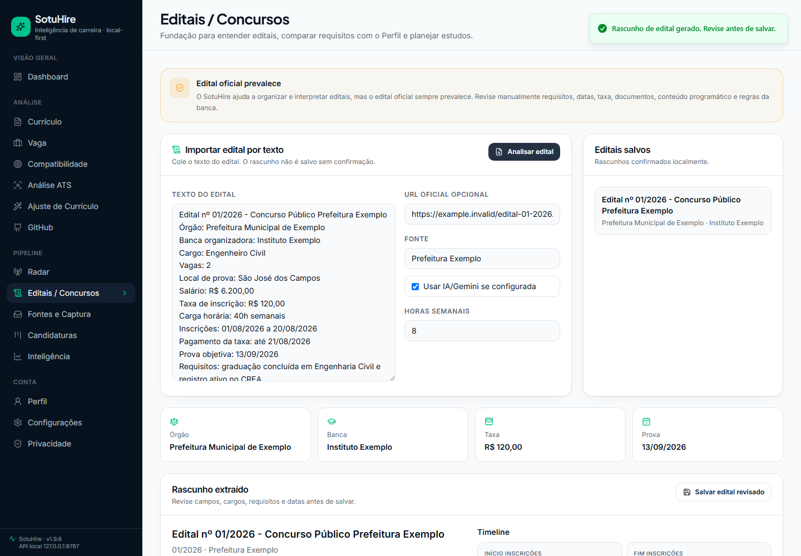
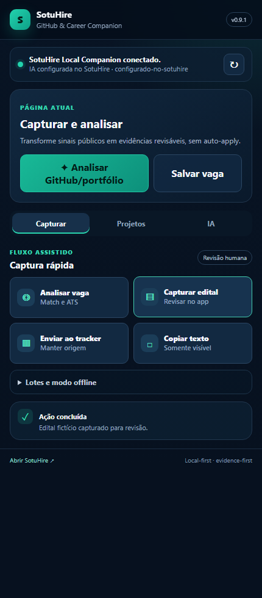
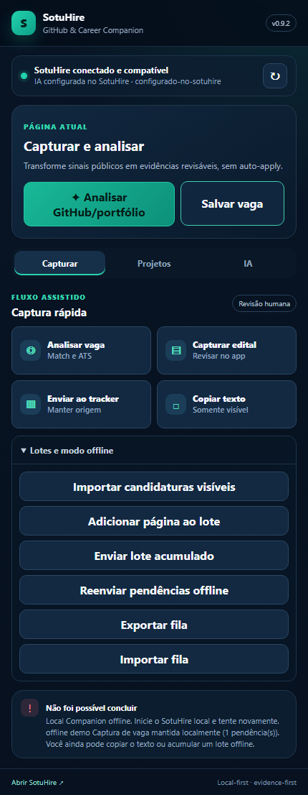
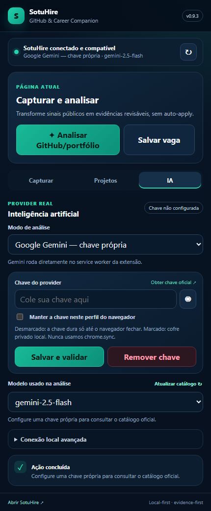

# SotuHire

[](https://github.com/Soturine/SotuHire/actions/workflows/ci.yml)
[](https://soturine.github.io/SotuHire/)
[](https://github.com/Soturine/SotuHire/releases/tag/v1.9.5)
[](https://www.python.org/)
[](LICENSE)

SotuHire é um copiloto de carreira local-first, multiárea e baseado em evidências para analisar currículos, comparar vagas, melhorar ATS, entender editais, descobrir oportunidades, acompanhar candidaturas e organizar o Perfil Profissional Universal da pessoa usuária.

Ele combina Perfil Profissional Universal, RAG local, Match, ATS, Tailor, Radar, Fontes, Kanban, GitHub/Portfólio, Lattes/acadêmico, Editais/Concursos, extensão assistiva e IA opcional sem transformar candidatura, inscrição ou decisão crítica em automação cega. A regra central é simples: a pessoa revisa antes de salvar, exportar, aplicar, se inscrever manualmente ou compartilhar contexto com provider externo.

[Documentação](docs/) · [Roadmap](docs/01-product/roadmap.md) · [Auditoria v1.9.5](docs/02-architecture/v1.9.5-integration-audit-matrix.md) · [Arquitetura](docs/02-architecture/module-integration-map.md) · [Contexto](docs/02-architecture/career-context-engine.md) · [Linhagem](docs/02-architecture/data-lineage-and-deduplication.md) · [RAG local](docs/04-ai/career-memory-rag.md) · [Demo](docs/09-portfolio/demo-script.md) · [Case study](docs/09-portfolio/portfolio-case-study.md) · [Segurança](docs/06-engineering/security-privacy.md) · [Release v1.9.5](docs/releases/v1.9.5.md) · [Changelog](CHANGELOG.md)

## Para Quem Serve

SotuHire não é uma ferramenta apenas para dev/TI. Ele foi desenhado para trajetórias técnicas, acadêmicas, científicas, artísticas, operacionais e profissionais reguladas:

- estudantes, pessoas em transição e pessoas sem experiência formal;
- cursos técnicos, tecnólogos, engenharias, laboratório, indústria e qualidade;
- saúde, direito, educação, pesquisa, administração, comercial, turismo, artes e design;
- iniciação científica, pós-graduação, docência, extensão, produção técnica e produção artística;
- profissionais com registros ou conselhos como CREA, CFT, CRQ, COREN, CRP, CRM, OAB, CRC, CAU, CREF, CRF, CRMV, CRESS, CRN e CRO;
- pessoas que usam GitHub/portfólio e pessoas que nunca usaram GitHub.

## Preview


| Perfil | Match | Radar e agendamentos |
| --- | --- | --- |
|  |  |  |

| Notificações | Tracker | Fontes |
| --- | --- | --- |
|  |  |  |





| Extensão | Captura de edital | Fila offline |
| --- | --- | --- |
|  |  |  |




## Principais Recursos

- **Perfil Profissional Universal**: centraliza objetivos, áreas, senioridade, localidades, modelos de trabalho, contratos, restrições e evidências revisáveis.
- **Acadêmico / Lattes**: importa texto colado do Currículo Lattes, projetos, publicações, extensão, docência e produção técnica/artística como candidatos revisáveis.
- **Editais / Concursos**: importa edital por texto colado, extrai órgão, banca, cargo, datas, taxa, requisitos, etapas e conteúdo programático, compara com o Perfil Universal e gera checklist/plano inicial.
- **Career Context Engine**: monta contexto compacto para Wishlist, Radar, Match, ATS, Tailor, Tracker, Fontes, GitHub/Portfólio, Notificações e Dashboard.
- **Análise de currículo e vaga**: extrai dados estruturados com fallback local e IA opcional.
- **Match, ATS e Tailor**: compara evidências reais, separa gaps, sugere ajustes seguros e evita inventar experiência, certificação, publicação ou registro.
- **Radar, Wishlist e agendamentos**: monitora fontes configuradas, RSS/Atom público e buscas revisáveis com quiet hours, cooldown e notificações locais.
- **Fontes, captura e extensão**: importa texto, link, CSV, JSON, capturas da extensão e capturas assistidas, sempre com revisão humana.
- **Kanban/Tracker**: acompanha candidaturas, status, fontes, requisitos recorrentes, funil e próximas ações.
- **GitHub/Portfólio**: analisa repositórios públicos e sugere candidatos de evidência para o Perfil, sem salvar automaticamente.
- **IA opcional e fallback local**: Gemini e OpenAI podem ser configurados no backend local com catálogo de modelos; sem chave, o produto continua funcionando localmente.
- **RAG/Memória local**: recupera evidências lexicais locais por relevância, score e origem.

## Como Funciona

```text
Dados do usuário
  -> Perfil Profissional Universal + Memória local + Lattes/Acadêmico + Extensão
  -> Career Context Engine
  -> Match / ATS / Tailor / Radar / Editais / Kanban / Fontes / GitHub / Dashboard
  -> revisão humana antes de salvar, exportar, aplicar ou compartilhar
```

O contexto é serializável, local-first e baseado em evidências. Itens de baixa confiança ficam como “a confirmar”. Evidências sensíveis não devem ir para provider externo sem permissão explícita.

## Demo Coerente

O modo Demo inclui sete trajetórias conectadas de ponta a ponta: estudante de engenharia, enfermagem/COREN, pesquisa/Lattes, docência/licenciatura/extensão, transição de carreira sem experiência formal, concurso público e artes/design com portfólio. A persona escolhida alimenta Perfil, contexto, Wishlist, Radar, Tracker, notificações e Dashboard sem misturar histórias.

Em **Configurações > Demo**, use **Restaurar dados de demonstração** para voltar ao estado inicial local. A ação não altera dados do modo API Real.

## Instalação Rápida

Requisitos:

- Python 3.11 ou superior;
- Node.js e npm para o frontend web;
- Git;
- chave Gemini ou OpenAI apenas se desejar IA externa opcional.

```bash
git clone https://github.com/Soturine/SotuHire.git
cd SotuHire
python -m venv .venv
```

Windows PowerShell:

```powershell
.\.venv\Scripts\Activate.ps1
pip install -e .[dev]
cd apps/web
npm ci
cd ../..
```

Linux/macOS:

```bash
source .venv/bin/activate
pip install -e ".[dev]"
cd apps/web
npm ci
cd ../..
```

## Rodar Localmente

API local:

```bash
python scripts/run_api.py
```

Frontend web:

```bash
cd apps/web
npm run dev
```

O frontend usa modo Demo por padrão e pode alternar para API Real em `http://127.0.0.1:8787/api/v1`.

## IA Opcional

O SotuHire funciona sem provider externo. Na v1.9.5, **Configurações / IA** mantém presets e catálogo de modelos, enquanto os resultados mostram provider/modelo solicitado e usado, prompt/versionamento, fallback e evidências seguras.

Presets disponíveis:

- **Local seguro**: IA externa desligada e fallback local.
- **IA básica**: currículo/Lattes, vaga/edital, match, ATS e tailor.
- **IA completa**: inclui Radar/Wishlist, Fontes/Extensão e GitHub/Portfólio.
- **Personalizado**: opções avançadas agrupadas por fluxo.

No app, escolha Gemini ou OpenAI, selecione um modelo conhecido ou informe um modelo customizado avançado e salve a chave somente no backend local. A chave do app não é devolvida ao frontend nem fica em `localStorage`/`sessionStorage`. Quando o provider falha ou não está configurado, o SotuHire registra o fallback local.

## Lattes e Acadêmico

A seção **Perfil > Acadêmico / Lattes** aceita texto colado do Currículo Lattes ou de trajetória acadêmica. O parser local e, opcionalmente, Gemini extraem candidatos de evidência para formação, publicações, projetos de pesquisa, extensão, docência, monitoria, eventos, prêmios, bolsas e produção técnica/artística.

Nada é salvo automaticamente. O usuário revisa, seleciona e confirma os itens antes de entrarem no Perfil Profissional Universal. O SotuHire não faz login no Lattes, não usa scraping autenticado e não coleta cookies, tokens, sessão, headers ou storage de terceiros.

## Editais e Concursos

A seção **Editais / Concursos** aceita texto colado de edital, concurso público, processo seletivo público, bolsa, residência, estágio público ou chamada institucional. A v1.9.5 consolida duplicatas por identidade preservando fontes, importa capturas da extensão e compara com Perfil Universal, evidências acadêmicas/Lattes confirmadas, Exam Fit Score, checklist e plano inicial.

Edital não é vaga privada. O SotuHire ajuda a organizar e interpretar editais, mas o edital oficial sempre prevalece. Revise manualmente requisitos, datas, taxa, documentos, conteúdo programático e regras da banca.

O módulo não faz inscrição automática, pagamento automático, boleto, envio automático de documentos, login em banca/órgão, scraping autenticado, crawler logado, CAPTCHA bypass ou auto-apply.

## Extensão Assistiva

A extensão do navegador continua com versionamento independente. SotuHire v1.9.5 usa a extensão v0.9.1: ela conversa com o site pela Local Companion API, captura vaga/edital/projeto/lote, mantém fila temporária offline e funciona sem o frontend React aberto.

Para GitHub/portfólio, há quatro modos reais: análise local, IA já configurada no SotuHire, Gemini com chave própria e OpenAI com chave própria. O catálogo oficial é atualizado periodicamente ou sob demanda e o modelo selecionado é o modelo enviado ao provider. A extensão enriquece perfis e repositórios pela API pública do GitHub — README, commits, linguagens, topics, estrutura e atividade — sem login, cookies ou token do GitHub.

Chaves próprias da extensão ficam isoladas no service worker: por padrão apenas em `chrome.storage.session` até o navegador fechar; persistência usa um cofre IndexedDB privado após consentimento explícito e nunca usa `chrome.storage.sync`. A chave não entra no content script, na página GitHub, no SotuHire, em logs ou no relatório. A análise sempre mantém fallback local e revisão humana.

A extensão consulta apenas um resumo seguro de status/contexto do Perfil, sem receber o perfil inteiro, memória completa ou chave de IA. Ela não acessa a API key do app, não automatiza candidatura/inscrição, não captura cookies/tokens/sessão/headers e não altera o fluxo `/api/v1/sources/authenticated-browser/collect`.

Leia também: [browser-extension/README.md](browser-extension/README.md).

## Segurança e Privacidade

- Sem auto-apply.
- Sem candidatura automática.
- Sem inscrição automática em concursos ou editais.
- Sem pagamento automático de taxa, boleto ou envio automático de documento.
- Sem bypass de CAPTCHA.
- Sem login ou scraping autenticado do Lattes, banca ou órgão.
- Sem API key do app no frontend; chave própria da extensão é opcional, isolada no service worker e removível.
- Evidências de IA, extensão, Lattes, GitHub ou portfólio exigem revisão humana antes de virar fato do Perfil.

## Arquitetura

- `modules/`: core local-first, parsers, IA opcional, Perfil, memória, contexto, Editais/Concursos, Radar, Tracker, fontes e extensão.
- `apps/api/`: API FastAPI local, com envelope `{ ok, data, warnings, request_id }`.
- `apps/web/`: frontend React/Vite com modo Demo e API Real.
- `browser-extension/`: extensão assistiva e integração com Local Companion API.
- `docs/`: documentação de produto, arquitetura, IA, segurança, roadmap e releases.

## Documentação

- [Índice documental](docs/documentation-index.md)
- [Visão de produto](docs/01-product/vision.md)
- [Estratégia multiárea](docs/01-product/multi-domain-product-strategy.md)
- [Mapa de integração de módulos](docs/02-architecture/module-integration-map.md)
- [Career Context Engine](docs/02-architecture/career-context-engine.md)
- [Extension Profile Bridge](docs/02-architecture/extension-profile-bridge.md)
- [Fundação para editais e concursos](docs/02-architecture/public-exams-foundation.md)
- [Prompt Catalog](docs/04-ai/prompt-catalog.md)
- [Catálogo de providers e modelos de IA](docs/02-architecture/ai-provider-model-catalog.md)
- [Prompt Lattes Extractor](docs/04-ai/prompts/profile-lattes-extractor-v1.md)
- [Prompt Public Exam Notice Extractor](docs/04-ai/prompts/public-exam-notice-extractor-v1.md)
- [Career Memory e RAG local](docs/04-ai/career-memory-rag.md)
- [Lattes, perfil acadêmico e IA v1.9.2](docs/07-development/v1.9.2-lattes-ai-universal-profile.md)
- [Fundação de editais v1.9.3](docs/07-development/v1.9.3-public-exams-edital-foundation.md)
- [Segurança e privacidade](docs/06-engineering/security-privacy.md)
- [Frontend web](apps/web/README.md)
- [Roteiro de demonstração](docs/09-portfolio/demo-script.md)
- [Case study](docs/09-portfolio/portfolio-case-study.md)
- [Release notes](docs/releases/v1.9.5.md)

## Roadmap Curto

- Upload direto de PDF/HTML do Lattes e de editais.
- Parser avançado de edital por banca/órgão.
- Plano de estudo avançado por edital.
- Matching adaptativo por domínio.
- Integração ainda mais profunda entre GitHub/Portfólio e Perfil.

## Licença

Apache-2.0. Consulte [LICENSE](LICENSE).
