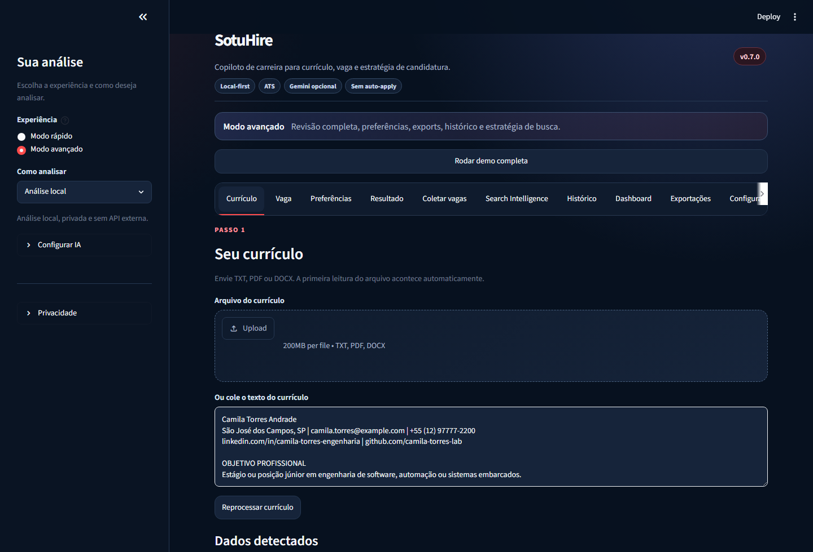

# SotuHire

[](https://github.com/Soturine/SotuHire/actions/workflows/ci.yml)
[](https://soturine.github.io/SotuHire/)
[](https://www.python.org/)
[](LICENSE)

Copiloto de carreira local-first para analisar currículos, comparar vagas, melhorar aderência ATS,
descobrir oportunidades e acompanhar candidaturas.

O SotuHire combina regras determinísticas, NLP e IA opcional para responder:

> Esta vaga faz sentido para mim, quais são os gaps e o que devo ajustar antes de aplicar?

[Documentação](https://soturine.github.io/SotuHire/) ·
[Roadmap](docs/01-product/roadmap.md) ·
[Changelog](CHANGELOG.md) ·
[Segurança e privacidade](docs/06-engineering/security-privacy.md)



## O Que O Projeto Faz

- lê currículos em TXT, PDF e DOCX;
- extrai experiências, formação, projetos, links e competências;
- interpreta descrições de vagas e publicações com oportunidades;
- calcula Match Score, ATS Score, Opportunity Fit Score e Risk Score;
- explica pontos fortes, gaps, riscos e palavras-chave ausentes;
- sugere adaptações de currículo sem inventar experiências;
- oferece análise local por padrão e Gemini opcional;
- coleta oportunidades públicas, URLs específicas, conteúdo assistido e fontes autenticadas
  autorizadas;
- normaliza, deduplica e salva oportunidades para análise;
- mantém tracker, histórico e dashboard locais;
- gera Search Intelligence e Hidden Jobs Radar.

## Como Usar

### Modo rápido

Use quando já possui um currículo e uma vaga:

```text
Carregar currículo -> colar vaga -> receber análise -> revisar sugestões
```

### Modo avançado

Use para revisar dados detectados, configurar IA, coletar oportunidades, comparar vagas, exportar
resultados e acompanhar candidaturas no tracker.

Também é possível clicar em **Rodar análise de exemplo** para conhecer o fluxo sem usar dados
pessoais.

## Instalação

### Requisitos

- Python 3.11 ou superior;
- Git;
- Windows, Linux ou macOS;
- chave Gemini apenas se desejar análise externa opcional.

### Baixar e executar

```bash
git clone https://github.com/Soturine/SotuHire.git
cd SotuHire
python -m venv .venv
```

Ative o ambiente virtual:

```powershell
# Windows PowerShell
.\.venv\Scripts\Activate.ps1
```

```bash
# Linux/macOS
source .venv/bin/activate
```

Instale e abra o app:

```bash
pip install -r requirements.txt
streamlit run app.py
```

O Streamlit mostrará o endereço local, normalmente `http://localhost:8501`.

## Configuração

O modo local funciona sem chave de API. Para personalizar configurações:

```bash
cp .env.example .env
```

No Windows PowerShell:

```powershell
Copy-Item .env.example .env
```

### Gemini opcional

```bash
pip install -r requirements-ai.txt
```

Configure no `.env`:

```env
DEFAULT_AI_PROVIDER=gemini
GEMINI_API_KEY=sua_chave
GEMINI_MODEL=gemini-2.5-flash
```

Também é possível configurar e testar a chave pela seção **Configurar IA** dentro do app.

### Coleta autenticada opcional

Instale as dependências de scraping:

```bash
pip install -r requirements-scraping.txt
playwright install chromium
```

No app, selecione **Navegador autenticado autorizado**, clique em **Abrir navegador para login**,
faça login manualmente no navegador dedicado e teste a conexão antes de coletar.

Leia o guia de [crawling com navegador autenticado](docs/05-data-sources/authenticated-browser-crawling.md).

## Modos De Coleta

| Modo | Uso |
| --- | --- |
| `PUBLIC_SCRAPING` | RSS, páginas públicas de carreira, boards e listagens abertas com cache, rate limit e `robots.txt`. |
| `MANUAL_URL` | Coleta somente a URL informada, sem seguir links em massa. |
| `USER_ASSISTED_CAPTURE` | Processa o conteúdo da vaga ou publicação atual enviado pela pessoa usuária. |
| `AUTHENTICATED_BROWSER` | Usa um navegador dedicado previamente autenticado para fontes autorizadas, com limites configuráveis. |

O SotuHire não automatiza login, não contorna CAPTCHA ou checkpoints e não envia candidaturas
automaticamente.

## Módulos Principais

| Módulo | Responsabilidade |
| --- | --- |
| `modules/parsers` | Extração e normalização de currículo e vaga. |
| `modules/analyzer`, `modules/ats`, `modules/preferences` | Scores, recomendação, riscos e aderência às preferências. |
| `modules/ai` | Providers, diagnóstico, Gemini opcional e análise estruturada. |
| `modules/resume_tailor` | Sugestões rastreáveis para adaptar o currículo. |
| `modules/scraping`, `modules/opportunities` | Conectores, coleta, deduplicação e armazenamento de oportunidades. |
| `modules/search_intelligence` | Queries, fontes sugeridas e detecção de oportunidades escondidas. |
| `modules/tracker`, `modules/storage` | Histórico, Kanban, follow-up e persistência local. |
| `modules/profile`, `modules/portfolio`, `modules/rag` | Perfil profissional, portfólio e memória de carreira. |
| `modules/ui` | Fluxos Streamlit rápido e avançado. |

Arquitetura resumida:

```text
currículo + vaga + preferências
        -> parsers e schemas
        -> regras, scores e IA opcional
        -> análise explicável e Resume Tailor
        -> tracker, histórico e dashboard

fontes e buscas
        -> conectores e coleta
        -> normalização e deduplicação
        -> análise e tracker
```

Veja a [documentação de arquitetura](docs/02-architecture/overview.md) e o
[pipeline de oportunidades](docs/02-architecture/opportunity-collection-pipeline.md).

## Estrutura Do Repositório

```text
SotuHire/
├── app.py                  # entrada Streamlit
├── modules/                # domínio, serviços, conectores e UI
├── tests/                  # testes unitários, integração e regressão
├── examples/               # currículos, vagas e resultados fictícios
├── config/                 # exemplos de fontes configuráveis
├── docs/                   # documentação publicada com MkDocs
├── scripts/                # automações auxiliares
└── .github/workflows/      # CI e publicação da documentação
```

## Qualidade E Desenvolvimento

Instale as dependências de desenvolvimento:

```bash
pip install -r requirements-dev.txt
```

Execute as verificações:

```bash
ruff check .
ruff format . --check
python -m pytest -q
mkdocs build --strict
```

Para visualizar a documentação localmente:

```bash
mkdocs serve
```

## Roadmap

### Disponível atualmente

- análise local e Gemini opcional;
- parsers de currículo e vaga;
- scores explicáveis e Resume Tailor;
- tracker, histórico e dashboard;
- Search Intelligence e Hidden Jobs Radar;
- coleta pública, URL manual, captura assistida e navegador autenticado autorizado.

### Próximas evoluções

- extensão de navegador para salvar e analisar a página atual;
- Resume Tailor exportável em DOCX/PDF;
- alertas configuráveis e follow-up;
- análise expandida de GitHub, portfólio, LinkedIn e Lattes;
- memória de carreira com RAG e evidências;
- conectores adicionais por fonte.

O planejamento detalhado está no [roadmap](docs/01-product/roadmap.md).

## Privacidade

- a análise local é o padrão;
- currículos reais, segredos, bancos locais e exports privados não devem ser versionados;
- o histórico não precisa armazenar o texto bruto do currículo;
- sugestões devem permanecer apoiadas por evidências fornecidas pela pessoa usuária;
- integrações externas e coletas devem ser habilitadas conscientemente.

Consulte [Security & Privacy](docs/06-engineering/security-privacy.md) e
[Compliance & Ethics](docs/05-data-sources/compliance-and-ethics.md).

## Documentação

A documentação completa está publicada em
[soturine.github.io/SotuHire](https://soturine.github.io/SotuHire/) e organizada por:

- produto e roadmap;
- arquitetura e fluxo de dados;
- regras de negócio e scores;
- IA e providers;
- fontes de dados e conectores;
- engenharia, testes e desenvolvimento.

O histórico de versões fica exclusivamente no [CHANGELOG.md](CHANGELOG.md).

## Contribuição

Contribuições são bem-vindas. Antes de enviar mudanças, execute a suíte de qualidade e consulte o
[guia de contribuição](docs/07-development/contributing.md).

## Licença

Distribuído sob a licença [Apache 2.0](LICENSE).
