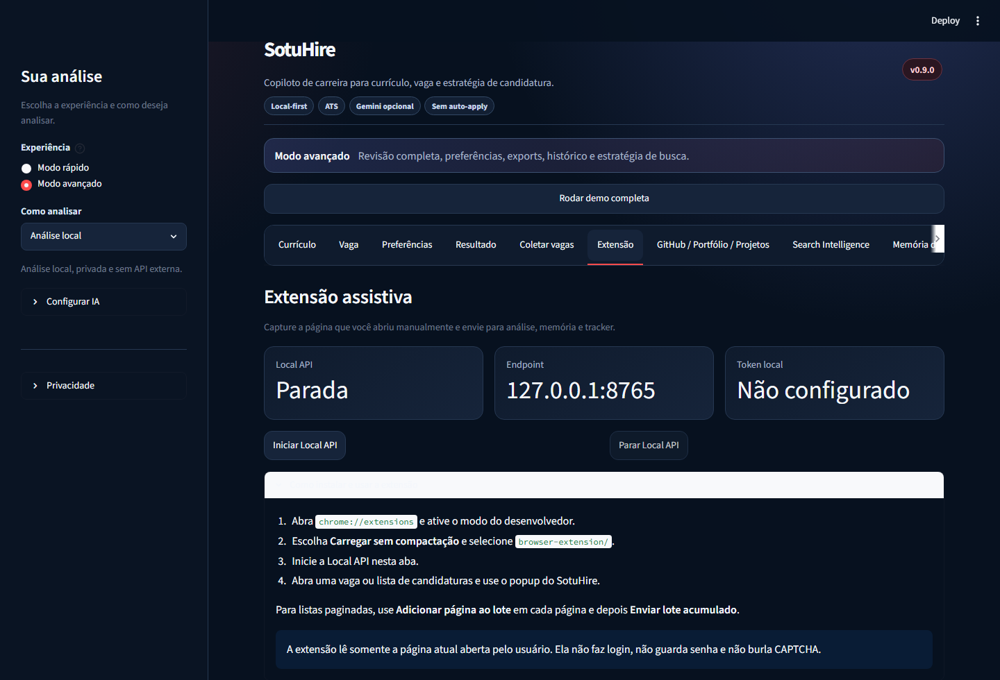

# SotuHire

[](https://github.com/Soturine/SotuHire/actions/workflows/ci.yml)
[](https://soturine.github.io/SotuHire/)
[](https://www.python.org/)
[](LICENSE)

Copiloto de carreira local-first para analisar currículos, comparar vagas, melhorar aderência ATS,
descobrir oportunidades e acompanhar candidaturas.

O SotuHire combina regras determinísticas, NLP e IA opcional para responder:

> Esta vaga faz sentido para mim, quais são os gaps e o que devo ajustar antes de aplicar?

[Documentação](https://soturine.github.io/SotuHire/) ·
[Roadmap](docs/01-product/roadmap.md) ·
[Visão](docs/01-product/vision.md) ·
[Estratégia multiárea](docs/01-product/multi-domain-product-strategy.md) ·
[Prompt Catalog](docs/04-ai/prompt-catalog.md) ·
[Prompt Architecture](docs/04-ai/prompt-architecture.md) ·
[Prompt Registry](docs/04-ai/prompt-registry.md) ·
[Prompts individuais](docs/04-ai/prompts/README.md) ·
[Changelog](CHANGELOG.md) ·
[Segurança e privacidade](docs/06-engineering/security-privacy.md)



## O Que O Projeto Faz

- lê currículos em TXT, PDF e DOCX;
- extrai experiências, formação, projetos, links e competências;
- interpreta descrições de vagas e publicações com oportunidades;
- possui base de extração estruturada por IA com JSON Guard, Pydantic e fallback local;
- classifica domínios e requisitos multiárea com Domain Intelligence inicial;
- calcula Match Score, ATS Score, Opportunity Fit Score e Risk Score;
- explica pontos fortes, gaps, riscos e palavras-chave ausentes;
- sugere adaptações de currículo sem inventar experiências;
- oferece análise local por padrão e Gemini opcional;
- aprende localmente com currículos, projetos, análises, feedbacks e candidaturas;
- recupera evidências relevantes com RAG local e explica por que recomendou uma vaga;
- consolida perfil profissional e preferências inferidas, editáveis pela pessoa usuária;
- coleta oportunidades públicas, URLs específicas, conteúdo assistido e fontes autenticadas
  autorizadas;
- normaliza, deduplica e salva oportunidades para análise;
- mantém tracker, histórico e dashboard locais;
- gera Search Intelligence e Hidden Jobs Radar;
- captura a vaga atual com extensão assistiva e Local Companion API;
- importa candidaturas paginadas sem duplicar vagas já registradas;
- consolida a mesma vaga encontrada em LinkedIn, Gupy, Indeed, InfoJobs, Nube e outros portais;
- mostra todas as fontes da candidatura e ranqueia requisitos recorrentes;
- analisa perfis GitHub, repositórios, READMEs, commits, projetos e portfólios públicos;
- transforma projetos em evidências reutilizáveis para vagas, memória e perfil profissional;
- oferece análise standalone na extensão ou análise conectada ao SotuHire local.

## Como Usar

### Modo rápido

Use quando já possui um currículo e uma vaga:

```text
Carregar currículo -> colar vaga -> receber análise -> revisar sugestões
```

### Modo avançado

Use para revisar dados detectados, configurar IA, coletar oportunidades, comparar vagas, exportar
resultados, consultar a **Memória de carreira** e acompanhar candidaturas no tracker.

Também é possível clicar em **Rodar análise de exemplo** para conhecer o fluxo sem usar dados
pessoais.

## Instalação

### Requisitos

- Python 3.11 ou superior;
- Git;
- Windows, Linux ou macOS;
- chave Gemini apenas se desejar análise externa opcional.

### Baixar e executar

```bash
git clone https://github.com/Soturine/SotuHire.git
cd SotuHire
python -m venv .venv
```

Ative o ambiente virtual:

```powershell
# Windows PowerShell
.\.venv\Scripts\Activate.ps1
```

```bash
# Linux/macOS
source .venv/bin/activate
```

Instale e abra o app:

```bash
pip install -r docs/requirements/requirements.txt
streamlit run app.py
```

O Streamlit mostrará o endereço local, normalmente `http://localhost:8501`.

## Configuração

O modo local funciona sem chave de API. Para personalizar configurações:

```bash
cp .env.example .env
```

No Windows PowerShell:

```powershell
Copy-Item .env.example .env
```

### Gemini opcional

```bash
pip install -r docs/requirements/requirements-ai.txt
```

Configure no `.env`:

```env
DEFAULT_AI_PROVIDER=gemini
GEMINI_API_KEY=sua_chave
GEMINI_MODEL=gemini-2.5-flash
```

Também é possível configurar e testar a chave pela seção **Configurar IA** dentro do app.

Por padrão, o Gemini não recebe a memória local. Para usá-la no aprimoramento da análise,
habilite explicitamente **Enviar contexto relevante para Gemini**. Somente as evidências
recuperadas para a vaga atual são resumidas e enviadas, nunca a memória inteira.

### Extensão assistiva

1. Inicie o app com `streamlit run app.py`.
2. Abra o modo avançado e a aba **Extensão**.
3. Clique em **Iniciar Local API**.
4. Em `chrome://extensions`, ative o modo desenvolvedor e carregue `browser-extension/`.
5. Abra uma vaga e use **Salvar vaga atual**, **Analisar vaga atual** ou **Enviar para tracker**.

Para importar muitas candidaturas já realizadas, percorra as páginas do tracker do portal e clique
em **Adicionar página ao lote** em cada uma. Depois use **Enviar lote acumulado**. O SotuHire
normaliza URLs e compara empresa+título para não criar duplicatas, inclusive quando um portal
redireciona a candidatura para outro.

A extensão pode pedir ao SotuHire local que use o Gemini configurado, mas nunca recebe ou armazena
a API Key. Leia [Browser Companion v0.9.0](docs/07-development/v0.9.0-browser-extension-companion.md).

Para GitHub e portfólios, a extensão possui dois modos:

- **Standalone Extension Analysis**: relatório local no navegador, com Gemini standalone opcional;
- **Connected SotuHire Analysis**: salva relatório, evidências, README e commits na memória local.

Em repositórios e perfis públicos do GitHub, o botão **SotuHire AI** aparece diretamente na
página e abre um modal com score, grade, stack, README, commits, arquitetura, recomendações e
ações para salvar no SotuHire. Para gerar o ZIP validado da extensão:

```bash
python scripts/package_extension.py
```

O artefato é criado em `dist/sotuhire-extension-v0.9.0.zip`. Consulte o
[guia da Chrome Web Store](docs/07-development/chrome-web-store-extension.md).

A chave Gemini standalone, quando escolhida, fica somente no `chrome.storage.local` e nunca entra
no payload da Local Companion API. O modo recomendado continua sendo usar Gemini pelo SotuHire
local. Veja [Análise GitHub e portfólio](docs/07-development/extension-github-portfolio-analysis.md).

### Coleta autenticada opcional

Instale as dependências de scraping:

```bash
pip install -r docs/requirements/requirements-scraping.txt
playwright install chromium
```

No app, selecione **Navegador autenticado autorizado**, clique em **Abrir navegador para login**,
faça login manualmente no navegador dedicado e teste a conexão antes de coletar.

Leia o guia de [crawling com navegador autenticado](docs/05-data-sources/authenticated-browser-crawling.md).

## Modos De Coleta

| Modo | Uso |
| --- | --- |
| `PUBLIC_SCRAPING` | RSS, páginas públicas de carreira, boards e listagens abertas com cache, rate limit e `robots.txt`. |
| `MANUAL_URL` | Coleta somente a URL informada, sem seguir links em massa. |
| `USER_ASSISTED_CAPTURE` | Processa o conteúdo da vaga ou publicação atual enviado pela pessoa usuária. |
| `AUTHENTICATED_BROWSER` | Usa um navegador dedicado previamente autenticado para fontes autorizadas, com limites configuráveis. |

O SotuHire não automatiza login, não contorna CAPTCHA ou checkpoints e não envia candidaturas
automaticamente.

## Módulos Principais

| Módulo | Responsabilidade |
| --- | --- |
| `modules/parsers` | Extração e normalização de currículo e vaga. |
| `modules/analyzer`, `modules/ats`, `modules/preferences` | Scores, recomendação, riscos e aderência às preferências. |
| `modules/ai` | Providers, diagnóstico, Gemini opcional, Prompt Registry, JSON Guard e extração estruturada. |
| `modules/domain_intelligence` | Classificação multiárea, aliases, requisitos e sinais de profissões regulamentadas. |
| `modules/resume_tailor` | Sugestões rastreáveis para adaptar o currículo. |
| `modules/scraping`, `modules/opportunities` | Conectores, coleta, deduplicação e armazenamento de oportunidades. |
| `modules/search_intelligence` | Queries, fontes sugeridas e detecção de oportunidades escondidas. |
| `modules/tracker`, `modules/storage` | Histórico, Kanban, follow-up e persistência local. |
| `modules/memory`, `modules/profile` | Career Memory, RAG local, evidências, perfil persistente e preferências inferidas. |
| `modules/local_api` | API localhost para integração local com a extensão. |
| `browser-extension` | Extensão assistiva multiportal e análise GitHub/portfólio no navegador. |
| `modules/portfolio` | Amostragem, commits, scores e evidências de GitHub/projetos/portfólio. |
| `modules/ui` | Fluxos Streamlit rápido e avançado. |

Arquitetura resumida:

```text
currículo + vaga + preferências
        -> parsers e schemas
        -> recuperação de evidências da memória local
        -> regras, scores e IA opcional
        -> análise explicável e Resume Tailor
        -> tracker, histórico e dashboard

fontes e buscas
        -> conectores e coleta
        -> normalização e deduplicação
        -> análise e tracker
```

Veja a [documentação de arquitetura](docs/02-architecture/overview.md) e o
[pipeline de oportunidades](docs/02-architecture/opportunity-collection-pipeline.md).

## Estrutura Do Repositório

```text
SotuHire/
├── app.py                  # entrada Streamlit
├── modules/                # domínio, serviços, conectores e UI
├── browser-extension/      # extensão assistiva Manifest V3
├── tests/                  # testes unitários, integração e regressão
├── examples/               # currículos, vagas e resultados fictícios
├── config/                 # exemplos de fontes configuráveis
├── docs/                   # documentação publicada com MkDocs
│   └── requirements/       # dependências separadas por perfil
├── scripts/                # automações auxiliares
└── .github/workflows/      # CI e publicação da documentação
```

## Qualidade E Desenvolvimento

Instale as dependências de desenvolvimento:

```bash
pip install -r docs/requirements/requirements-dev.txt
```

Execute as verificações:

```bash
ruff check .
ruff format . --check
python -m pytest -q
mkdocs build --strict
```

Para visualizar a documentação localmente:

```bash
mkdocs serve
```

## Roadmap

### Disponível atualmente

- análise local e Gemini opcional;
- Career Memory local, RAG lexical e análise baseada em evidências;
- perfil profissional persistente, feedback learning e preferências inferidas;
- export/import de memória e flags explícitas de privacidade;
- parsers de currículo e vaga;
- Prompt Registry, JSON Guard e schemas Pydantic para extração estruturada;
- Domain Intelligence inicial para vagas e currículos multiárea;
- scores explicáveis e Resume Tailor;
- tracker, histórico e dashboard;
- Search Intelligence e Hidden Jobs Radar;
- coleta pública, URL manual, captura assistida e navegador autenticado autorizado.
- extensão assistiva multiportal, Local Companion API e importação paginada deduplicada;
- calibração da memória, feedback de evidência e ranking de requisitos.
- análise de GitHub, portfólio, READMEs e commits com evidências de projeto.
- GitHub Analyzer 2.0 com GitHub API pública, tree builder, sampler, dependency graph, evidence
  index, scoring calculado por código e fallback local.

### Próximas evoluções documentadas

- v0.12.0: Match Engine 2.0, com matching por requisitos, evidências, domínio, senioridade, gaps
  críticos e competências transferíveis;
- v1.0: versão generalista estável de inteligência de carreira.

O planejamento detalhado está no [roadmap](docs/01-product/roadmap.md).

## Privacidade

- a análise local é o padrão;
- currículos reais, segredos, bancos locais e exports privados não devem ser versionados;
- o histórico não precisa armazenar o texto bruto do currículo;
- a memória de carreira fica em `data/memory/`, pode ser exportada/importada e pode ser apagada;
- Gemini recebe apenas contexto relevante quando a opção explícita estiver habilitada;
- a extensão não recebe API Key, cookie, senha ou conteúdo de outras abas;
- capturas e fontes ficam em stores locais ignorados pelo Git;
- sugestões devem permanecer apoiadas por evidências fornecidas pela pessoa usuária;
- integrações externas e coletas devem ser habilitadas conscientemente.

Consulte [Security & Privacy](docs/06-engineering/security-privacy.md) e
[Compliance & Ethics](docs/05-data-sources/compliance-and-ethics.md).

## Documentação

A documentação completa está publicada em
[soturine.github.io/SotuHire](https://soturine.github.io/SotuHire/) e organizada por:

- produto e roadmap;
- arquitetura e fluxo de dados;
- regras de negócio e scores;
- IA e providers;
- fontes de dados e conectores;
- engenharia, testes e desenvolvimento.

O histórico de versões fica exclusivamente no [CHANGELOG.md](CHANGELOG.md).

## Contribuição

Contribuições são bem-vindas. Antes de enviar mudanças, execute a suíte de qualidade e consulte o
[guia de contribuição](docs/07-development/contributing.md).

## Licença

Distribuído sob a licença [Apache 2.0](LICENSE).
