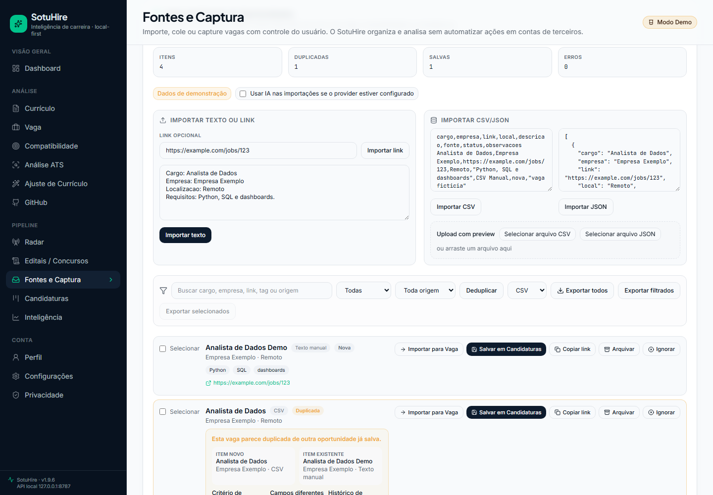
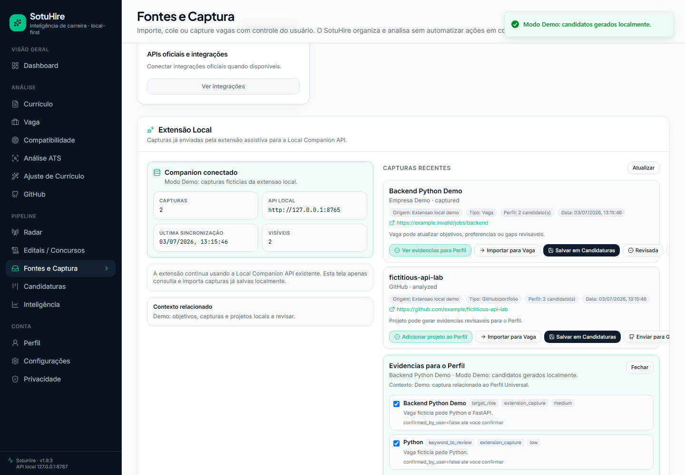

# SotuHire

[](https://github.com/Soturine/SotuHire/actions/workflows/ci.yml)
[](https://soturine.github.io/SotuHire/)
[](https://github.com/Soturine/SotuHire/releases/tag/v1.9.1)
[](https://www.python.org/)
[](LICENSE)

SotuHire e um copiloto de carreira local-first, multi area e baseado em evidencias para analisar curriculos, comparar vagas, melhorar ATS, descobrir oportunidades, acompanhar candidaturas e organizar o perfil profissional da pessoa usuaria.

Ele combina Perfil Profissional Universal, RAG local, Match, ATS, Tailor, Radar, Fontes, Kanban, GitHub/Portfolio e IA opcional sem transformar a candidatura em automacao cega. A regra central e simples: a pessoa revisa antes de salvar, exportar, aplicar ou compartilhar contexto com provider externo.

[Documentacao](docs/) · [Roadmap](docs/01-product/roadmap.md) · [Visao](docs/01-product/vision.md) · [Estrategia multi area](docs/01-product/multi-domain-product-strategy.md) · [Arquitetura](docs/02-architecture/module-integration-map.md) · [Contexto](docs/02-architecture/career-context-engine.md) · [Ponte da extensao](docs/02-architecture/extension-profile-bridge.md) · [RAG local](docs/04-ai/career-memory-rag.md) · [Seguranca](docs/06-engineering/security-privacy.md) · [Changelog](CHANGELOG.md)

## Para Quem Serve

SotuHire nao e uma ferramenta apenas para dev/TI. Ele foi desenhado para trajetorias tecnicas, academicas, cientificas, artisticas, operacionais e profissionais reguladas:

- estudantes, pessoas em transicao e pessoas sem experiencia formal;
- cursos tecnicos, tecnologos, engenharias, laboratorio, industria e qualidade;
- saude, direito, educacao, pesquisa, administracao, comercial, turismo, artes e design;
- profissionais com registros ou conselhos como CREA, CFT, CRQ, COREN, CRP, CRM, OAB, CRC, CAU, CREF, CRF, CRMV, CRESS, CRN e CRO;
- pessoas que usam GitHub/portfolio e pessoas que nunca usaram GitHub.

## Preview


| Perfil | Match | Radar e agendamentos |
| --- | --- | --- |
|  |  |  |

| Notificacoes | Tracker | Fontes |
| --- | --- | --- |
|  |  |  |




## Principais Recursos

- **Perfil Profissional Universal**: centraliza objetivos, areas, senioridade, localidades, modelos de trabalho, contratos, restricoes e evidencias revisaveis.
- **Career Context Engine**: monta contexto compacto para Wishlist, Radar, Match, ATS, Tailor, Tracker, Fontes, GitHub/Portfolio, Notificacoes e Dashboard.
- **Analise de curriculo e vaga**: extrai dados estruturados com fallback local e IA opcional.
- **Match, ATS e Tailor**: compara evidencias reais, separa gaps, sugere ajustes seguros e evita inventar experiencia, certificacao ou registro.
- **Radar, Wishlist e agendamentos**: monitora fontes configuradas, RSS/Atom publico e buscas revisaveis com quiet hours, cooldown e notificacoes locais.
- **Fontes, captura e extensao**: importa texto, link, CSV, JSON, capturas da extensao e capturas assistidas, sempre com revisao humana.
- **Kanban/Tracker**: acompanha candidaturas, status, fontes, requisitos recorrentes, funil e proximas acoes.
- **GitHub/Portfolio**: analisa repositorios publicos e sugere candidatos de evidencia para o perfil, sem salvar automaticamente.
- **IA opcional e fallback local**: Gemini pode ser usado pelo backend local; sem chave, o produto continua funcionando localmente.
- **RAG/Memoria local**: recupera evidencias lexicais locais por relevancia, score e origem.

## Como Funciona

```text
Dados do usuario
  -> Perfil Profissional Universal + Memoria local
  -> Career Context Engine
  -> Match / ATS / Tailor / Radar / Kanban / Fontes / GitHub / Dashboard
  -> revisao humana antes de salvar, exportar, aplicar ou compartilhar
```

O contexto e serializavel, local-first e baseado em evidencias. Itens de baixa confianca ficam como "a confirmar". Evidencias sensiveis nao devem ir para provider externo sem permissao explicita.

## Instalacao Rapida

Requisitos:

- Python 3.11 ou superior;
- Node.js e npm para o frontend web;
- Git;
- chave Gemini apenas se desejar IA externa opcional.

```bash
git clone https://github.com/Soturine/SotuHire.git
cd SotuHire
python -m venv .venv
```

Windows PowerShell:

```powershell
.\.venv\Scripts\Activate.ps1
pip install -r docs/requirements/requirements.txt
.\start-sotuhire.ps1
```

Linux/macOS:

```bash
source .venv/bin/activate
pip install -r docs/requirements/requirements.txt
```

## Rodar Localmente

Launcher web-first:

```powershell
.\start-sotuhire.ps1
```

Flags uteis:

```powershell
.\start-sotuhire.ps1 -NoBrowser
.\start-sotuhire.ps1 -SkipInstall
.\start-sotuhire.ps1 -ApiOnly
.\start-sotuhire.ps1 -WebOnly
.\start-sotuhire.ps1 -Production
.\start-sotuhire.ps1 -WithCompanion
```

API local:

```powershell
python scripts/run_api.py
```

Frontend web:

```bash
cd apps/web
npm ci
npm run dev
```

Streamlit legado/dev continua disponivel:

```powershell
streamlit run app.py
```

## Configurar IA Opcional

SotuHire funciona sem provider externo. Para usar Gemini, configure pela tela **Configuracoes -> IA e Providers** ou por ambiente local:

```env
DEFAULT_AI_PROVIDER=gemini
GEMINI_API_KEY=sua_chave
GEMINI_MODEL=gemini-2.5-flash
```

A chave fica somente no backend local, em arquivo ignorado pelo Git. O frontend nunca recebe nem persiste API key. O envio de memoria/contexto para provider externo depende de opt-in explicito.

## Extensao Assistiva

A extensao em [browser-extension/](browser-extension/README.md) usa uma Local Companion API para capturar vagas visiveis e analisar GitHub/portfolio. Ela pode trabalhar conectada ao SotuHire local e e compativel com a extensao v0.9.0.

O fluxo assistivo nao faz candidatura automatica, nao captura cookies/tokens/sessao/headers, nao burla CAPTCHA e nao coloca API key no frontend. Capturas e projetos podem virar evidencias candidatas revisaveis para o Perfil Profissional Universal; o usuario confirma antes de salvar.

## Seguranca E Privacidade

- local-first por padrao;
- sem auto-apply;
- sem envio automatico de curriculo;
- sem bypass de CAPTCHA;
- sem captura de cookies, tokens, sessao, headers ou storage de terceiros;
- sem API key no frontend;
- sem salvar candidatos de evidencia no Perfil sem revisao;
- sem mover score final ou regras anti-invencao para o browser.

Veja [Security & Privacy](docs/06-engineering/security-privacy.md) e [Compliance & Ethics](docs/05-data-sources/compliance-and-ethics.md).

## Arquitetura

```text
apps/web
  -> apps/api/routes
  -> apps/api/services
  -> modules/context
  -> modules/profile + modules/memory
  -> modules/radar + modules/sources + modules/tracker
  -> modules/matching + modules/ats + modules/resume_tailor
  -> data/ local ignorado pelo Git
```

Leia o [mapa de integracao de modulos](docs/02-architecture/module-integration-map.md), a [documentacao do Career Context Engine](docs/02-architecture/career-context-engine.md), a [Extension Profile Bridge](docs/02-architecture/extension-profile-bridge.md), o [catalogo de prompts](docs/04-ai/prompt-catalog.md) e a [documentacao do frontend](apps/web/README.md).

## Documentacao

- [Indice documental](docs/documentation-index.md)
- [Roadmap](docs/01-product/roadmap.md)
- [Visao do produto](docs/01-product/vision.md)
- [Estrategia multi area](docs/01-product/multi-domain-product-strategy.md)
- [Career Memory e RAG local](docs/04-ai/career-memory-rag.md)
- [Extension Profile Bridge](docs/02-architecture/extension-profile-bridge.md)
- [Prompt Catalog](docs/04-ai/prompt-catalog.md)
- [Security & Privacy](docs/06-engineering/security-privacy.md)
- [Release notes v1.9.1](docs/releases/v1.9.1.md)
- [Changelog](CHANGELOG.md)

## Desenvolvimento

```bash
ruff check .
ruff format --check .
pytest
mkdocs build --strict
python -m compileall modules tests apps scripts
pyright
```

Frontend:

```bash
cd apps/web
npm ci
npm run build
npm run lint
npm run typecheck
npm run test:e2e
```

Screenshots web:

```bash
python scripts/capture_web_walkthrough.py
```

Extensao:

```bash
python scripts/package_extension.py
```

## Roadmap Curto

- aprofundar matching adaptativo por dominio sem hardcode gigante por profissao;
- evoluir upload direto de arquivos para o Perfil Profissional Universal;
- ampliar a revisao de candidatos de evidencia de GitHub/Portfolio;
- estudar notificacoes nativas opcionais;
- manter o fluxo authenticated browser preservado e revisavel.

## Licenca

Distribuido sob a licenca [Apache 2.0](LICENSE).
