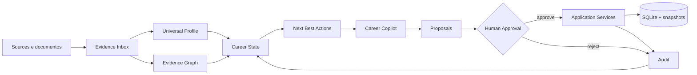
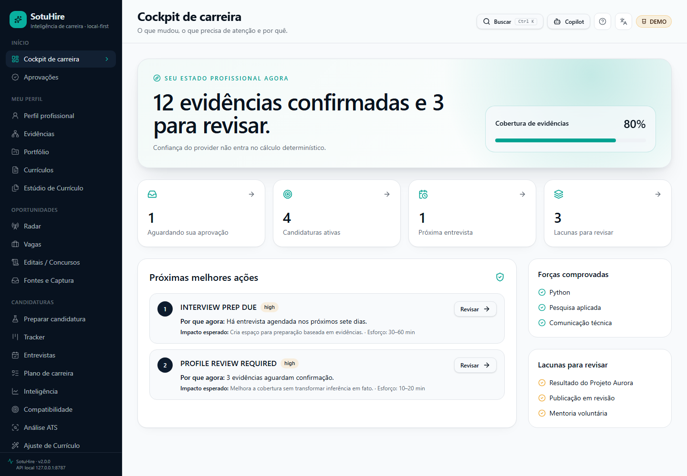
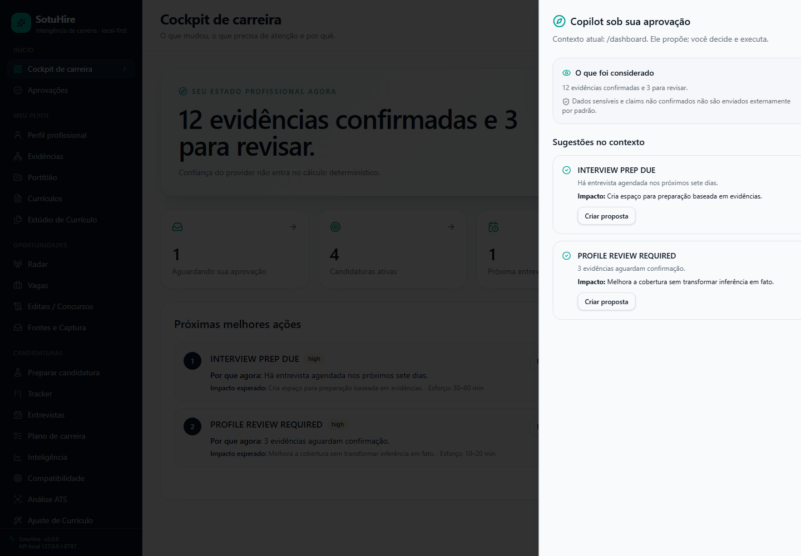
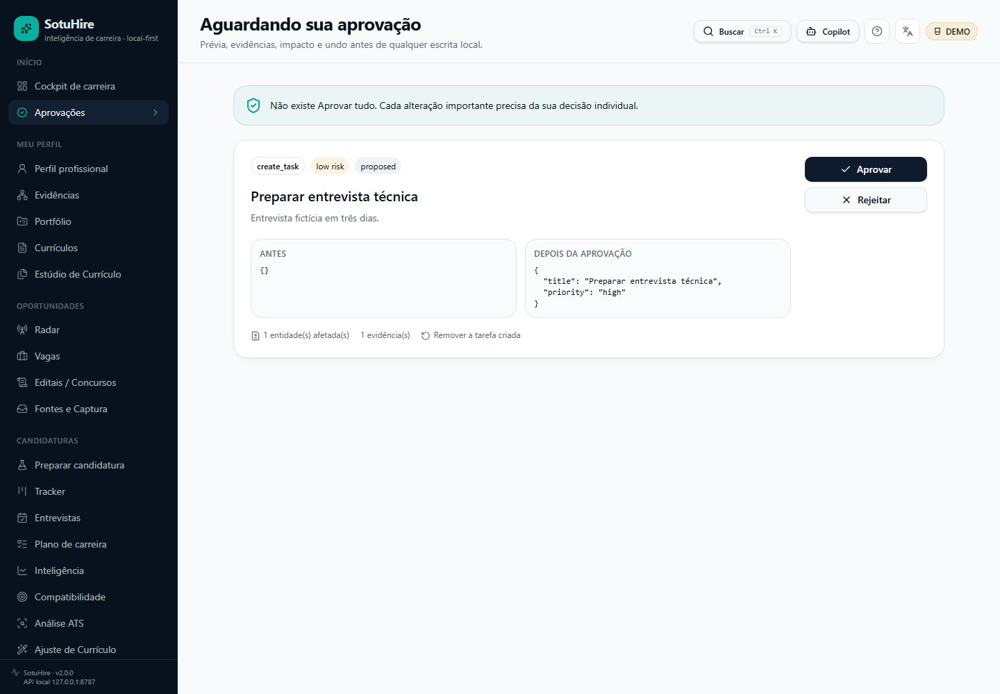
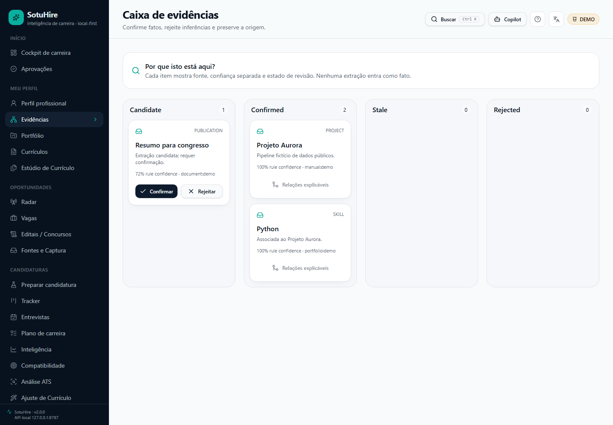
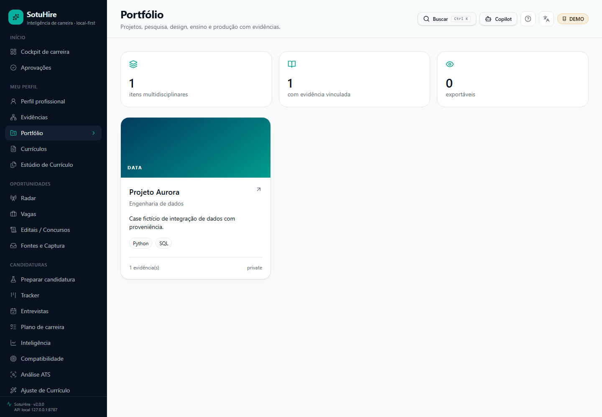
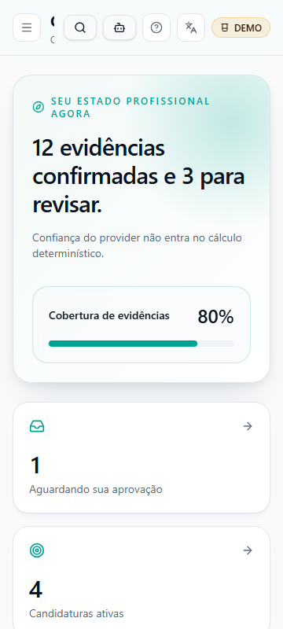

# SotuHire — Copiloto de Carreira Local-First com IA, Evidências e Aprovação Humana

[](https://github.com/Soturine/SotuHire/actions/workflows/ci.yml)
[](https://soturine.github.io/SotuHire/)
[](https://github.com/Soturine/SotuHire/releases/latest)
[](https://www.python.org/)
[](LICENSE)

O SotuHire ajuda estudantes e profissionais de diferentes áreas a compreender o estado da própria
carreira, organizar evidências e decidir a próxima ação. Ele conecta perfil, currículo, portfólio,
trajetória acadêmica, oportunidades, candidaturas, entrevistas e outcomes sem entregar decisões
importantes a uma automação opaca.

**O diferencial:** o Copilot pode observar, explicar, planejar e propor. Alterações importantes
seguem sempre **prévia → evidências → impacto → aprovação humana → execução local → audit → undo**.


## Por que existe

Ferramentas isoladas não respondem “onde estou?”, “o que está faltando?” ou “por que devo fazer
isso agora?”. O SotuHire cria continuidade entre dados confirmados e decisões. Inferências ficam
na [Caixa de Evidências](docs/05-user-guide/evidence.md); fatos confirmados formam o
[Evidence Graph](docs/02-architecture/evidence-graph.md); regras determinísticas produzem o
[Career State](docs/02-architecture/career-state-engine.md); o
[Copilot](docs/02-architecture/human-approved-copilot.md) transforma recomendações em propostas
individuais e reversíveis.

Serve a software, engenharia, saúde, direito, pesquisa, educação, design, artes, administração,
serviços, carreiras técnicas, concursos, início ou transição de carreira. GitHub é uma fonte útil
quando aplicável — nunca o centro obrigatório do produto.

## A jornada em cinco minutos

1. Inicie API e frontend e escolha idioma/tema.
2. Crie ou importe o perfil; nenhuma extração vira fato automaticamente.
3. Revise a Caixa de Evidências e confirme somente o que é verdadeiro.
4. Abra o Career Cockpit para prioridades, gaps, entrevistas e candidaturas.
5. Abra o Copilot, examine razão/evidências/impacto e crie uma proposta.
6. Aprove individualmente, execute localmente e use undo quando oferecido.

## Capacidades principais

| Área | O que entrega | Boundary |
| --- | --- | --- |
| Career Cockpit | estado, prioridades e saúde de dados/IA | sem score mágico único |
| Evidence Graph | nós e relações tipadas com origem, review e stale | inferência não vira fato |
| Portfólio | software, pesquisa, ensino, design, hardware, arte e mais | IA gera rascunho revisável |
| Acadêmico/profissional | Lattes, pesquisa, publicações, registros e resultados | números só confirmados |
| Next Best Actions | regras determinísticas e explicáveis | sem alterar pesos por outcome |
| Approval Queue | before/after, impacto, risco, evidence refs e undo | sem “Aprovar tudo” |
| Copilot | contexto mínimo, planos e tools allowlisted | writes viram propostas |
| Busca universal | rotas, evidências e portfólio | SQLite/local API, sem ElasticSearch |
| Application Lab | Match, ATS, Tailor, variante, kit e Tracker | candidatura sempre manual |
| Providers | local, Gemini, OpenAI, Ollama, LM Studio e compatíveis | opt-in e fallback explícito |

## Como tudo se conecta


```mermaid
flowchart LR
  S[Sources e documentos] --> I[Evidence Inbox]
  I --> P[Universal Profile]
  I --> G[Evidence Graph]
  P --> C[Career State]
  G --> C
  C --> N[Next Best Actions]
  N --> O[Career Copilot]
  O --> Q[Proposals]
  Q --> H{Human Approval}
  H -->|approve| A[Application Services]
  H -->|reject| U[Audit]
  A --> D[(SQLite + snapshots)]
  A --> U
  U --> C
```

```mermaid
flowchart TB
  W[React Web] --> F[FastAPI loopback]
  E[Extension 0.10.0] --> L[Local Companion 2.0]
  L --> F
  F --> X[Domain + application services]
  X --> DB[(SQLite schema 8)]
  X --> R[Provider Router]
  R --> LP[Local deterministic]
  R --> GP[Gemini / OpenAI]
  R --> OP[Ollama / LM Studio / compatible]
  M[MCP] -. não exposto na v2.0 .-> X
```

Detalhes: [arquitetura v2](docs/02-architecture/data-flow.md),
[tool registry](docs/02-architecture/copilot-tool-registry.md),
[segurança](docs/06-engineering/v2-security-threat-model.md) e
[privacidade do contexto](docs/04-ai/copilot-context-and-privacy.md).

## Screenshots

| Career Cockpit | Copilot contextual |
| --- | --- |
|  |  |

| Approval Queue | Evidence Inbox |
| --- | --- |
|  |  |

| Portfólio | Mobile |
| --- | --- |
|  |  |

Galeria completa e roteiro: [demo de 3–5 minutos](docs/09-portfolio/demo-script.md).

## Instalação

Requisitos: Python 3.11/3.12, Node.js 22+, npm e Git.

```bash
git clone https://github.com/Soturine/SotuHire.git
cd SotuHire
python -m venv .venv
```

### Windows PowerShell

```powershell
.\.venv\Scripts\Activate.ps1
python -m pip install --upgrade pip
pip install -e .[dev]
cd apps/web
npm ci
cd ../..
```

### Linux e macOS

```bash
source .venv/bin/activate
python -m pip install --upgrade pip
pip install -e ".[dev]"
cd apps/web && npm ci && cd ../..
```

Em dois terminais:

```bash
python scripts/run_api.py
```

```bash
cd apps/web
npm run dev
```

Abra `http://127.0.0.1:5173`. A API permanece em loopback; os contratos v1 continuam em
`/api/v1` e o núcleo Copilot/Evidence usa `/api/v2`.

Companion e extensão: `python -m modules.local_api.server` e depois carregue
`browser-extension/` em `chrome://extensions`. Veja o [guia da extensão](browser-extension/README.md).

## IA e providers

O produto funciona sem IA externa. Em **Configurações → IA**, escolha:

- **Local deterministic:** estado, ranking e regras sem modelo;
- **Gemini/OpenAI:** somente com chave no backend e opt-in;
- **Ollama/LM Studio/OpenAI-compatible:** endpoint loopback por padrão.

Antes de compartilhar contexto externo, o SotuHire informa purpose, quantidade de itens, estimativa
de tokens e itens sensíveis omitidos. Registro profissional é sensível e não sai por padrão.
Veja [providers](docs/04-ai/provider-strategy.md) e [context budget](docs/04-ai/copilot-context-and-privacy.md).

## Privacidade e segurança

Dados estruturados v2 usam SQLite. JSON/JSONL permanece apenas para compatibilidade, fixtures e
export onde necessário. Conteúdo de vagas, PDF, README, RSS, portfólio e web é não confiável e não
pode escolher tools, alterar system instructions ou contornar aprovação.

### O que o SotuHire NÃO faz

- auto-apply, candidatura ou inscrição em massa;
- login, CAPTCHA bypass ou captura de cookie/sessão/senha/token;
- envio automático de currículo, e-mail ou resposta a recrutador;
- pagamento ou submissão de formulário;
- alteração silenciosa do perfil;
- invenção de experiência, skill, formação, publicação, registro ou resultado.

Threat model: [Copilot, tools, anexos, busca e prompt injection](docs/06-engineering/v2-security-threat-model.md).

## Migração e recuperação

Schema 6 ou 7 pode avançar explicitamente ao schema 8, com backup, dry-run e verify:

```bash
python scripts/migrate_local_data.py --dry-run
python scripts/migrate_local_data.py --apply
python scripts/migrate_local_data.py --verify
python scripts/check_data_health.py
```

Arquivos legados não são apagados. Leia o [guia de migração v2](docs/06-engineering/v2-migration-and-recovery.md).

## Desenvolvimento, testes e documentação

```bash
ruff check .
ruff format --check .
pyright
pytest
mkdocs build --strict
cd apps/web
npm run test:unit
npm run lint
npm run typecheck
npm run build
npm run test:e2e
```

- [Documentação publicada](https://soturine.github.io/SotuHire/)
- [Índice completo da documentação](docs/documentation-index.md)
- [Visão do produto](docs/01-product/v2-product-vision.md)
- [Evidence Graph](docs/02-architecture/evidence-graph.md)
- [Human-Approved Copilot](docs/02-architecture/human-approved-copilot.md)
- [Approval Queue](docs/02-architecture/approval-queue.md)
- [Frontend v2](docs/02-architecture/frontend-v2.md)
- [Application Lab](docs/02-architecture/application-lab.md)
- [Roadmap](docs/01-product/roadmap.md)
- [Release v2.0](docs/releases/v2.0.md)
- [Histórico de mudanças](CHANGELOG.md)

## Post-v2

O roadmap não promete uma versão arbitrária. Próximos investimentos dependem de feedback real:
qualidade de recomendações com amostra (`n`), acessibilidade, conectores aprovados, migração gradual
de compatibilidade legada e possível MCP local somente após validar transporte, token e scopes.

## Licença

[Apache License 2.0](LICENSE). Contribuições seguem [CONTRIBUTING.md](CONTRIBUTING.md).
