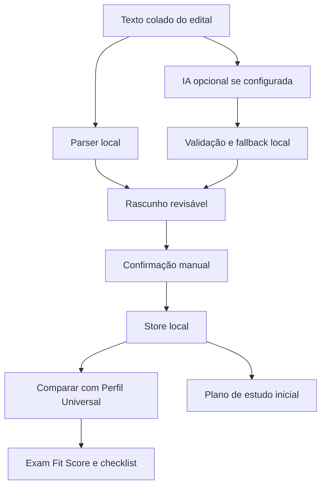

# Concurso Mode: fundação para editais e provas públicas

O **Concurso Mode** deixou de ser apenas uma ideia documental na v1.9.3. O SotuHire agora tem uma fundação real para editais, concursos públicos, processos seletivos públicos, bolsas, residências, estágios públicos e chamadas institucionais.

Na v1.9.4, essa fundação ganhou validação de IA real via Gemini/OpenAI configurados no backend local, fallback explícito e importação de capturas da extensão como `public_exam`.

Essa fundação ainda não é um sistema completo de concursos. Ela existe para organizar texto colado de edital, separar dados críticos, comparar requisitos com o Perfil Profissional Universal e preparar próximos passos revisáveis.

> O SotuHire ajuda a organizar e interpretar editais, mas o edital oficial sempre prevalece. Revise manualmente requisitos, datas, taxa, documentos, conteúdo programático e regras da banca.

## O que existe na v1.9.3

- módulo separado `modules/public_exams/`;
- importação de edital por texto colado;
- parser local para órgão, banca, cargo, salário, taxa, datas, requisitos, etapas, documentos e conteúdo programático;
- IA/Gemini opcional como extrator assistido, sempre com revisão humana e fallback local;
- store local em JSON para editais confirmados;
- endpoints `/api/v1/public-exams`;
- tela inicial **Editais / Concursos** no frontend moderno;
- comparação inicial com Perfil Profissional Universal, Career Context Engine e evidências acadêmicas/Lattes confirmadas;
- `ExamFitScore` inicial;
- checklist de requisitos/documentos;
- `StudyPlanDraft` simples;
- preparação de Radar/Tracker para tratar oportunidade pública sem misturar com vaga privada.

## Reforços da v1.9.4

- provider/modelo selecionado em Configurações de IA é usado no extrator de edital quando `use_ai=true`;
- fallback local continua obrigatório quando Gemini/OpenAI falham;
- extensão captura edital/concurso sem login, cookies, tokens, sessão, headers ou storage de terceiros;
- site importa captura para `/public-exams` como rascunho revisável;
- contexto seguro da extensão não entrega Perfil completo nem API key.

## Por que é um domínio separado

Edital não é vaga privada. Concurso tem regras próprias: órgão, banca, cargo, requisitos legais, datas, taxa, conteúdo programático, etapas, prova, títulos e documentos.

Por isso a implementação vive em:

```text
modules/public_exams/
```

Essa separação evita misturar matching de emprego privado com regras administrativas, legais e documentais de oportunidades públicas.

## Entidades principais

- `ExamNotice`: edital, órgão, banca, fonte, versão local, cargos, documentos e warnings;
- `ExamRole`: cargo, área, regime, localidade, remuneração, vagas, requisitos, etapas e disciplinas;
- `ExamRequirement`: formação, registro, experiência, título, documento ou regra exigida;
- `ExamSubject`: disciplina, tópico, etapa, peso e prioridade quando disponíveis;
- `ExamTimeline`: inscrição, pagamento, prova, resultado, recursos e envio de documentos;
- `ExamFitScore`: aderência inicial ao Perfil Profissional Universal;
- `StudyPlanDraft`: plano de estudos inicial e revisável por disciplina.

## Fluxo atual



## Fora de escopo

- upload direto de PDF/HTML;
- crawler de editais;
- busca automática na internet;
- login em banca ou órgão;
- inscrição automática;
- pagamento de taxa;
- emissão de boleto;
- envio automático de documentos;
- decisão final de elegibilidade;
- promessa de aprovação.

## Limites de segurança

- Não faz inscrição automática.
- Não substitui leitura oficial do edital.
- Não faz login em plataformas de concurso.
- Não captura cookies, tokens, sessão, headers ou storage de terceiros.
- Não faz scraping autenticado.
- Não faz CAPTCHA bypass.
- Não promete aprovação.
- Não decide elegibilidade final sem revisão humana.
- Não altera `/api/v1/sources/authenticated-browser/collect`.

Leia também: [Fundação para Editais e Concursos](../02-architecture/public-exams-foundation.md).
