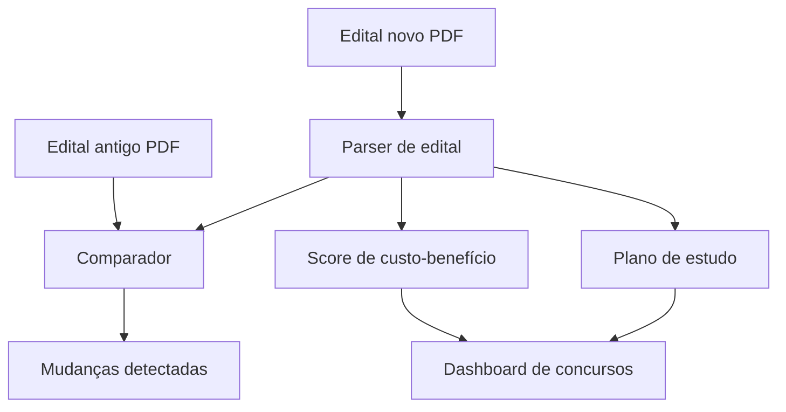

# Concurso Mode: modo futuro para editais e provas públicas

O **Concurso Mode** é uma ideia forte, mas deve ficar fora do MVP principal. Ele usa raciocínio parecido com análise de vagas, porém o domínio é outro: edital, banca, regime, conteúdo programático, datas, salário, benefícios e histórico de chamadas.

## Por que não entra no MVP

O MVP do SotuHire precisa validar primeiro:

- currículo;
- vaga;
- match;
- ATS;
- preferências;
- tracker.

Concurso exige parsers de PDF mais complexos e regras jurídicas/administrativas específicas. Misturar tudo agora causaria explosão de escopo.

## Oportunidade de produto

Concurseiros gastam muito com performance, organização e análise de editais. Um modo de inteligência para concursos pode virar produto próprio no futuro.

## Entidades principais

- edital;
- cargo;
- banca;
- órgão;
- estado/cidade;
- salário;
- benefícios;
- taxa de inscrição;
- número de vagas;
- cadastro reserva;
- regime: estatutário, CLT, temporário;
- datas;
- conteúdo programático;
- peso por disciplina;
- requisitos;
- histórico de convocações.

## Fluxo futuro



## Comparações úteis

O sistema pode comparar:

- edital antigo vs novo;
- cargo A vs cargo B;
- estado A vs estado B;
- banca A vs banca B;
- salário vs volume de conteúdo;
- vagas imediatas vs cadastro reserva;
- regime estatutário vs CLT.

## Saída esperada

```json
{
  "exam_fit_score": 82,
  "salary_score": 75,
  "study_effort_score": 60,
  "time_until_exam_days": 90,
  "regime": "CLT",
  "recommendation": "priorizar com cautela",
  "detected_changes": ["aumentou conteúdo de legislação", "mudou banca"]
}
```

## Roadmap

- v1.0 experimental: comparar editais simples.
- v1.1: extrair conteúdo programático.
- v1.2: calcular plano de estudo.
- v1.3: histórico de bancas.
- v1.4: radar de editais.

## Relação com SotuHire

O SotuHire deve documentar essa possibilidade, mas manter a implementação em pasta separada:

```text
modules/public_exams/
```

Isso preserva arquitetura limpa e evita misturar regras de emprego privado com regras de concurso.
