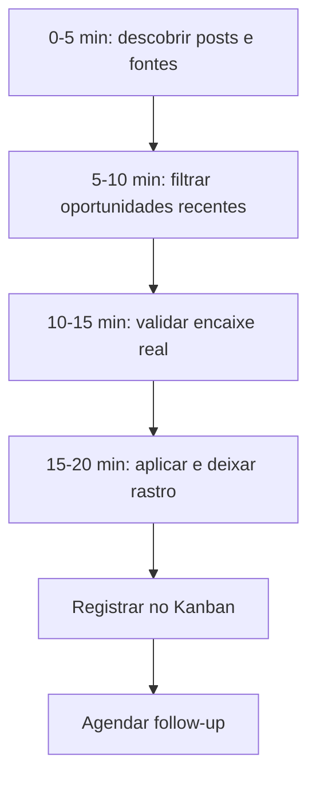

# Rotina Inteligente de Busca de Vagas

Este documento define a **Daily Job Search Routine** do SotuHire: uma rotina curta, repetível e rastreável para transformar a busca de vagas em processo, não em ansiedade.

A ideia vem de um problema real: muitas pessoas procuram vaga apenas abrindo o LinkedIn, digitando um cargo, clicando em "candidatar-se", enviando o mesmo currículo e esperando resposta. Isso parece ação, mas muitas vezes é só candidatura no automático.

O SotuHire deve ajudar o usuário a responder perguntas melhores:

- Onde procurar oportunidades além dos portais saturados?
- Quais posts indicam vaga antes da vaga virar anúncio formal?
- Qual vaga vale priorizar hoje?
- Meu currículo está alinhado com a vaga?
- Meu LinkedIn e GitHub confirmam o que eu digo no currículo?
- Existe recrutador, pessoa da empresa ou canal de contato visível?
- Quando devo fazer follow-up?
- Qual mensagem curta e profissional enviar?

## Objetivo

Criar uma rotina de **20 minutos por dia** para busca de vagas com estratégia.

A rotina não substitui o julgamento humano e não promete contratação. Ela organiza busca, triagem, aplicação, registro e follow-up.

## Fluxo de 20 minutos



### 0-5 minutos: descobrir posts e fontes

O usuário não deve procurar apenas em abas formais de vagas. O SotuHire deve sugerir buscas em:

- posts do LinkedIn colados manualmente;
- posts públicos encontrados em buscadores;
- páginas públicas de empresas;
- portais alternativos;
- comunidades;
- newsletters;
- sites de estágio;
- portais de trabalho remoto;
- ATS públicos como Gupy, Greenhouse, Lever e Ashby;
- portais brasileiros como CIEE, Companhia de Estágios, InfoJobs, InHire, Vagas.com, Catho e Nube.

### 5-10 minutos: filtrar oportunidades recentes

O sistema deve priorizar oportunidades das últimas 24 horas ou últimos 7 dias quando essa informação existir.

Regras:

- vaga antiga pode continuar válida, mas perde prioridade se estiver muito saturada;
- post recente com recrutador visível pode ter prioridade maior;
- vaga júnior/estágio recente deve ser analisada rapidamente;
- vaga com descrição vaga demais deve receber alerta de risco;
- vaga que exige senioridade incompatível deve ser descartada ou classificada como baixa prioridade.

### 10-15 minutos: validar encaixe real

Antes de aplicar, o SotuHire deve rodar um checklist:

- Tenho pelo menos 60% dos requisitos?
- Meu currículo mostra as palavras-chave principais dessa vaga?
- Meu LinkedIn confirma o que está no currículo?
- Meu GitHub/portfólio mostra algo relacionado?
- A senioridade é compatível?
- A localização/modalidade faz sentido?
- A empresa e a vaga parecem legítimas?
- Existe recrutador ou contato visível?

### 15-20 minutos: aplicar e deixar rastro

Depois de aplicar, o SotuHire deve sugerir uma mensagem curta para recrutador ou pessoa da empresa, sempre com revisão humana.

Modelo base:

```text
Olá, [nome]. Tudo bem?

Vi a vaga de [cargo] na [empresa] e me candidatei hoje.
Tenho experiência/interesse em [stack/contexto principal da vaga] e achei a oportunidade alinhada ao meu perfil.

Fico à disposição caso faça sentido conversar.
```

A mensagem deve ser curta, profissional e sem parecer desespero.

## Entradas da rotina

```json
{
  "target_role": "Analista de Dados Júnior",
  "seniority": "junior",
  "modality": ["remoto", "hibrido"],
  "location": "Brasil",
  "skills": ["SQL", "Python", "Power BI"],
  "daily_time_minutes": 20,
  "preferred_sources": ["LinkedIn Posts", "Gupy", "CIEE", "MeuHome", "Remotar"]
}
```

## Saídas esperadas

```json
{
  "generated_queries": [],
  "recommended_sources": [],
  "candidate_opportunities": [],
  "readiness_checklist": {},
  "message_draft": "",
  "kanban_card": {},
  "next_follow_up_date": ""
}
```

## Relação com outros módulos

- [Search Intelligence](../05-data-sources/search-intelligence.md)
- [Social Post Discovery](../05-data-sources/social-post-discovery.md)
- [Hidden Jobs Radar](../05-data-sources/hidden-jobs-radar.md)
- [Job Tracker Kanban](../07-development/job-tracker-kanban.md)
- [Follow-up Assistant](../07-development/follow-up-assistant.md)
- [Profile Score](../03-business-rules/profile-score.md)
- [Portfolio Analyzer](../05-data-sources/github-portfolio-analyzer.md)

## Critérios de aceitação

- A rotina deve gerar queries úteis por cargo, senioridade, stack, país e modalidade.
- A rotina deve priorizar oportunidades recentes.
- A rotina deve evitar candidaturas no escuro.
- A rotina deve sempre gerar registro no tracker.
- A rotina não deve aplicar automaticamente.
- A rotina não deve enviar mensagem automaticamente.
- A rotina deve permitir revisão humana antes de qualquer ação externa.

## Não objetivos

- Não automatizar candidatura em massa.
- Não burlar login, captcha ou limitação de plataforma.
- Não transformar o usuário em spammer.
- Não fingir que score alto garante contratação.

## Inspiração de produto

A lógica é parecida com a mentalidade do SoturAI e do SotuRail: observar sinais, classificar riscos, registrar histórico, aprender com evidências e evitar decisões impulsivas. No SotuHire, o mercado não é financeiro; o “mercado” é o conjunto de vagas, portais, posts, recrutadores e respostas do usuário.
