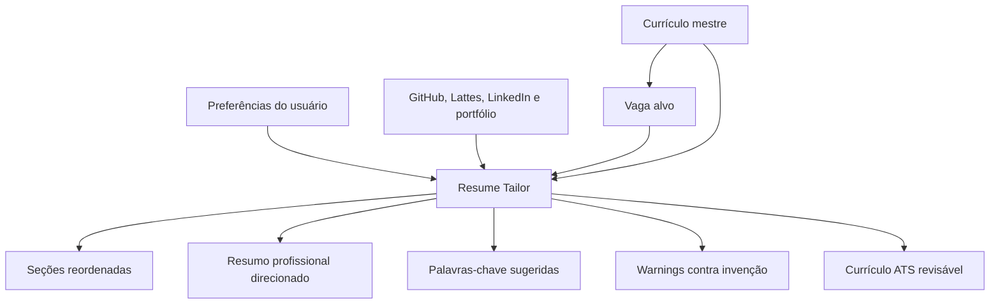

# Resume Tailor: currículo direcionado por vaga

O **Resume Tailor** é o módulo responsável por transformar um currículo mestre em uma versão direcionada para uma vaga específica. Ele não é um gerador de currículo fictício. Ele é um **alfaiate de evidências reais**: recebe histórico, projetos, formações, GitHub, Lattes, LinkedIn e portfólio, e reorganiza o que já existe para dar mais peso ao que a vaga realmente valoriza.

Links úteis:

- [JSON Resume Schema](https://jsonresume.org/schema) como inspiração de formato aberto para currículo mestre.
- [Gemini Structured Outputs](https://ai.google.dev/gemini-api/docs/structured-output) para respostas tipadas.
- [Pydantic](https://docs.pydantic.dev/) para validar as saídas antes de salvar ou exibir.

## Problema que o módulo resolve

Candidatos geralmente usam o mesmo currículo para todas as vagas. Isso cria três problemas:

1. Experiências relevantes ficam escondidas.
2. Palavras-chave da vaga não aparecem de forma clara.
3. O currículo não conversa com o ATS nem com o recrutador humano.

O SotuHire resolve isso com uma versão direcionada, mas mantendo a verdade factual.

## Conceito de currículo mestre

O currículo mestre é uma base completa com tudo que o usuário realmente fez:

- formação acadêmica;
- cursos;
- experiências profissionais;
- extensão universitária;
- projetos pessoais;
- projetos GitHub;
- portfólio;
- publicações;
- Lattes;
- certificações;
- idiomas;
- tecnologias;
- conquistas verificáveis.

Ele pode usar o padrão [JSON Resume](https://jsonresume.org/schema) como base, mas o SotuHire adiciona metadados próprios:

```json
{
  "fact": "Projeto SotuHire usa Python, IA e análise de vagas",
  "source": "github",
  "evidence": "README.md",
  "confidence": 0.95,
  "can_use_in_resume": true,
  "last_verified_at": "2026-06-12"
}
```

## Fluxo principal



## O que a IA pode fazer

A IA pode:

- reordenar seções;
- reescrever bullets com linguagem mais clara;
- dar destaque para experiências compatíveis com a vaga;
- sugerir palavras-chave que já estejam sustentadas por evidência;
- adaptar o resumo profissional;
- apontar lacunas;
- sugerir o que remover de uma versão curta.

## O que a IA não pode fazer

A IA não pode:

- inventar cargo;
- inventar empresa;
- inventar curso;
- inventar certificação;
- inventar métrica;
- inventar fluência;
- transformar interesse em experiência;
- criar formação que não existe.

Regra absoluta:

```text
Se não existe evidência, a IA deve retornar warning, não escrever como fato.
```

## Exemplo do Colégio Embraer

Se a vaga for de tecnologia aplicada à indústria, aeroespacial, engenharia, dados industriais ou empresa próxima desse ecossistema, o SotuHire pode destacar formação técnica, base matemática, disciplina e contato com ambiente de alta exigência.

Se a vaga for web startup genérica, esse dado ainda pode existir, mas não precisa ser o primeiro destaque. O currículo direcionado muda a ênfase, não a verdade.

## Saídas esperadas

O módulo deve retornar:

- `section_order`;
- `tailored_summary`;
- `tailored_sections`;
- `keywords_added`;
- `warnings`;
- `evidence_source`;
- `invented_information=false`.

## MVP

No MVP, o Resume Tailor deve gerar apenas sugestões e Markdown revisável. DOCX e PDF entram depois.

## Evolução

1. Sugestões por seção.
2. Exportação Markdown.
3. Exportação DOCX.
4. Exportação PDF.
5. Múltiplas versões por vaga.
6. Histórico de currículos gerados.
