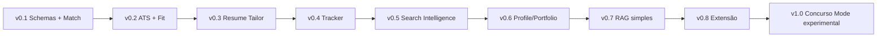

# Roadmap

## Estado atual — v0.9.0

Este roadmap está alinhado ao estado atual do SotuHire em **v0.9.0**.

A leitura correta é **current-first**:

1. entender o que já existe;
2. separar o que está em estabilização;
3. planejar os próximos marcos reais;
4. manter versões antigas apenas como histórico.

## O que já existe no produto

A v0.9.0 já inclui:

- análise local de currículo x vaga;
- Match Score determinístico inicial;
- ATS Score simples;
- Opportunity Fit Score;
- Risk Score;
- Resume Tailor seguro em modo sugestão;
- parsers de currículo e vaga;
- provider Gemini opcional;
- fallback local;
- histórico local;
- dashboard;
- Job Tracker;
- Search Intelligence;
- Hidden Jobs Radar;
- Career Memory local;
- RAG lexical local;
- perfil profissional persistente;
- captura assistiva via extensão;
- Local Companion API;
- importação paginada de candidaturas já realizadas;
- análise de GitHub, repositórios, projetos e portfólios;
- modo standalone da extensão;
- modo conectado ao SotuHire local;
- documentação MkDocs;
- CI com Ruff e pytest;
- exemplos e fixtures fictícias.

## Correção de rota após v0.9.0

O projeto não está mais no estágio de MVP inicial.

A próxima fase não deve ser descrita como “começar parser”, “criar tracker” ou “fazer extensão no futuro”, porque essas partes já existem.

A próxima fase correta é:

```text
Estabilizar v0.9.0
-> estruturar extração por IA
-> tornar o produto multiárea
-> aprofundar GitHub/Portfolio Analyzer
-> substituir match simples por Match Engine 2.0
-> fechar v1.0 como copiloto de carreira generalista
```

## Estratégia geral atual

O SotuHire deve evoluir em etapas pequenas, mas a regra agora é:

> Primeiro estabilizar o que já existe. Depois aprofundar IA estruturada. Depois escalar para múltiplas áreas.

O núcleo do produto deixa de ser apenas “currículo + vaga” e passa a ser:

```text
Currículo + vaga + portfólio + histórico + preferências + evidências
```

O produto deve continuar local-first, explicável e com revisão humana.

## Próximo ciclo real

O próximo ciclo real é a transição para a v0.10.0:

- Prompt Registry;
- prompts versionados por função;
- structured output com schemas;
- extração de currículo por IA;
- extração de vaga por IA;
- Domain Intelligence multiárea;
- confidence por campo;
- revisão humana de campos incertos;
- fallback heurístico preservado;
- fixtures multiárea;
- preparação para Match Engine 2.0.

## Marcos planejados a partir da v0.9.0

| Versão | Foco | Resultado esperado |
| --- | --- | --- |
| v0.9.1 | estabilização documental e polimento | roadmap, visão, README e changelog alinhados ao estado real |
| v0.10.0 | AI Structured Extraction + Domain Intelligence | currículo e vaga extraídos por IA em JSON validado |
| v0.11.0 | GitHub Analyzer 2.0 | análise profunda de repo com GitHub API, sampler, evidências e score de portfólio |
| v0.12.0 | Match Engine 2.0 | match por requisitos, evidências, domínio, confidence e gaps críticos |
| v1.0 | produto generalista estável | demo multiárea, prompts estáveis, docs e fluxo confiável |

## O que fica como histórico

As seções abaixo registram decisões e marcos anteriores.

Elas não devem ser lidas como próximos passos atuais.

Quando uma seção antiga disser que algo é “futuro”, conferir primeiro a tabela acima e o README atual.

## Histórico — Roadmap entregue até v0.4

O roadmap inicial foi consolidado em 12 de junho de 2026:

- **v0.1:** núcleo determinístico, Pydantic, scores e Resume Tailor seguro;
- **v0.2:** UX guiada, modo rápido/avançado e parsers automáticos;
- **v0.3:** provider estruturado, Gemini opcional, fallback local e exports;
- **v0.4:** tracker local, histórico e dashboard inicial.

As seções históricas abaixo continuam registradas para preservar decisões anteriores.

## v0.1 - Núcleo do produto

Foco: entregar o **SotuHire v0.1 — MVP Core** como análise local, funcional, explicável e testável de currículo + vaga + preferências.

Entregas:

- campo para texto do currículo;
- campo para descrição da vaga;
- preferências de modalidade, localização, salário, contrato e senioridade;
- schemas Pydantic para preferências, análise, currículo mestre e Resume Tailor;
- Match Score determinístico;
- ATS Score simples;
- Opportunity Fit Score;
- Risk Score simples;
- recomendação final explicável;
- pontos fortes, gaps e palavras-chave ausentes;
- Resume Tailor em modo sugestão com regra anti-invenção;
- Streamlit simples;
- tratamento básico de texto vazio e erro;
- testes pytest;
- Ruff.

Critério de pronto:

- usuário consegue rodar localmente;
- currículo, vaga e preferências geram relatório estruturado;
- scores permanecem entre 0 e 100;
- regras de negócio rodam sem depender da UI ou de LLM;
- sugestões do Resume Tailor não inventam experiência;
- erros básicos são tratados.

Fora da v0.1:

- scraping real;
- extensão Chrome;
- auto-apply ou envio automático para recrutador;
- DOCX/PDF final;
- PyTorch, fine-tuning e multi-agent complexo;
- Concurso Mode funcional.

## v0.2 - Saída estruturada

Foco: transformar o relatório em dados confiáveis.

Entregas:

- schema Pydantic;
- JSON com score, recomendação, listas e mensagem;
- validação de resposta;
- UI com componentes Streamlit;
- fallback para resposta inválida.

Critério de pronto:

- UI não depende de texto solto;
- score aparece como métrica;
- listas aparecem organizadas;
- output inválido não quebra a aplicação.

## v0.3 - Regras de negócio

Foco: deixar critérios explícitos e testáveis.

Entregas:

- regras de senioridade;
- termos prioritários;
- termos impeditivos;
- classificação de recomendação;
- score de risco;
- testes unitários.

Critério de pronto:

- regras rodam sem IA;
- testes passam;
- alteração de regra não exige mexer na UI.

## v0.4 - QA e qualidade

Foco: mostrar engenharia.

Entregas:

- pytest;
- Ruff;
- pyproject.toml;
- GitHub Actions;
- fixtures;
- mocks para IA;
- comandos de desenvolvimento.

Critério de pronto:

- `ruff check .` passa;
- `ruff format . --check` passa;
- `pytest` passa;
- CI passa no GitHub.

## v0.5 - Persistência local

Foco: histórico.

Entregas:

- SQLite;
- salvar análises;
- listar histórico;
- filtrar por status;
- editar status;
- exportar CSV/JSON.

Critério de pronto:

- análise fica salva;
- usuário consegue ver histórico;
- dados sensíveis não são versionados.

## v0.6 - Scraping responsável

Foco: começar coleta automática controlada.

Entregas:

- interface de fontes;
- conector manual;
- conector de página pública simples;
- normalizador;
- deduplicação;
- rate limit;
- cache;
- logs;
- fixtures HTML.

Critério de pronto:

- conector roda sem login;
- não acessa área privada;
- respeita limites;
- não faz auto-apply;
- testes usam fixtures locais.

## v0.7 - Hidden Jobs Radar

Foco: identificar oportunidades em textos informais.

Entregas:

- classificador de post;
- extração de cargo/empresa/local/contato;
- score de confiança;
- match com currículo;
- mensagem sugerida para abordagem;
- salvamento no tracker.

Critério de pronto:

- texto de post colado vira oportunidade estruturada;
- falso positivo é sinalizado;
- usuário revisa antes de qualquer ação.

## v0.8 - Job Tracker

Foco: organizar busca.

Entregas:

- tabela de vagas;
- status da candidatura;
- campos de contato;
- data de aplicação;
- notas;
- filtros;
- métricas simples.

Status sugeridos:

```text
saved
analyzed
applied
interview
rejected
offer
archived
```

## v0.9 - Extensão assistiva

Foco: reduzir copiar/colar.

Entregas:

- extensão lê página aberta pelo usuário;
- envia texto ao app local;
- mostra match;
- salva no tracker;
- sem auto-apply;
- sem envio automático de mensagens.

## v1.0 - Produto apresentável

Foco: portfólio forte.

Entregas:

- README com screenshots;
- demo em vídeo/GIF;
- docs publicadas;
- CI;
- testes;
- release;
- exemplos fictícios;
- roadmap claro.

## Pós-v1

Ideias futuras:

- suporte a currículo DOCX;
- exportação de relatório PDF;
- comparação entre múltiplos currículos;
- modo local com LLM via Ollama;
- embeddings;
- ranking semântico;
- dashboard mais avançado;
- alertas por e-mail/Telegram;
- deploy opcional.

---

## Histórico legado — Roadmap expandido: copiloto completo de carreira

Esta seção foi mantida para rastreabilidade. Alguns itens listados como futuros já foram antecipados na v0.8.0 ou v0.9.0. Para planejamento atual, usar a seção **Marcos planejados a partir da v0.9.0**.

## v0.6 - Search Intelligence

- Gerar queries por cargo, stack, senioridade, modalidade e país.
- Criar busca por domínio com `site:`.
- Sugerir fontes alternativas por perfil.
- Integrar com [Alternative Job Boards](../05-data-sources/alternative-job-boards.md).
- Priorizar fontes para estágio, júnior, trainee, remoto e híbrido.

## v0.7 - Social Opportunity Radar

- Detectar oportunidade em post colado.
- Extrair cargo, empresa, stack, local e contato.
- Classificar confiança do post.
- Criar card no tracker.
- Gerar mensagem curta para recrutador.

## v0.8 - Job Tracker Kanban

- Criar colunas de candidatura.
- Salvar score, fonte, link e próximo follow-up.
- Gerar métricas por fonte.
- Evitar candidatura duplicada.

## v0.9 - Profile Score Engine

- LinkedIn Score por CSV exportado.
- Portfolio Score por GitHub/portfólio.
- Lattes Score quando o usuário fornecer dados acadêmicos.
- Readiness Score combinando perfil + vaga.

## v1.0 - RAG Memory

- Indexar currículo, vagas, posts, projetos, LinkedIn, Lattes e histórico.
- Recuperar evidências relevantes para cada análise.
- Explicar recomendações com base em fontes internas.

## Histórico legado — v1.1 Browser Extension Assistant antecipado na v0.9.0

- Botão para analisar vaga aberta.
- Botão para salvar vaga no tracker.
- Botão para analisar post informal.
- Botão para analisar repositório/portfólio.
- Sempre exigir confirmação do usuário.

## v1.2 - Alerts Engine

- Alertas de vaga com alto match.
- Alertas de follow-up.
- Alertas de fonte nova.
- Futuro: Telegram/e-mail.

## v1.3 - Multi-provider AI

- Interface `AIProvider`.
- Gemini, OpenAI, OpenRouter e Ollama.
- Comparação de custo/qualidade.
- Modo local-first quando possível.

## Ajuste de rota: Resume Tailor, preferências e concursos

A partir da análise das referências e das perguntas de validação do produto, o roadmap passa a separar claramente o que é MVP, o que é evolução natural e o que é produto futuro.

### MVP imediato

- Schemas Pydantic — v0.1.
- Análise currículo x vaga — v0.1.
- ATS Score — v0.1.
- Match Score — v0.1.
- Opportunity Fit Score — v0.1.
- Resume Tailor em modo sugestão — v0.1.

### Evolução de produto

- Tracker/Kanban.
- RAG simples de carreira.
- GitHub/Portfolio Score.
- LinkedIn/Profile Score.
- Extensão assistiva local.
- Resume Tailor com DOCX/PDF revisável.

### Futuro separado

- Concurso Mode.
- ML avançado com embeddings locais.
- Agentes especializados.
- Reranking semântico com modelos próprios.

### Mermaid histórico do roadmap consolidado antigo


# Marco entregue: v0.5.0

A v0.5.0 transforma o fluxo guiado em uma demonstração utilizável sem dados pessoais:

- análise automática no modo rápido;
- setup local assistido do Gemini;
- exemplos fictícios e expected outputs;
- skills técnicas limpas;
- dashboard filtrável;
- regressões do fluxo real simulado.

Scraping real, extensão Chrome, auto-apply, envio automático, PyTorch obrigatório e Concurso Mode funcional continuam fora deste marco.

# Marco entregue: v0.6.0

A v0.6.0 inicia Search Intelligence e Hidden Jobs Radar em modo estritamente seguro:

- gera queries e cargos equivalentes;
- sugere fontes públicas e alertas manuais;
- cria rotina semanal de busca;
- não acessa rede, não raspa páginas e não envia mensagens;
- diferencia claramente modo rápido e avançado;
- adiciona diagnóstico real do Gemini e screenshots reproduzíveis.

Scraping responsável permanece uma etapa futura separada, dependente de políticas por fonte, rate limit, cache e revisão humana.

# Marco entregue: v0.7.0

A v0.7.0 transforma a estratégia em coleta pública acionável:

- conecta URL manual, RSS/Atom, listagens e páginas públicas de carreira;
- adiciona registry e fontes configuráveis;
- usa robots.txt, user-agent identificável, cache, rate limit e logs;
- normaliza e deduplica oportunidades antes da análise;
- permite analisar e salvar oportunidades no tracker;
- torna Search Intelligence e Hidden Jobs Radar acionáveis;
- corrige o roteamento da chave Gemini da sessão para a análise real.

Coleta autenticada autorizada passa a integrar o escopo após a v0.7.0. Bypass de bloqueios,
auto-apply e envio automático permanecem fora do roadmap entregue.

# Ajuste de escopo: captura assistida

A coleta da v0.7 passa a distinguir páginas públicas, URL única e captura assistida. A captura assistida permite que a pessoa usuária envie a vaga ou publicação atualmente aberta, inclusive dentro de sua própria sessão autenticada.

Próximo marco:

- extensão com ação **Salvar vaga atual**;
- ação **Analisar vaga atual**;
- ação **Enviar para tracker**;
- preview do conteúdo antes do envio;
- permissões mínimas por página.

Crawling autenticado autorizado foi implementado como modo separado, conectado via CDP a uma
sessão iniciada pela pessoa usuária. Auto-apply e bypass continuam fora desse marco.

# Marco entregue: v0.8.0

A v0.8.0 adiciona memória de carreira e inteligência personalizada:

- memória local de currículos, projetos, análises, feedbacks, oportunidades e tracker;
- RAG lexical com evidências usadas na recomendação;
- perfil profissional persistente e preferências inferidas;
- export/import e controles explícitos de privacidade;
- contexto relevante opcional para Gemini, desativado por padrão;
- Search Intelligence e Hidden Jobs Radar personalizados pelo histórico;
- registro de vagas às quais a pessoa já se candidatou.

Próximos passos: embeddings locais opcionais, avaliação longitudinal das recomendações e extensão
assistiva para capturar a vaga atual.

# Marco entregue: v0.9.0

A v0.9.0 entrega o Browser Companion assistivo e calibra a memória:

- extensão multiportal para LinkedIn, Gupy, Indeed, InfoJobs, Nube, páginas de carreira e outros;
- Local Companion API restrita a localhost;
- captura, análise e tracker para a vaga atual;
- importação paginada de centenas de candidaturas;
- deduplicação entre portais com preservação de todas as fontes;
- ranking de requisitos recorrentes no dashboard;
- feedback útil/não útil e ranking calibrado de evidências;
- extração opcional de currículo por Gemini com fallback local.
- análise standalone/conectada de GitHub, repositórios, projetos e portfólios;
- evidências de README, commits e stack técnica reutilizadas nas vagas.

Próximos passos: edição visual do Kanban, export de ranking, provedores adicionais e embeddings
locais opcionais.

# Correção de rota pós-v0.9.0

A seção histórica acima deve ser lida como registro da evolução do projeto. A partir da v0.9.0, o produto já possui extensão, Local Companion API, Career Memory, RAG lexical, tracker, Hidden Jobs Radar, Search Intelligence, extração opcional por Gemini e análise GitHub/portfólio.

Portanto, o próximo roadmap não deve tratar extensão, RAG ou GitHub como ideias distantes. O foco agora é estabilizar, aprofundar IA estruturada, generalizar para múltiplas áreas e fortalecer a análise baseada em evidências.

## Princípios do roadmap corrigido

1. Não adicionar features soltas antes de estabilizar o fluxo.
2. Não deixar o produto enviesado para TI.
3. Não depender só de heurísticas quando a IA estruturada puder extrair melhor.
4. Não deixar a IA calcular tudo sem validação.
5. Não deixar a extensão carregar a inteligência pesada.
6. Não reduzir qualidade de documentação, testes e explicabilidade.
7. Não mexer no escopo de coleta autenticada dentro desta revisão.

## v0.9.1 — Estabilização documental e clareza

Foco: alinhar documentação com o estado real da v0.9.0.

Entregas:

- corrigir leitura do roadmap;
- documentar visão multiárea;
- documentar Prompt Catalog;
- documentar AI Orchestration;
- documentar GitHub Analyzer 2.0;
- documentar Match Engine 2.0;
- criar plano de v0.10, v0.11 e v0.12;
- manter docs existentes sem redução.

Critério de pronto:

- MkDocs lista os novos documentos;
- roadmap indica próximos marcos reais;
- prompts têm contratos de entrada e saída;
- multiárea aparece como decisão central de produto.

## v0.10.0 — AI Structured Extraction e Domain Intelligence

Foco: Gemini ou outro provider deve extrair informações do currículo e da vaga de forma estruturada, validada e multiárea.

Entregas:

- Prompt Registry;
- `resume_extraction_v1`;
- `job_extraction_multi_domain_v1`;
- `ats_analysis_v1`;
- `match_analysis_evidence_based_v1`;
- schemas Pydantic;
- JSON Guard;
- confidence por campo;
- comparação parser local x IA;
- UI de revisão;
- fixtures multiárea.

Critério de pronto:

- currículo de TI, enfermagem, pedagogia, engenharia civil e psicologia são extraídos em schema;
- vaga de TI, enfermagem, arquitetura, engenharia e curso técnico é extraída em schema;
- campos críticos têm confidence;
- registro profissional ausente não é inventado;
- fallback local continua funcionando.

## v0.11.0 — GitHub Analyzer 2.0

Foco: substituir análise rasa de repo por pipeline profundo no backend/site, com a extensão funcionando como ponte.

Entregas:

- GitHub API client;
- full repository tree;
- directory tree filtrada;
- file sampler;
- raw file reader;
- dependency graph simples;
- cache por SHA;
- prompt `github_repo_analysis_v2`;
- scores por dimensão;
- evidências por arquivo;
- bullets seguros para currículo;
- comparação repo x vaga;
- página de Portfólio/GitHub Analyzer no site.

Critério de pronto:

- repo por URL gera relatório validado;
- relatório cita evidências por arquivo;
- scores finais são calculados por código;
- extensão envia owner/repo e abre relatório completo;
- relatório pode ser salvo na Career Memory.

## v0.12.0 — Match Engine 2.0 multiárea

Foco: trocar match simples por engine de requisitos, evidências, domínio e confiança.

Entregas:

- requisitos classificados;
- score ponderado por domínio;
- gaps críticos;
- competências transferíveis;
- score de evidência;
- score de confiança;
- explicação por requisito;
- travas por knockout gaps;
- integração com ATS, Resume Tailor e Career Memory.

Critério de pronto:

- match não depende apenas de keyword;
- áreas não técnicas não são penalizadas por ausência de GitHub;
- registros profissionais obrigatórios viram gap crítico;
- competências transferíveis aparecem como parciais;
- recomendação final explica score e riscos.

## v1.0 — SotuHire generalista estável

Foco: fechar uma versão de portfólio/produto confiável.

Entregas:

- demo com múltiplas áreas;
- README alinhado;
- screenshots atualizadas;
- testes passando;
- cobertura documentada;
- prompts versionados;
- schemas estáveis;
- exemplos fictícios completos;
- vídeo/GIF de fluxo principal;
- docs publicadas.

Critério de pronto:

- pessoa consegue analisar currículo, vaga, GitHub/portfólio e tracker;
- produto funciona com áreas diferentes;
- resultados são explicáveis;
- dados sensíveis continuam locais por padrão;
- ações externas exigem revisão humana.

## Documentos de apoio

- [Estratégia multiárea](multi-domain-product-strategy.md)
- [Regras multiárea](../03-business-rules/multi-domain-career-rules.md)
- [Prompt Catalog](../04-ai/prompt-catalog.md)
- [AI Orchestration e Confidence](../04-ai/ai-orchestration-and-confidence.md)
- [v0.10.0 AI Structured Extraction](../07-development/v0.10.0-ai-structured-extraction.md)
- [v0.11.0 GitHub Analyzer 2.0](../07-development/v0.11.0-github-analyzer-2.md)
- [v0.12.0 Match Engine 2.0](../07-development/v0.12.0-match-engine-2.md)
