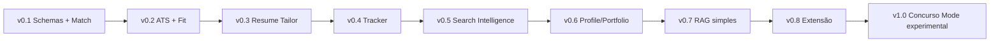

# Roadmap

## Estratégia geral

O SotuHire deve evoluir em etapas pequenas. A regra é:

> Primeiro entregar valor manualmente. Depois automatizar coleta. Depois escalar.

Não começar por scraper complexo. O núcleo do produto é o match entre currículo e vaga.

## Roadmap entregue até v0.4

O roadmap foi consolidado em 12 de junho de 2026:

- **v0.1:** núcleo determinístico, Pydantic, scores e Resume Tailor seguro;
- **v0.2:** UX guiada, modo rápido/avançado e parsers automáticos;
- **v0.3:** provider estruturado, Gemini opcional, fallback local e exports;
- **v0.4:** tracker local, histórico e dashboard inicial.

As seções históricas abaixo continuam registradas para preservar decisões anteriores. O próximo ciclo começa após validar a experiência v0.4 com dados fictícios variados.

### Próximo ciclo

- melhorar heurísticas e revisão dos parsers;
- adicionar filtros e tendências ao dashboard;
- RAG simples de carreira apoiado por evidências;
- Search Intelligence responsável;
- extensão assistiva apenas no futuro.

## v0.1 - Núcleo do produto

Foco: entregar o **SotuHire v0.1 — MVP Core** como análise local, funcional, explicável e testável de currículo + vaga + preferências.

Entregas:

- campo para texto do currículo;
- campo para descrição da vaga;
- preferências de modalidade, localização, salário, contrato e senioridade;
- schemas Pydantic para preferências, análise, currículo mestre e Resume Tailor;
- Match Score determinístico;
- ATS Score simples;
- Opportunity Fit Score;
- Risk Score simples;
- recomendação final explicável;
- pontos fortes, gaps e palavras-chave ausentes;
- Resume Tailor em modo sugestão com regra anti-invenção;
- Streamlit simples;
- tratamento básico de texto vazio e erro;
- testes pytest;
- Ruff.

Critério de pronto:

- usuário consegue rodar localmente;
- currículo, vaga e preferências geram relatório estruturado;
- scores permanecem entre 0 e 100;
- regras de negócio rodam sem depender da UI ou de LLM;
- sugestões do Resume Tailor não inventam experiência;
- erros básicos são tratados.

Fora da v0.1:

- scraping real;
- extensão Chrome;
- auto-apply ou envio automático para recrutador;
- DOCX/PDF final;
- PyTorch, fine-tuning e multi-agent complexo;
- Concurso Mode funcional.

## v0.2 - Saída estruturada

Foco: transformar o relatório em dados confiáveis.

Entregas:

- schema Pydantic;
- JSON com score, recomendação, listas e mensagem;
- validação de resposta;
- UI com componentes Streamlit;
- fallback para resposta inválida.

Critério de pronto:

- UI não depende de texto solto;
- score aparece como métrica;
- listas aparecem organizadas;
- output inválido não quebra a aplicação.

## v0.3 - Regras de negócio

Foco: deixar critérios explícitos e testáveis.

Entregas:

- regras de senioridade;
- termos prioritários;
- termos impeditivos;
- classificação de recomendação;
- score de risco;
- testes unitários.

Critério de pronto:

- regras rodam sem IA;
- testes passam;
- alteração de regra não exige mexer na UI.

## v0.4 - QA e qualidade

Foco: mostrar engenharia.

Entregas:

- pytest;
- Ruff;
- pyproject.toml;
- GitHub Actions;
- fixtures;
- mocks para IA;
- comandos de desenvolvimento.

Critério de pronto:

- `ruff check .` passa;
- `ruff format . --check` passa;
- `pytest` passa;
- CI passa no GitHub.

## v0.5 - Persistência local

Foco: histórico.

Entregas:

- SQLite;
- salvar análises;
- listar histórico;
- filtrar por status;
- editar status;
- exportar CSV/JSON.

Critério de pronto:

- análise fica salva;
- usuário consegue ver histórico;
- dados sensíveis não são versionados.

## v0.6 - Scraping responsável

Foco: começar coleta automática controlada.

Entregas:

- interface de fontes;
- conector manual;
- conector de página pública simples;
- normalizador;
- deduplicação;
- rate limit;
- cache;
- logs;
- fixtures HTML.

Critério de pronto:

- conector roda sem login;
- não acessa área privada;
- respeita limites;
- não faz auto-apply;
- testes usam fixtures locais.

## v0.7 - Hidden Jobs Radar

Foco: identificar oportunidades em textos informais.

Entregas:

- classificador de post;
- extração de cargo/empresa/local/contato;
- score de confiança;
- match com currículo;
- mensagem sugerida para abordagem;
- salvamento no tracker.

Critério de pronto:

- texto de post colado vira oportunidade estruturada;
- falso positivo é sinalizado;
- usuário revisa antes de qualquer ação.

## v0.8 - Job Tracker

Foco: organizar busca.

Entregas:

- tabela de vagas;
- status da candidatura;
- campos de contato;
- data de aplicação;
- notas;
- filtros;
- métricas simples.

Status sugeridos:

```text
saved
analyzed
applied
interview
rejected
offer
archived
```

## v0.9 - Extensão assistiva

Foco: reduzir copiar/colar.

Entregas:

- extensão lê página aberta pelo usuário;
- envia texto ao app local;
- mostra match;
- salva no tracker;
- sem auto-apply;
- sem envio automático de mensagens.

## v1.0 - Produto apresentável

Foco: portfólio forte.

Entregas:

- README com screenshots;
- demo em vídeo/GIF;
- docs publicadas;
- CI;
- testes;
- release;
- exemplos fictícios;
- roadmap claro.

## Pós-v1

Ideias futuras:

- suporte a currículo DOCX;
- exportação de relatório PDF;
- comparação entre múltiplos currículos;
- modo local com LLM via Ollama;
- embeddings;
- ranking semântico;
- dashboard mais avançado;
- alertas por e-mail/Telegram;
- deploy opcional.

---

# Roadmap expandido: copiloto completo de carreira

## v0.6 - Search Intelligence

- Gerar queries por cargo, stack, senioridade, modalidade e país.
- Criar busca por domínio com `site:`.
- Sugerir fontes alternativas por perfil.
- Integrar com [Alternative Job Boards](../05-data-sources/alternative-job-boards.md).
- Priorizar fontes para estágio, júnior, trainee, remoto e híbrido.

## v0.7 - Social Opportunity Radar

- Detectar oportunidade em post colado.
- Extrair cargo, empresa, stack, local e contato.
- Classificar confiança do post.
- Criar card no tracker.
- Gerar mensagem curta para recrutador.

## v0.8 - Job Tracker Kanban

- Criar colunas de candidatura.
- Salvar score, fonte, link e próximo follow-up.
- Gerar métricas por fonte.
- Evitar candidatura duplicada.

## v0.9 - Profile Score Engine

- LinkedIn Score por CSV exportado.
- Portfolio Score por GitHub/portfólio.
- Lattes Score quando o usuário fornecer dados acadêmicos.
- Readiness Score combinando perfil + vaga.

## v1.0 - RAG Memory

- Indexar currículo, vagas, posts, projetos, LinkedIn, Lattes e histórico.
- Recuperar evidências relevantes para cada análise.
- Explicar recomendações com base em fontes internas.

## v1.1 - Browser Extension Assistant

- Botão para analisar vaga aberta.
- Botão para salvar vaga no tracker.
- Botão para analisar post informal.
- Botão para analisar repositório/portfólio.
- Sempre exigir confirmação do usuário.

## v1.2 - Alerts Engine

- Alertas de vaga com alto match.
- Alertas de follow-up.
- Alertas de fonte nova.
- Futuro: Telegram/e-mail.

## v1.3 - Multi-provider AI

- Interface `AIProvider`.
- Gemini, OpenAI, OpenRouter e Ollama.
- Comparação de custo/qualidade.
- Modo local-first quando possível.

## Ajuste de rota: Resume Tailor, preferências e concursos

A partir da análise das referências e das perguntas de validação do produto, o roadmap passa a separar claramente o que é MVP, o que é evolução natural e o que é produto futuro.

### MVP imediato

- Schemas Pydantic — v0.1.
- Análise currículo x vaga — v0.1.
- ATS Score — v0.1.
- Match Score — v0.1.
- Opportunity Fit Score — v0.1.
- Resume Tailor em modo sugestão — v0.1.

### Evolução de produto

- Tracker/Kanban.
- RAG simples de carreira.
- GitHub/Portfolio Score.
- LinkedIn/Profile Score.
- Extensão assistiva local.
- Resume Tailor com DOCX/PDF revisável.

### Futuro separado

- Concurso Mode.
- ML avançado com embeddings locais.
- Agentes especializados.
- Reranking semântico com modelos próprios.

### Mermaid do roadmap consolidado


# Marco entregue: v0.5.0

A v0.5.0 transforma o fluxo guiado em uma demonstração utilizável sem dados pessoais:

- análise automática no modo rápido;
- setup local assistido do Gemini;
- exemplos fictícios e expected outputs;
- skills técnicas limpas;
- dashboard filtrável;
- regressões do fluxo real simulado.

Scraping real, extensão Chrome, auto-apply, envio automático, PyTorch obrigatório e Concurso Mode funcional continuam fora deste marco.
