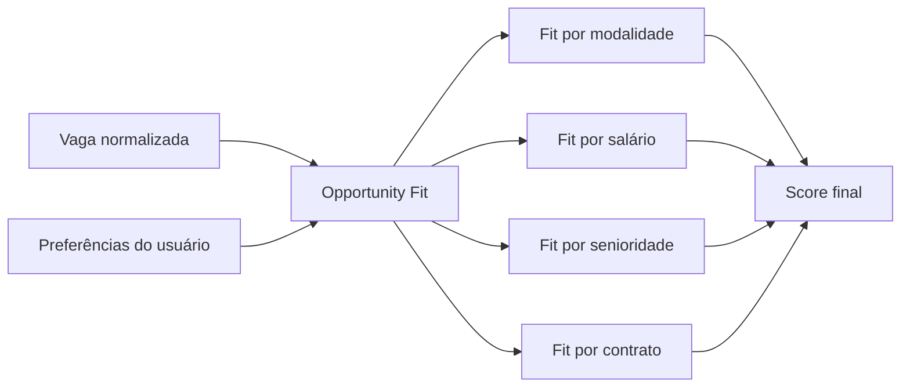

# Opportunity Fit Score: prioridades do usuário

O **Opportunity Fit Score** mede se uma vaga combina com a vida e a estratégia do usuário, não apenas com o currículo. Uma vaga pode ter ótimo match técnico e ainda ser ruim para o momento do candidato.

## Por que isso importa

Ferramentas comuns de match costumam responder:

```text
Essa vaga combina com suas skills?
```

O SotuHire deve responder:

```text
Essa vaga combina com suas skills, prioridades, localização, salário, momento de carreira e tolerância a risco?
```

## Pesos configuráveis

O usuário pode ajustar pesos para:

- salário mínimo;
- modalidade: remoto, híbrido ou presencial;
- localização;
- senioridade;
- tipo de contrato: estágio, CLT, PJ, trainee, freelance;
- velocidade do processo seletivo;
- chance de aprendizado;
- reputação da empresa;
- benefícios;
- idioma exigido;
- risco de vaga genérica;
- facilidade de candidatura.

## Scores separados

O dashboard deve mostrar scores separados:

| Score | Pergunta respondida |
|---|---|
| Match Score | O perfil técnico combina? |
| ATS Score | O currículo está legível e bem estruturado? |
| Opportunity Fit Score | A vaga combina com as prioridades do usuário? |
| Risk Score | A vaga tem sinais de risco? |
| Portfolio Score | O GitHub/portfólio reforça a candidatura? |
| LinkedIn Score | O perfil público está coerente? |

## Fórmula inicial

A primeira versão pode usar média ponderada simples:

```text
fit = soma(score_item * peso_item) / soma(pesos_usados)
```

Essa regra é fácil de explicar, testar e ajustar.

## Exemplo

Vaga A:

- Match técnico: 88
- Remota: sim
- Salário: informado e acima do mínimo
- Senioridade: júnior
- Processo: simples

Resultado:

```text
Opportunity Fit Score: 91
Recomendação: Aplicar hoje.
```

Vaga B:

- Match técnico: 90
- Presencial longe
- Salário não informado
- Pede inglês avançado
- Diz júnior, mas exige 5 anos

Resultado:

```text
Opportunity Fit Score: 42
Recomendação: Salvar ou ignorar, apesar do match técnico alto.
```

## Fluxo



## Regras de transparência

O score precisa explicar o motivo:

- por que subiu;
- por que caiu;
- quais campos estavam ausentes;
- quais suposições foram feitas.

Não basta mostrar número.
