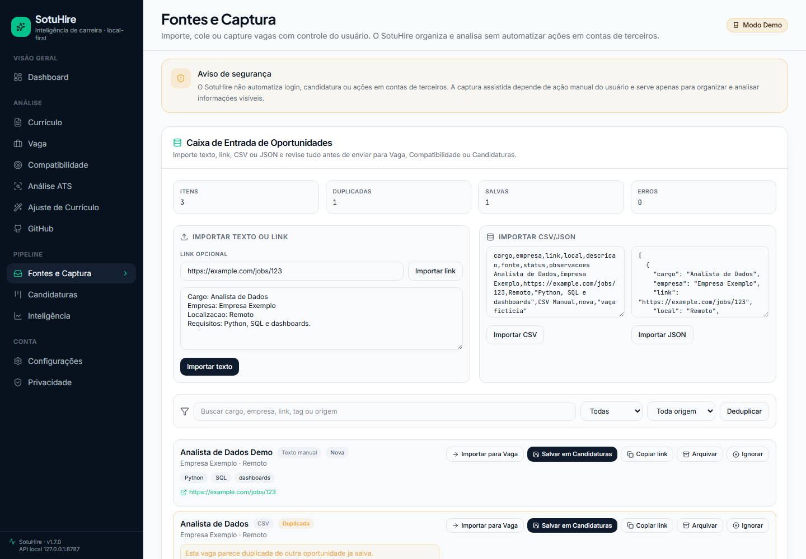
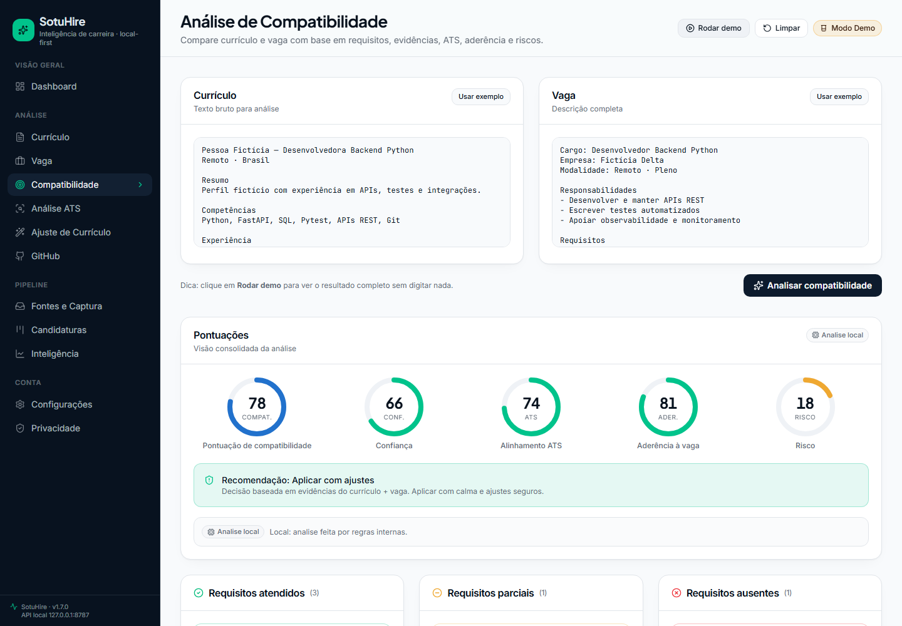
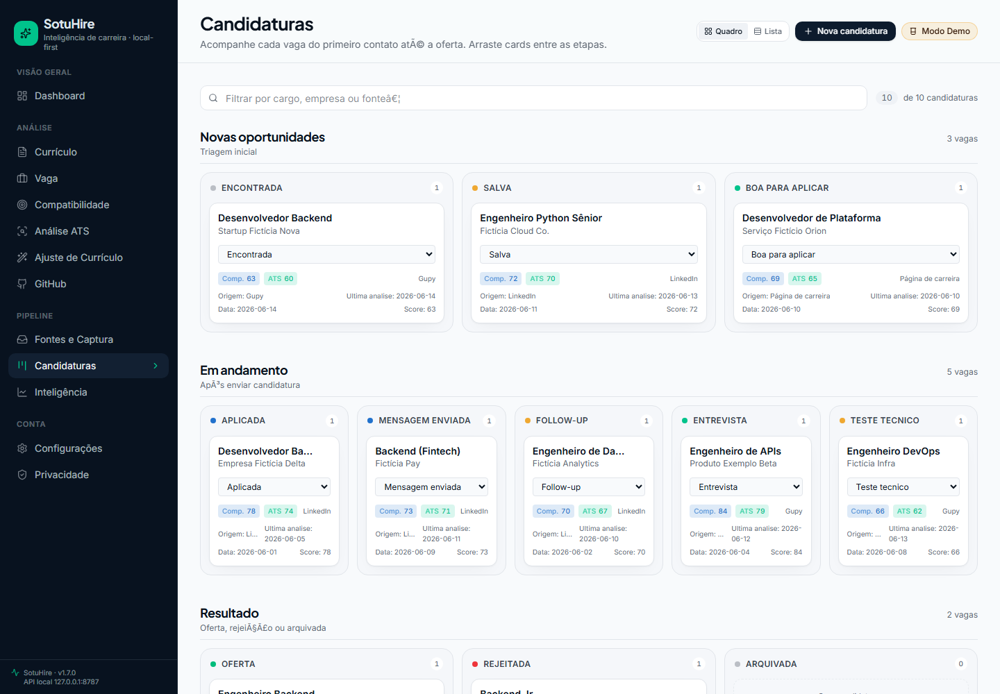
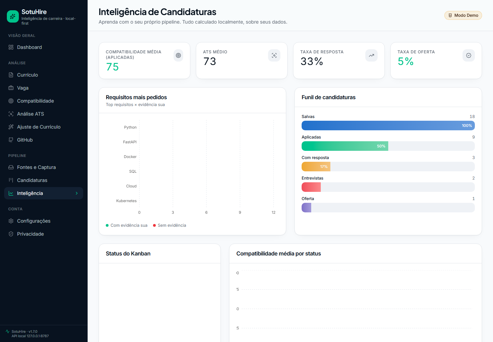
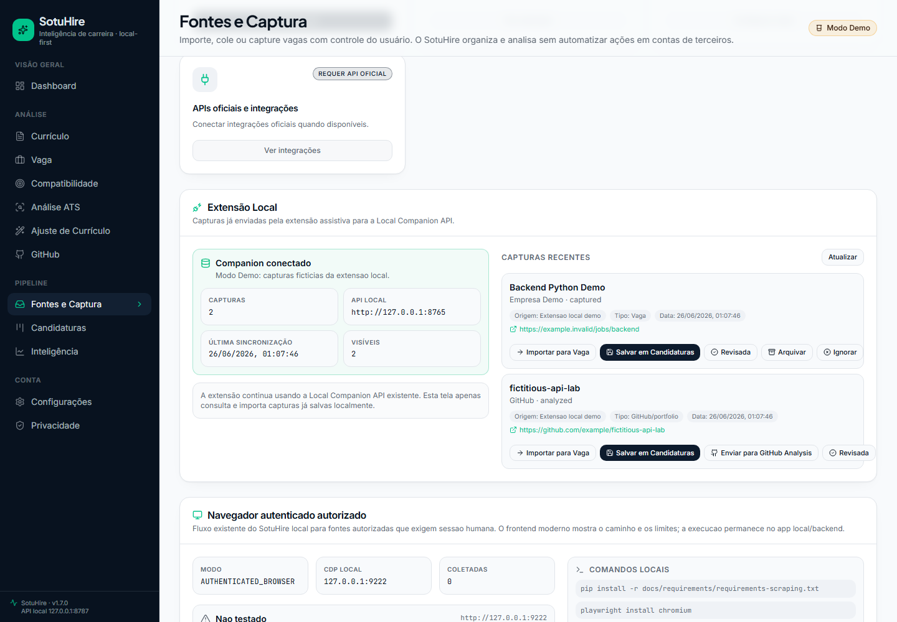

# Visual preview v1.7.0

Esta pagina registra o estado visual atual do frontend moderno do SotuHire. A serie v1.7 usa
capturas Playwright com viewport fixo `1440x1000`, `deviceScaleFactor=1` e `fullPage=false`, sem
chrome do navegador, sem marca d'agua, sem dados reais e sem API keys.

## Walkthrough

## Telas principais

### Home

### Dashboard

### Fontes e Captura - Caixa de Entrada

### Importacao CSV

### Detalhes de importacao

### Analise a partir de oportunidade

### Kanban com origem

### Inteligencia

### Historico da Extensao Local

### IA e Providers

## Padrao visual

- viewport: `1440x1000`;
- `deviceScaleFactor=1`;
- `fullPage=false`;
- dados ficticios;
- sem browser chrome;
- sem Lovable, Lightshot ou marca d'agua;
- sem tokens ou chaves;
- serie atual priorizada no README raiz para evitar mistura de proporcoes.
