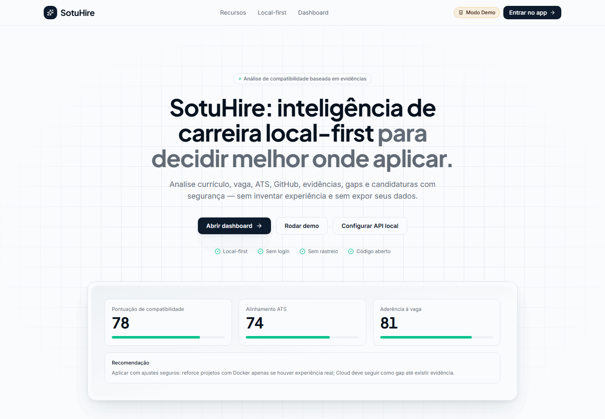
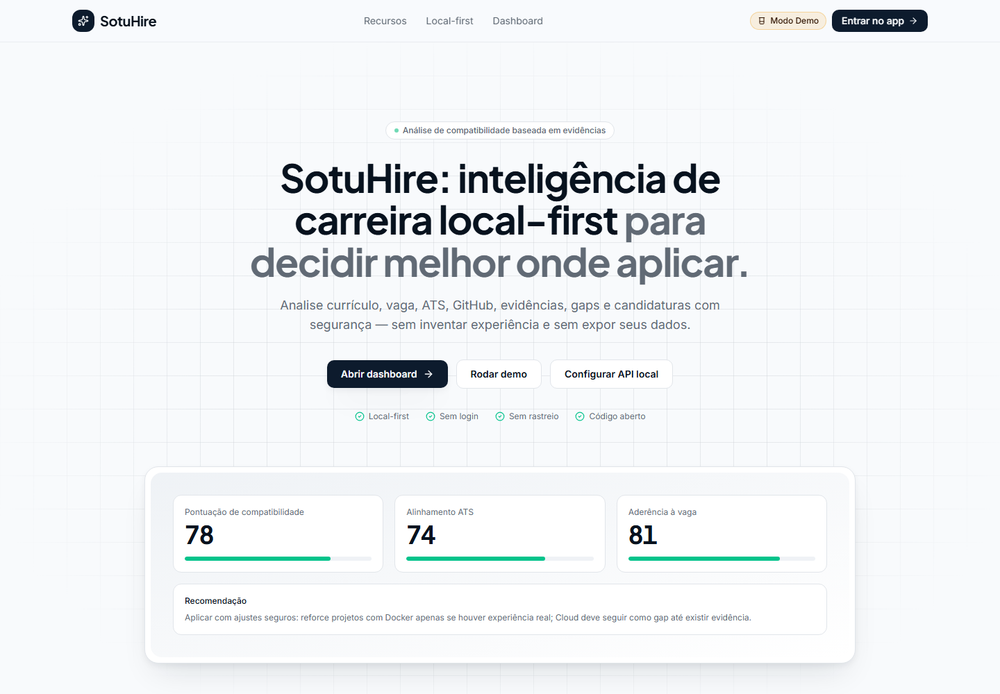
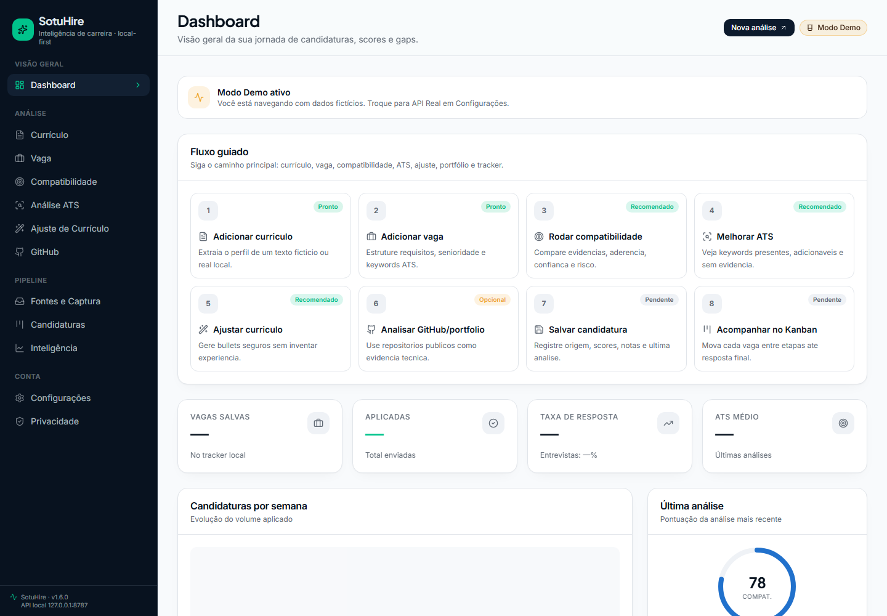
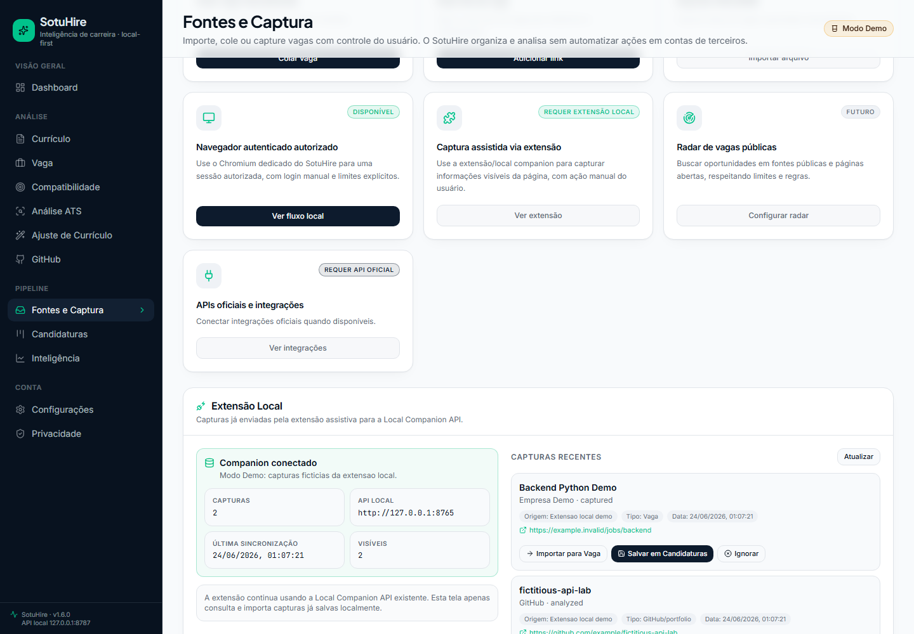
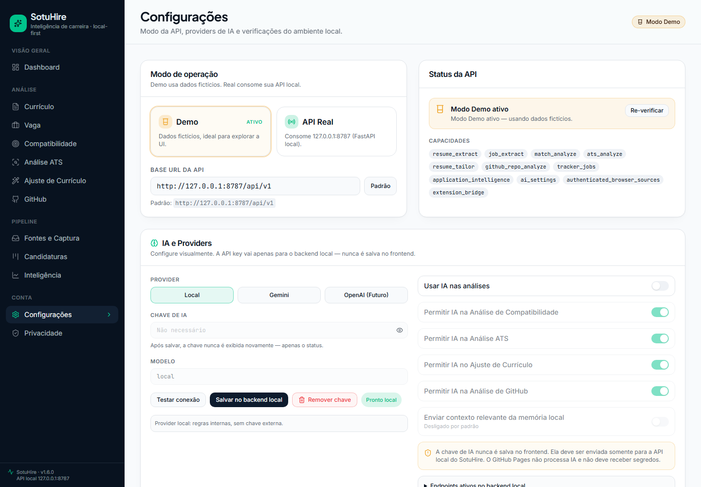
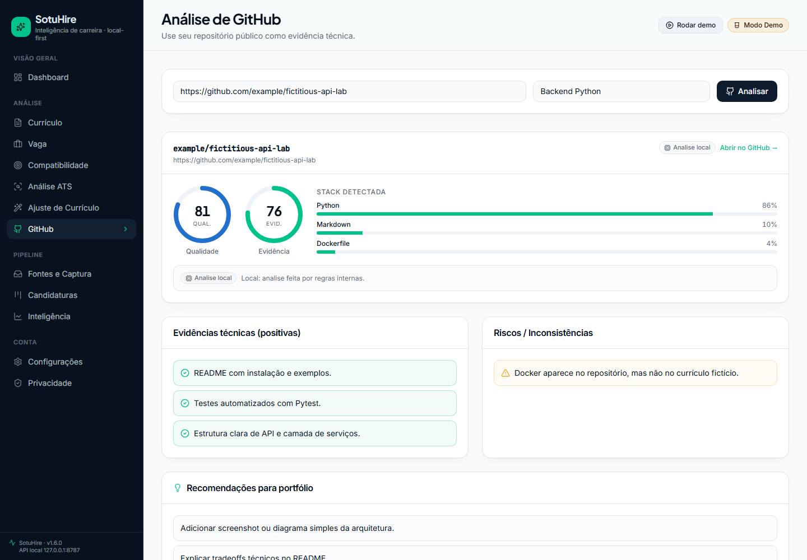

# Visual preview v1.6.0

Esta pagina registra o estado visual do frontend moderno do SotuHire. A v1.6.0 mantem o padrao
`1440x1000`, melhora Kanban, Fontes e Captura, IA/fallback e QA cross-browser.

As capturas usam apenas mocks e exemplos ficticios. Elas nao exibem curriculo real, token, API key,
dados pessoais reais, watermark, navegador ou backend remoto.

## Frontend moderno

O app moderno fica em `apps/web` e roda localmente com React/Vite. Ele possui modo Demo e modo API
Real para a FastAPI local em `http://127.0.0.1:8787/api/v1`.

### Walkthrough v1.6

### Home

### Dashboard

### Kanban

### Fontes e Captura - Extensao Local

### Configuracoes e IA

### GitHub Analysis

## QA visual

- viewport: `1440x1000`;
- `deviceScaleFactor=1`;
- `fullPage=false`;
- sem browser chrome;
- sem dados reais;
- sem API key;
- sem screenshots com tamanhos diferentes.

## Historico visual

As capturas v1.5.1, v1.5.0 e v1.3 permanecem em `docs/assets/screenshots/` como historico. O README
raiz e esta pagina priorizam a serie v1.6 para evitar mistura de tamanhos.

### Streamlit local/dev

O Streamlit continua disponivel como modo legado/dev/local debug e nao foi removido pela integracao
web-first.

