# Visual preview v1.3/v1.4

Esta página registra o estado visual do frontend moderno do SotuHire. A base visual vem da v1.3.0;
o screenshot de **Configurações e IA** foi atualizado na v1.4.0 para refletir os endpoints reais de
settings/ai.

As capturas usam apenas mocks e exemplos fictícios. Elas não exibem currículo real, token,
API key, dados pessoais reais ou backend em execução no GitHub Pages.

## Frontend moderno

O app moderno fica em `apps/web` e roda localmente com React/Vite. Ele possui modo Demo e modo API
Real para a FastAPI local em `http://127.0.0.1:8787/api/v1`.

### Walkthrough

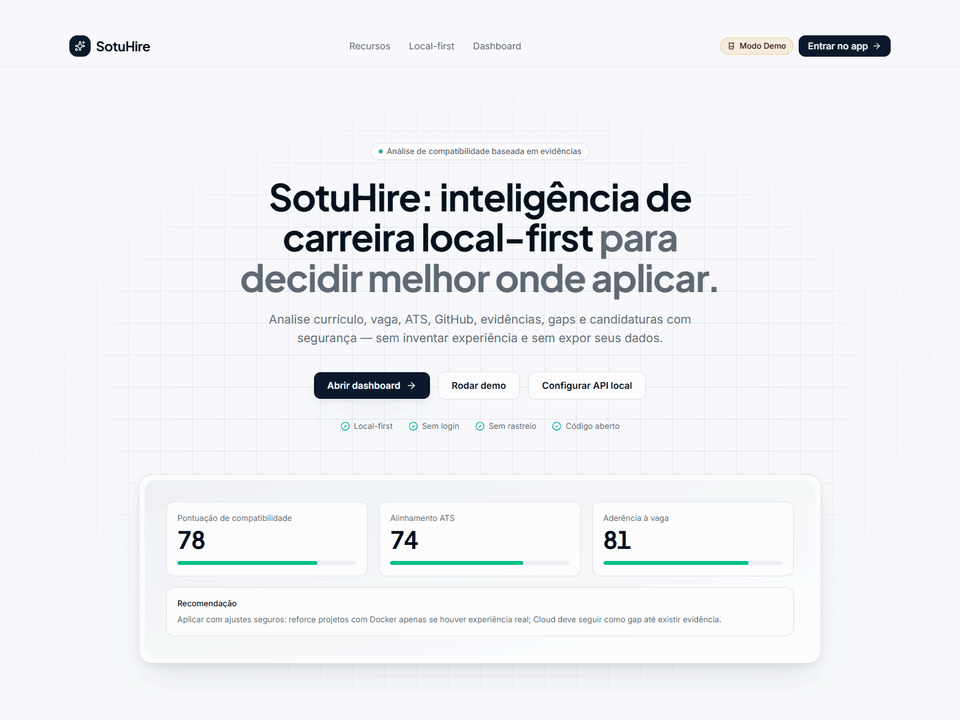

### Home

### Dashboard

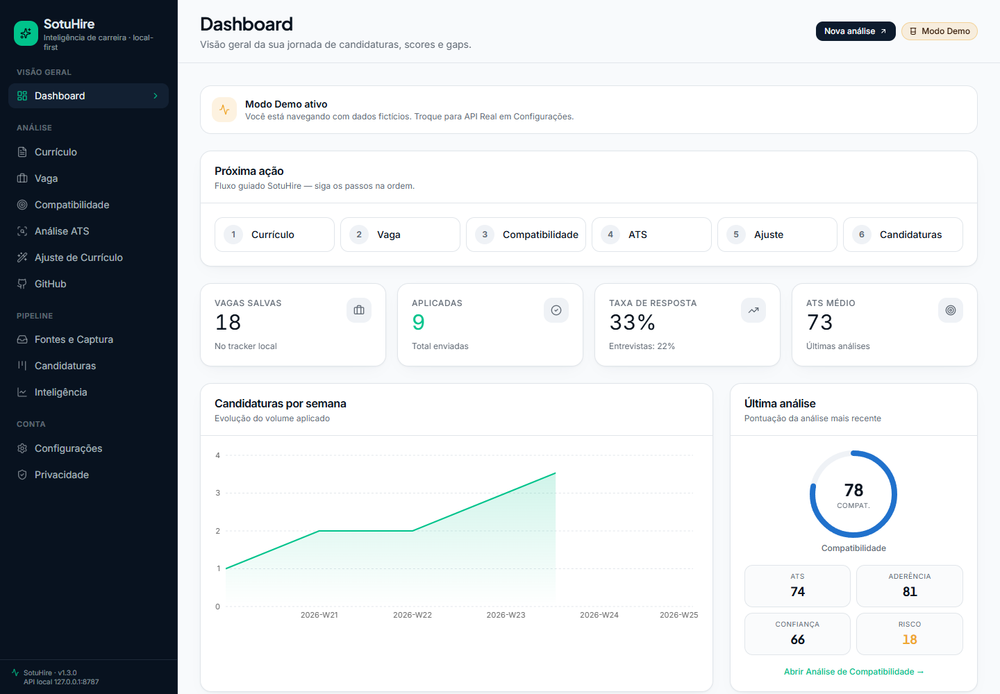

### Currículo

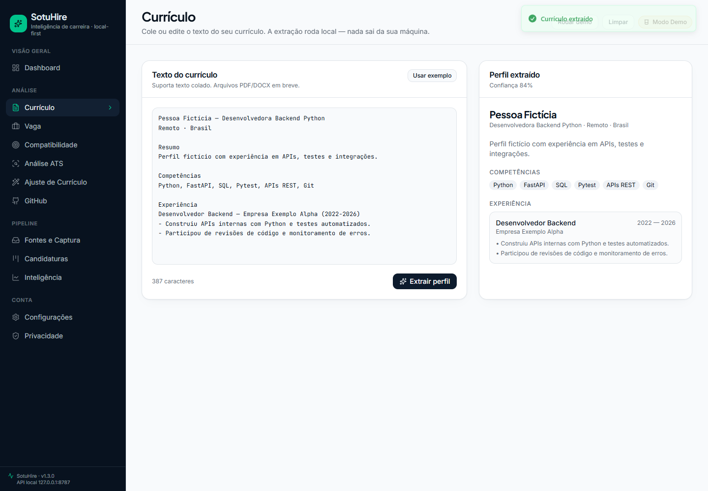

### Vaga

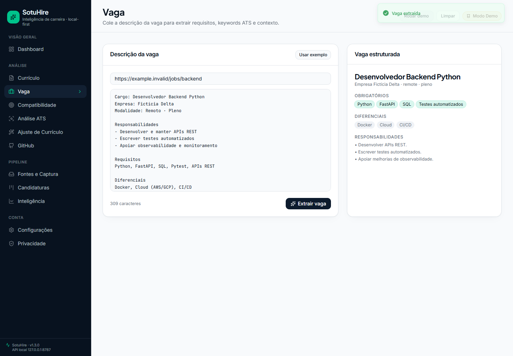

### Análise de Compatibilidade

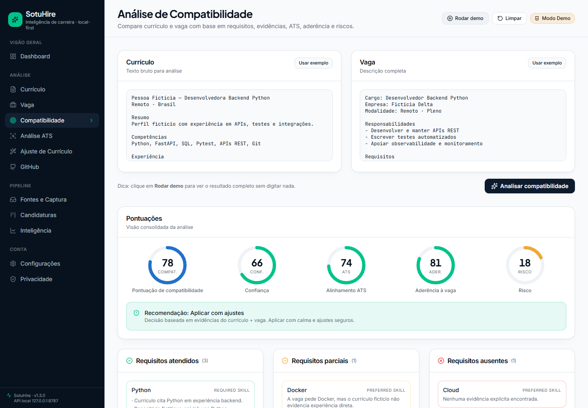

### Análise ATS

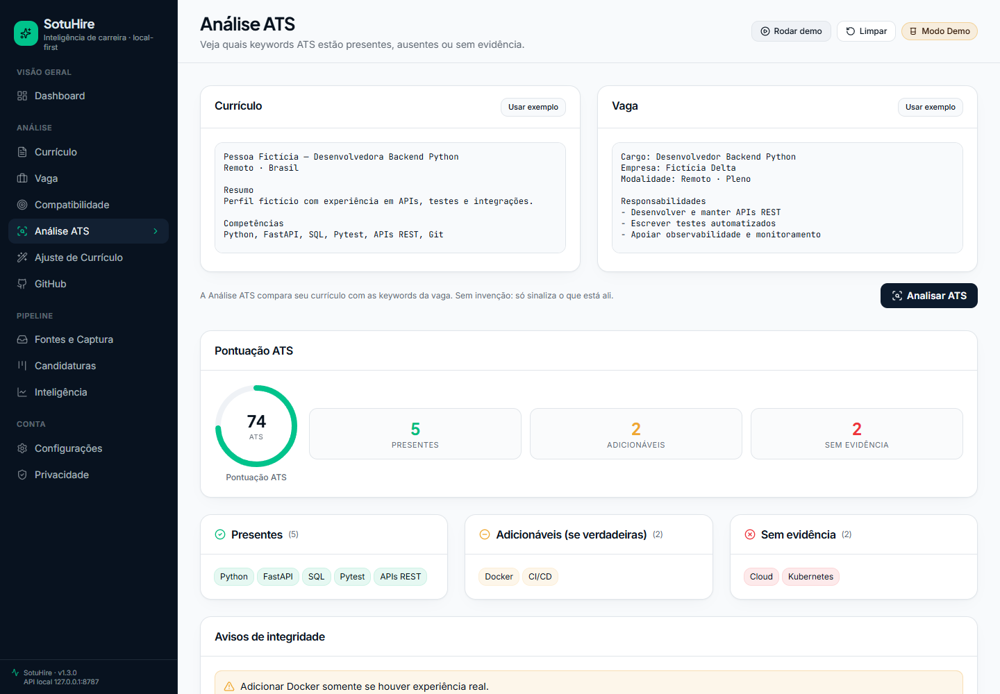

### Ajuste de Currículo

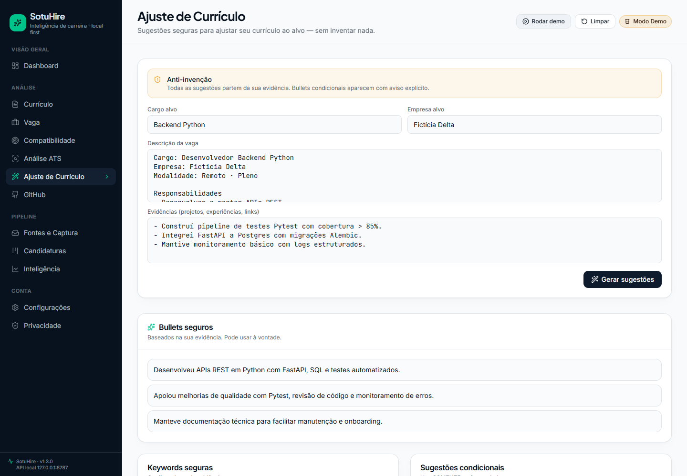

### Análise de GitHub

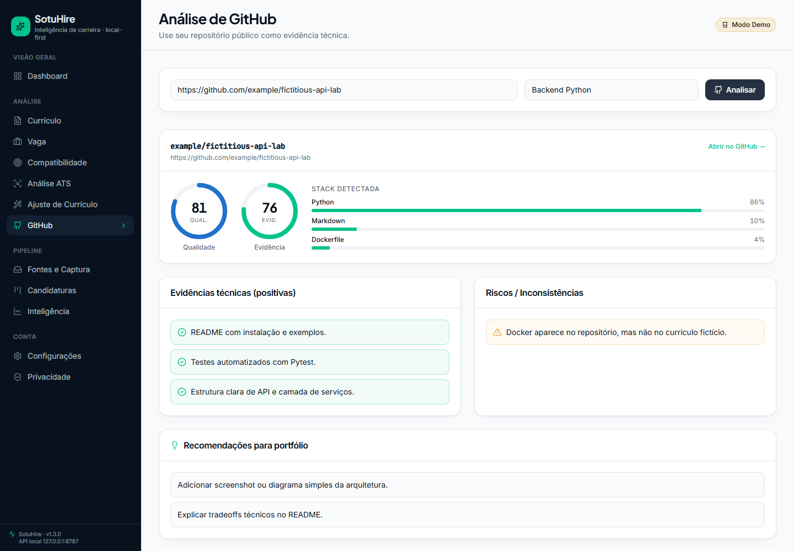

### Fontes e Captura

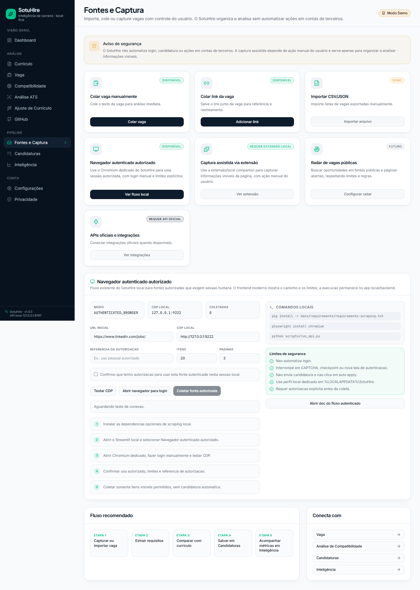

### Candidaturas

### Inteligência de Candidaturas

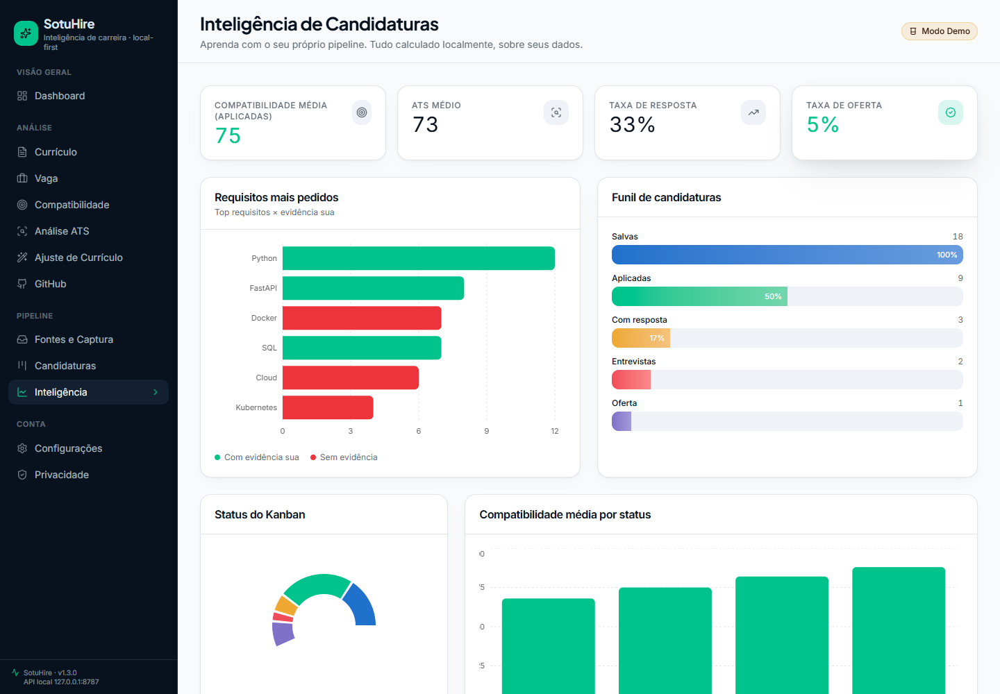

### Configurações e IA v1.4

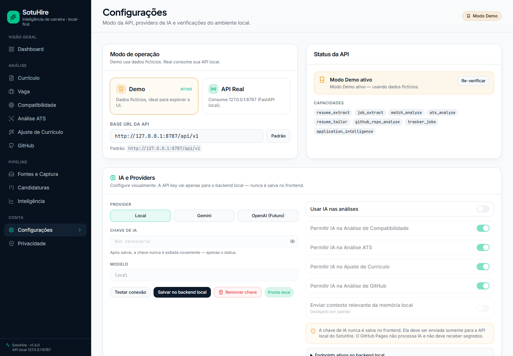

### Privacidade

## Streamlit local/dev

O Streamlit continua disponível como modo legado/dev/local debug e não foi removido pela integração
web-first.

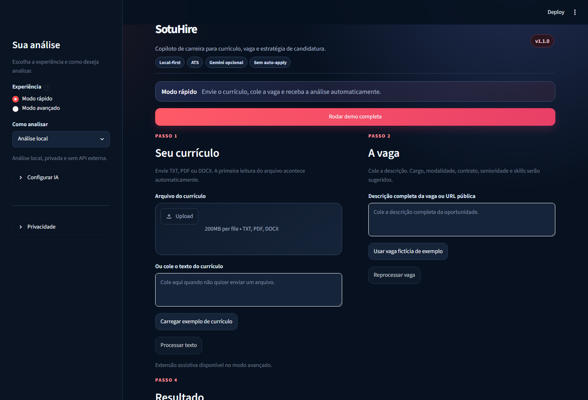

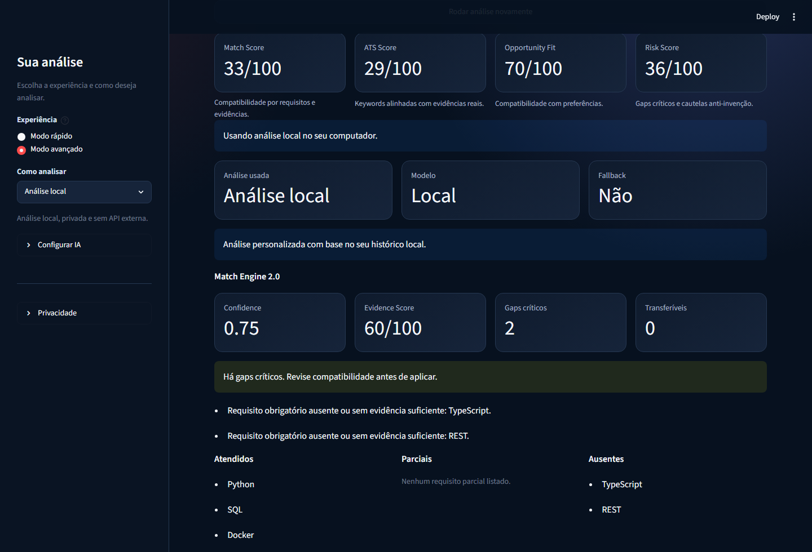

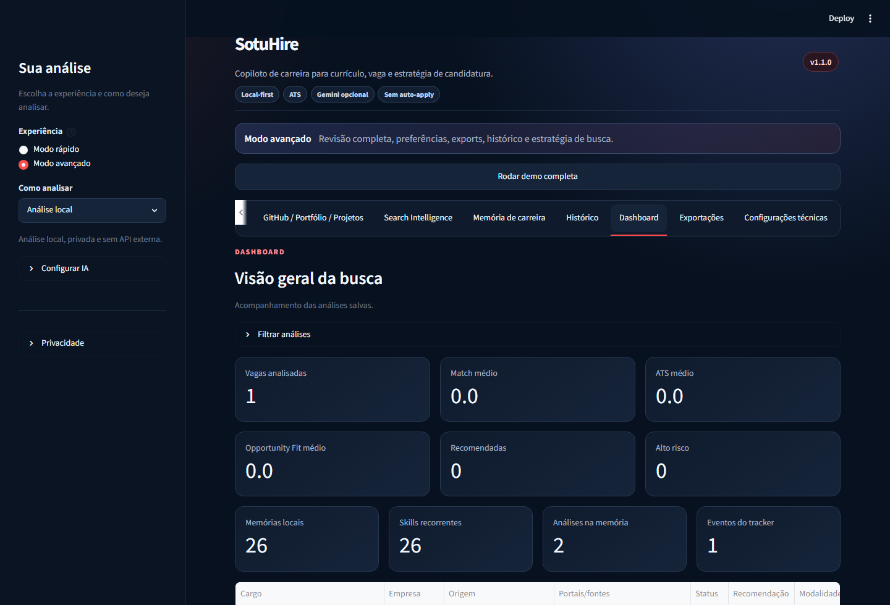
