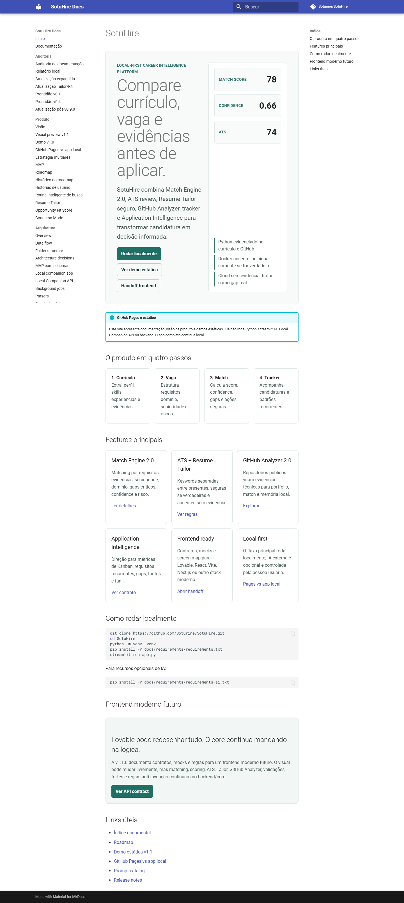
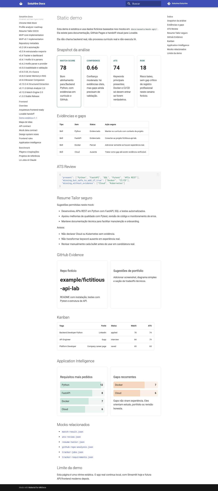
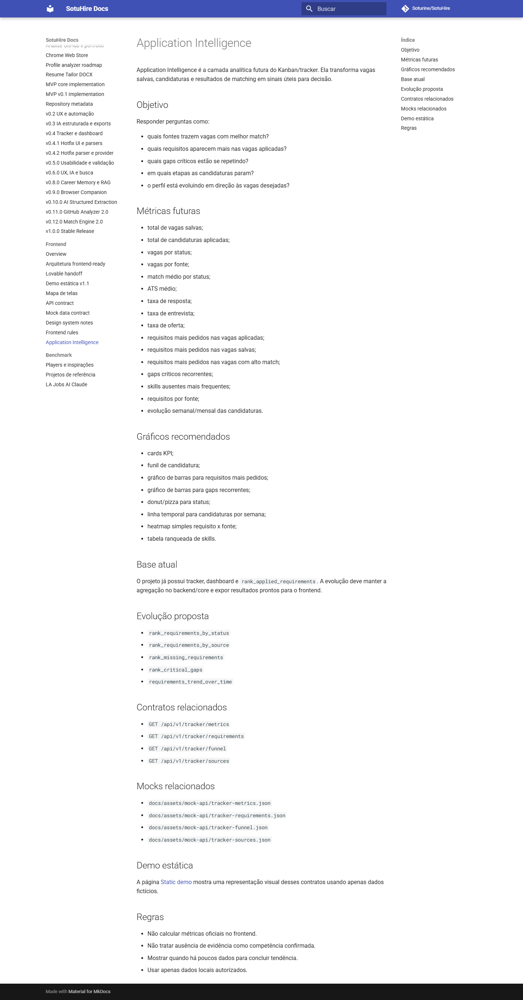
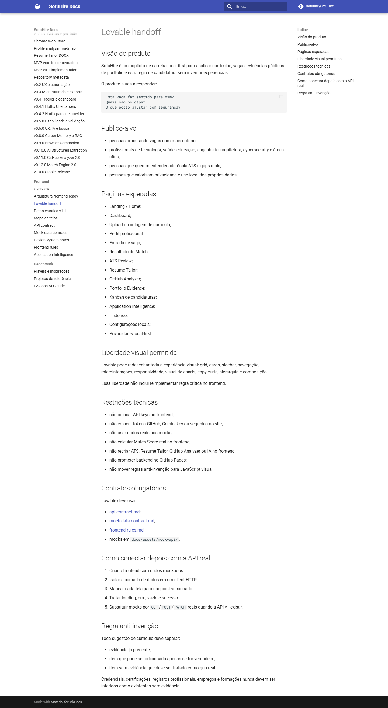
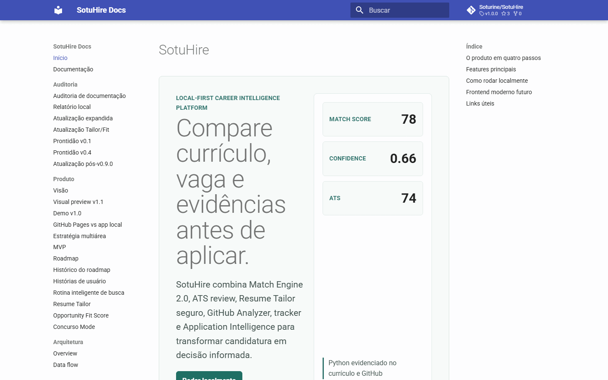
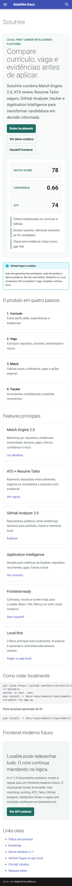

# Visual preview v1.1

Esta página registra o estado visual do app local Streamlit e do site/documentação na v1.1.0.

As capturas usam apenas mocks e exemplos fictícios. Elas não exibem currículo real, token,
API key, dados pessoais reais ou backend em execução no GitHub Pages.

## App Streamlit local

Estas imagens mostram o app real rodando localmente via Streamlit.

## Site público / GitHub Pages

Estas imagens mostram a vitrine estática do MkDocs/GitHub Pages.

### Home

### Demo estática

### Application Intelligence

### Frontend handoff

### Walkthrough

### Mobile

