# Visual preview v1.5.1

Esta página registra o estado visual do frontend moderno do SotuHire. A v1.5.1 padroniza capturas em
viewport `1440x1000`, deixa o GIF mais lento e melhora o fluxo guiado, os estados Local/IA/Fallback,
o painel **Extensão Local** e o Kanban.

As capturas usam apenas mocks e exemplos fictícios. Elas não exibem currículo real, token, API key,
dados pessoais reais, watermark, navegador ou backend remoto.

## Frontend moderno

O app moderno fica em `apps/web` e roda localmente com React/Vite. Ele possui modo Demo e modo API
Real para a FastAPI local em `http://127.0.0.1:8787/api/v1`.

### Walkthrough v1.5.1

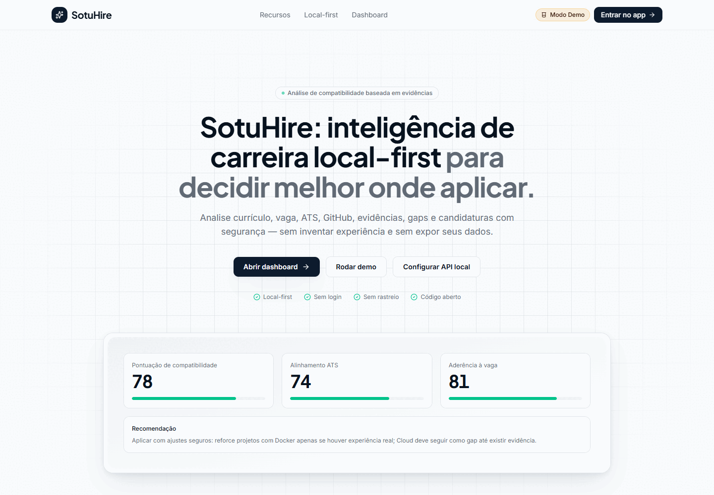

### Home

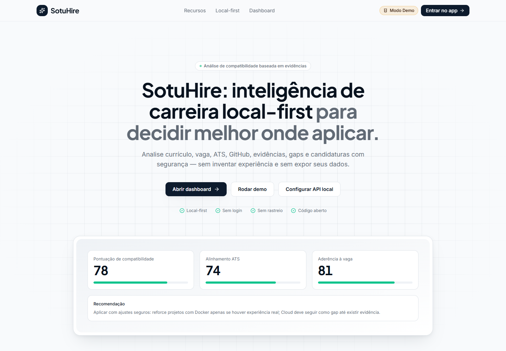

### Dashboard

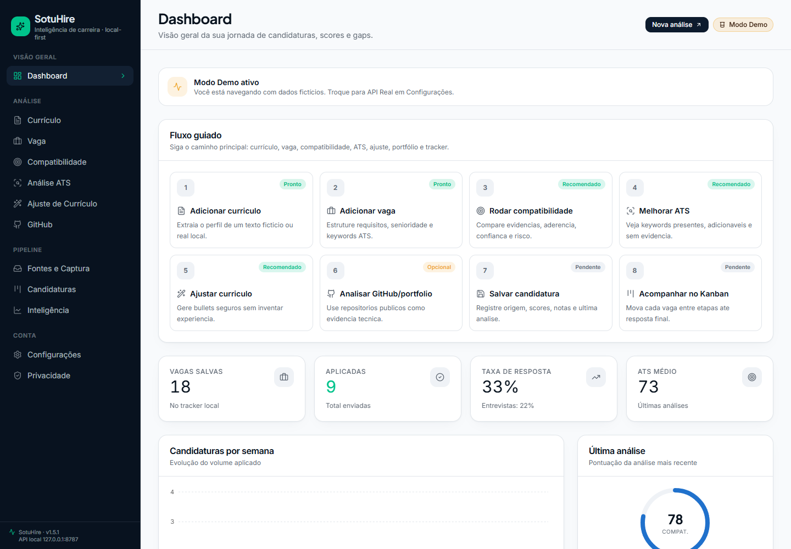

### Currículo

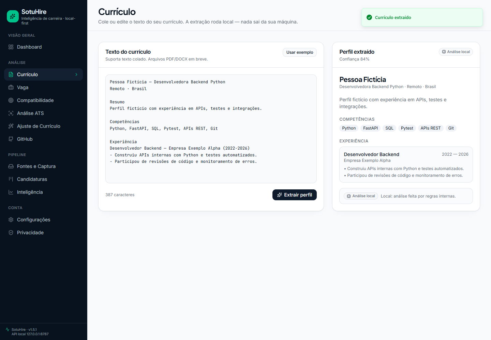

### Vaga

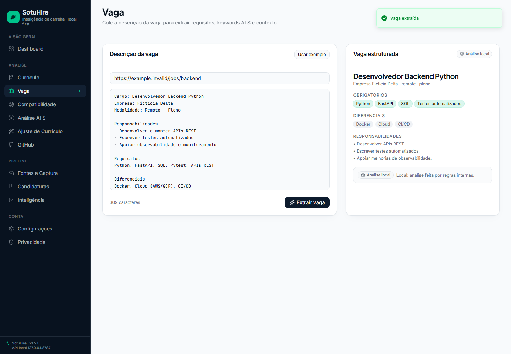

### Análise de Compatibilidade

### Análise ATS

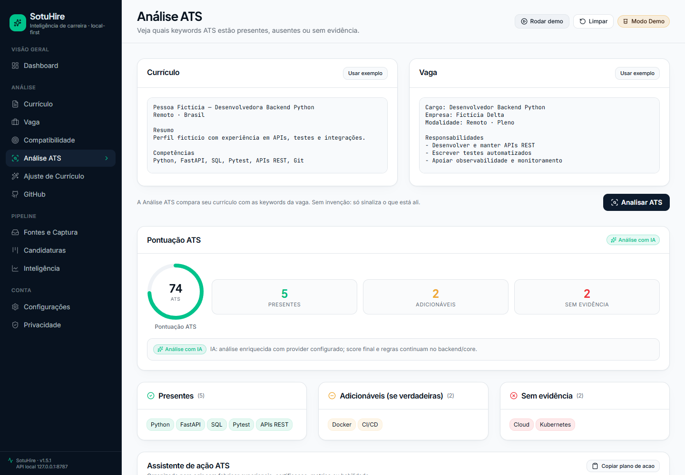

### Ajuste de Currículo

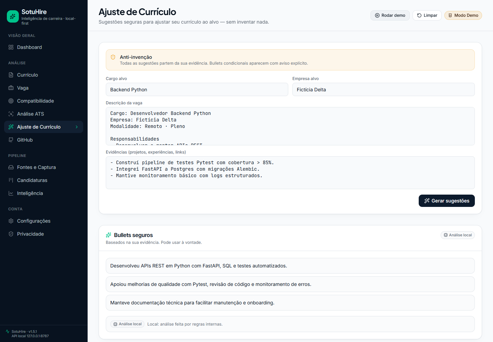

### Análise de GitHub

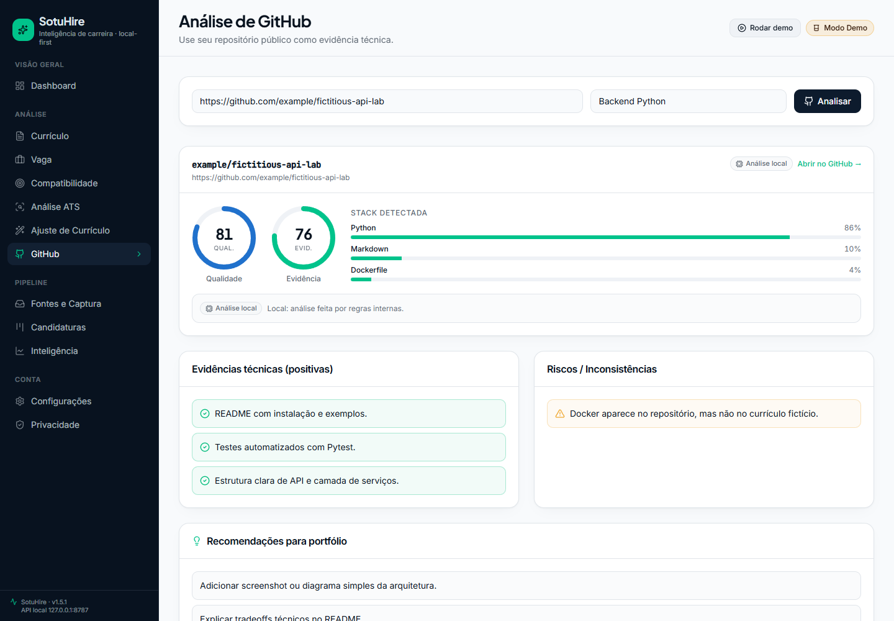

### Fontes e Captura

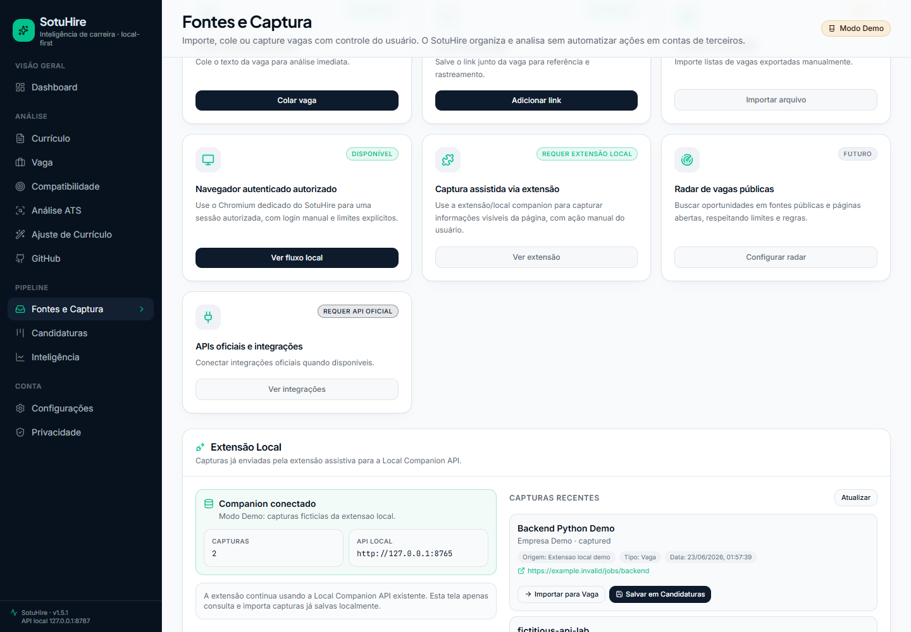

### Candidaturas

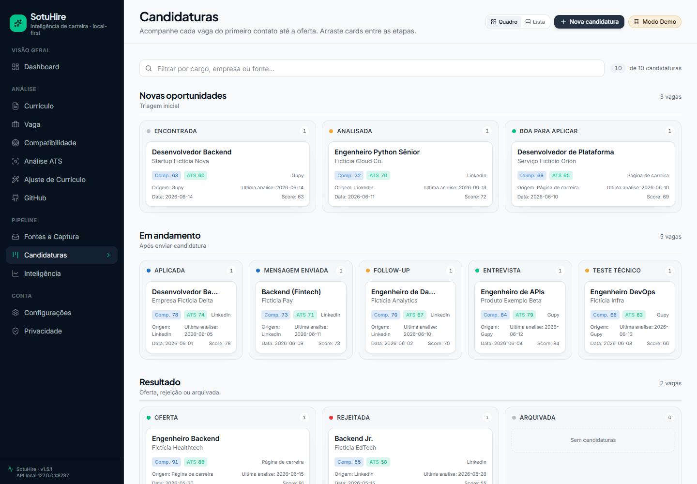

### Inteligência de Candidaturas

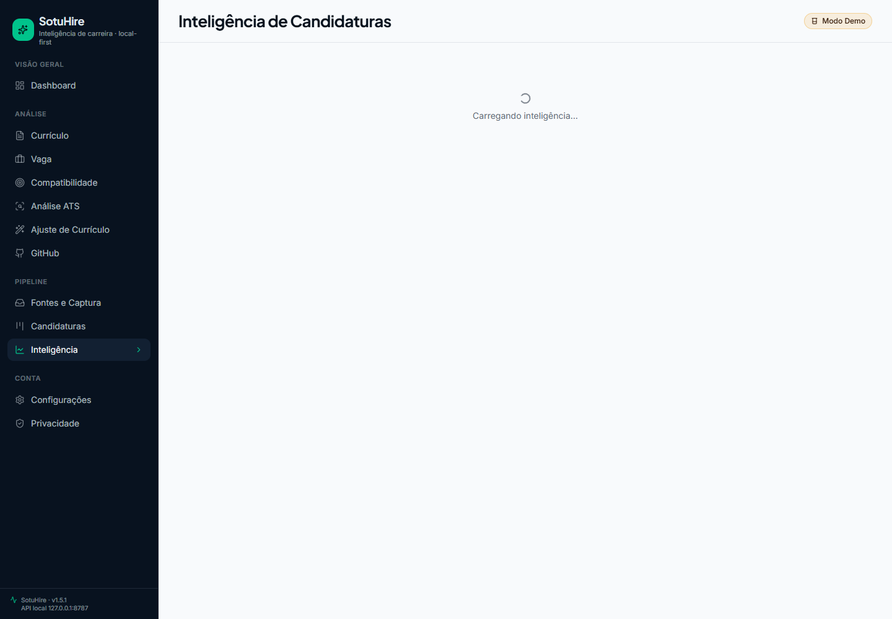

### Configurações e IA

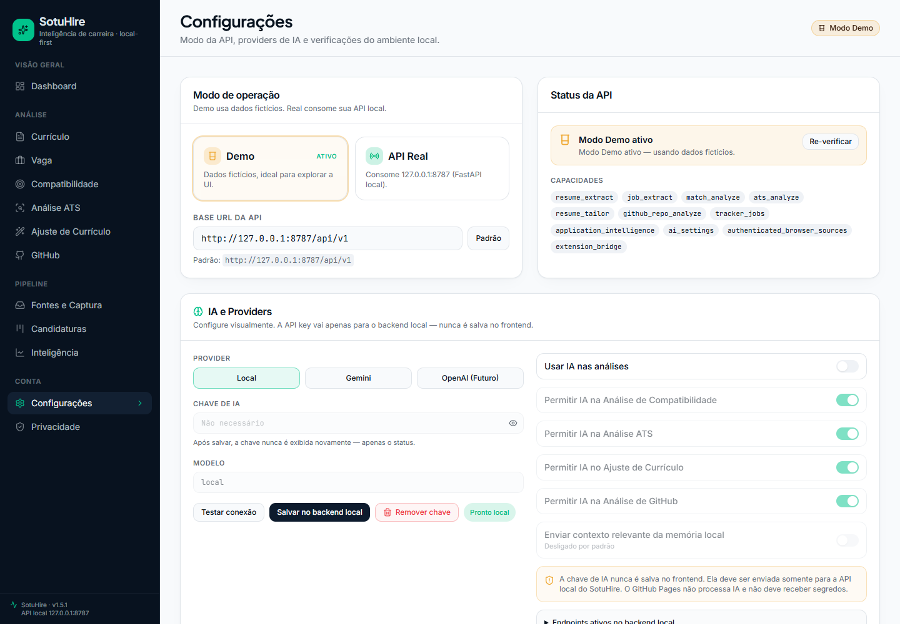

### Privacidade

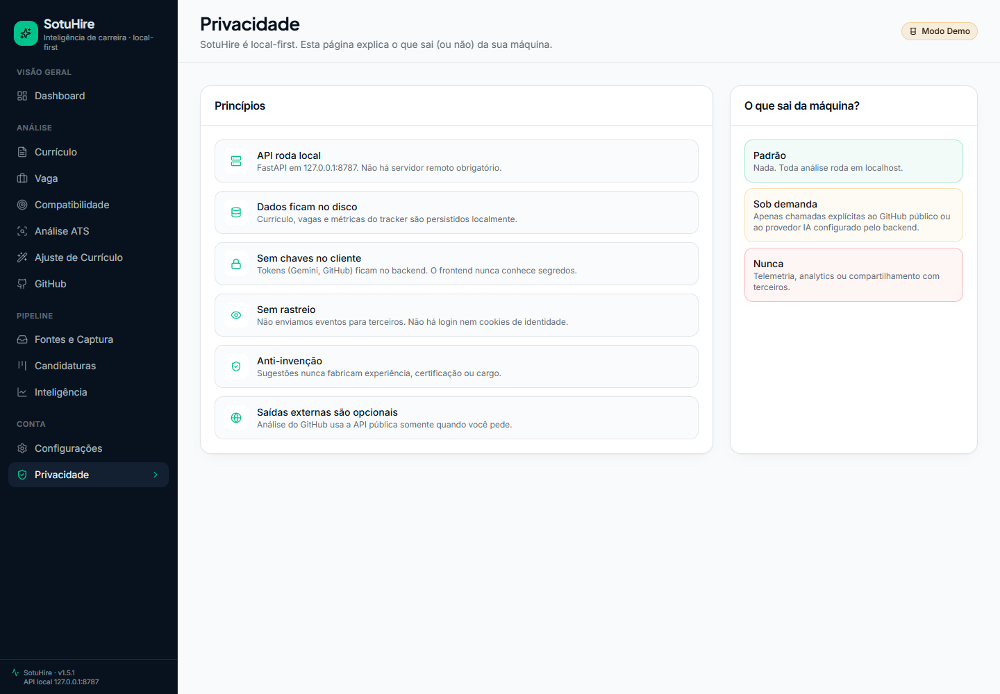

## Histórico visual

As capturas v1.5.0 e v1.3 permanecem em `docs/assets/screenshots/` como histórico, mas o README
raiz e esta página priorizam a série v1.5.1 para evitar mistura de tamanhos.

### Streamlit local/dev

O Streamlit continua disponível como modo legado/dev/local debug e não foi removido pela integração
web-first.

