# Visual preview v1.5

Esta página registra o estado visual do frontend moderno do SotuHire. A v1.5.0 adiciona badges de
provider/fallback, roteamento de IA no backend e o painel **Extensão Local** em **Fontes e Captura**.

As capturas usam apenas mocks e exemplos fictícios. Elas não exibem currículo real, token, API key,
dados pessoais reais ou backend em execução no GitHub Pages.

## Frontend moderno

O app moderno fica em `apps/web` e roda localmente com React/Vite. Ele possui modo Demo e modo API
Real para a FastAPI local em `http://127.0.0.1:8787/api/v1`.

### Walkthrough v1.5

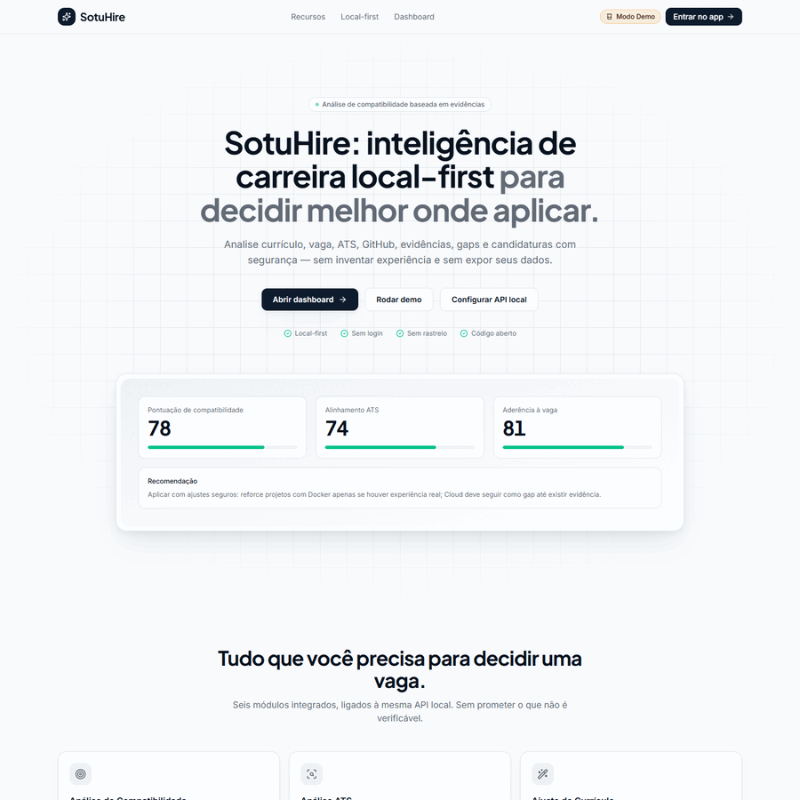

### Walkthrough legado v1.3

### Home

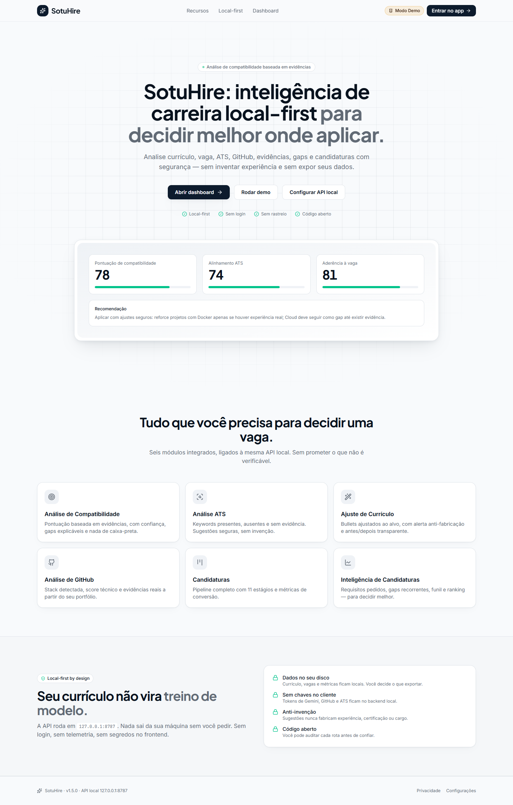

### Dashboard

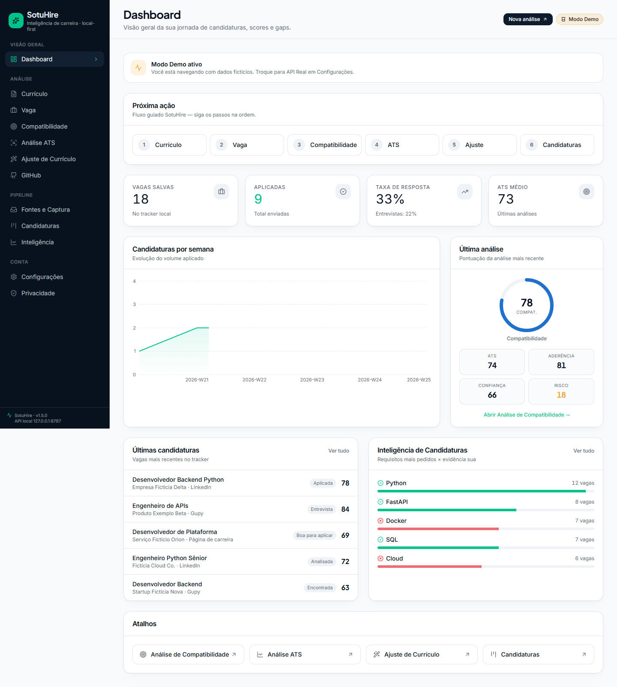

### Currículo

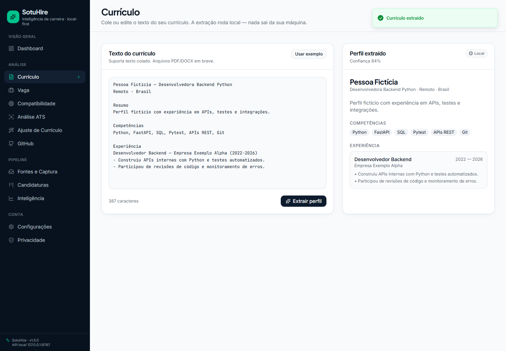

### Vaga

### Análise de Compatibilidade

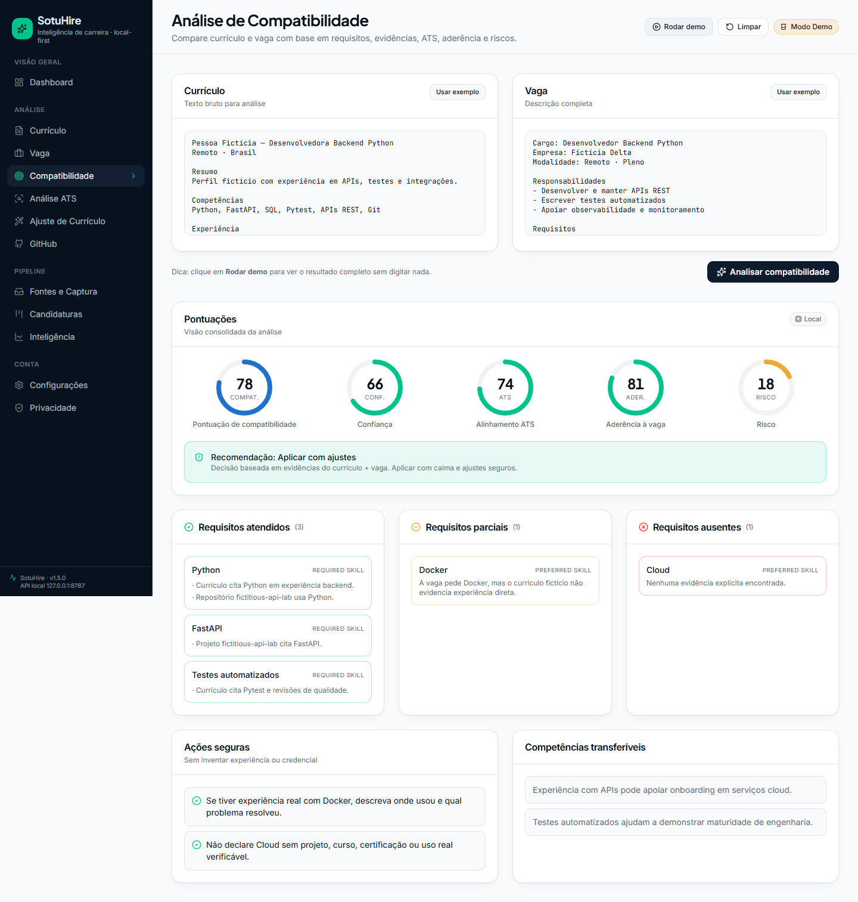

### Análise ATS

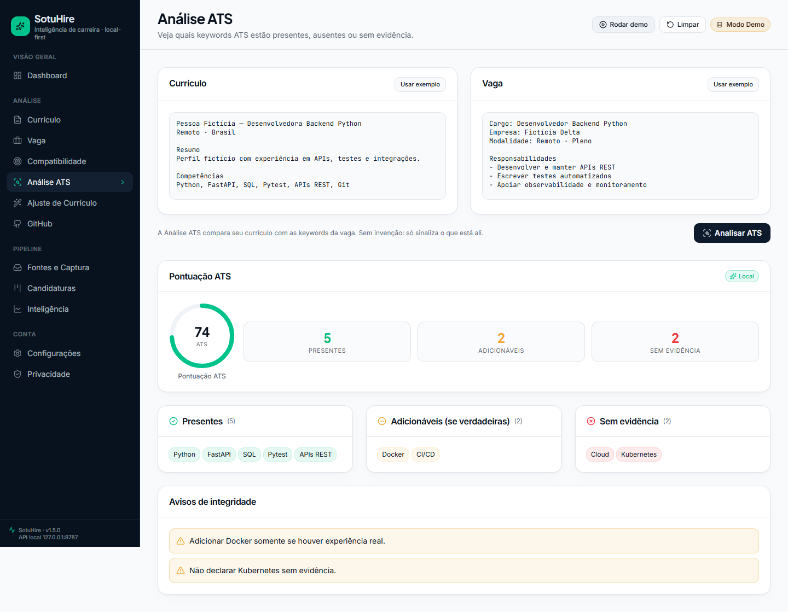

### Ajuste de Currículo

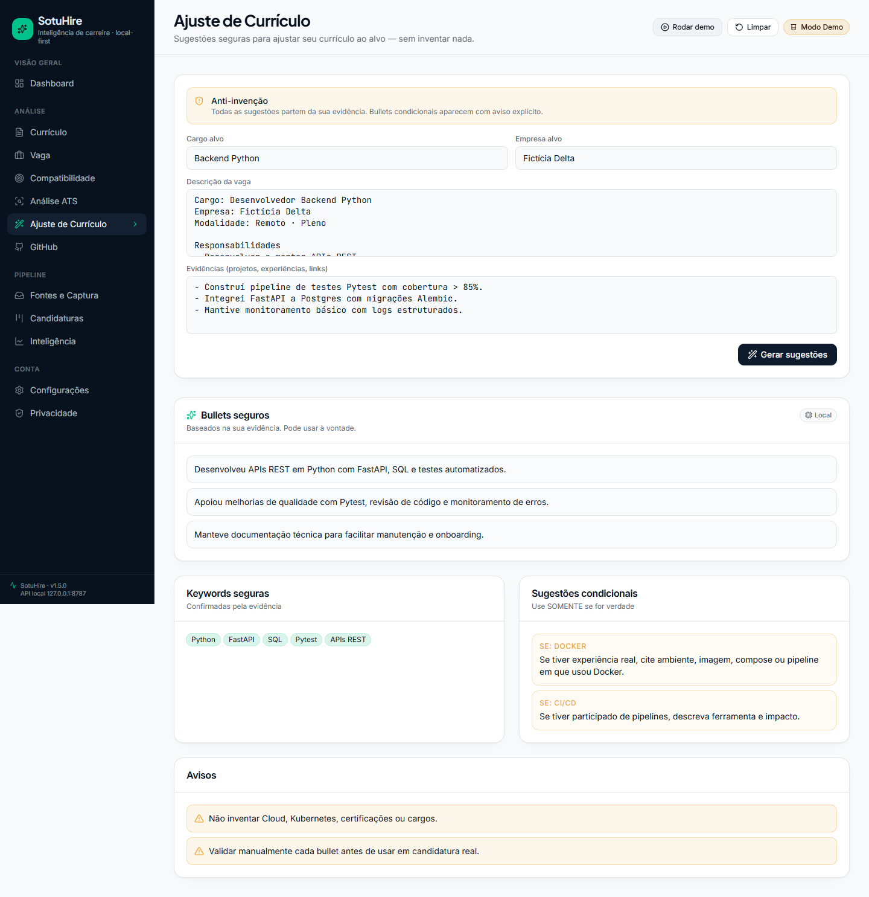

### Análise de GitHub

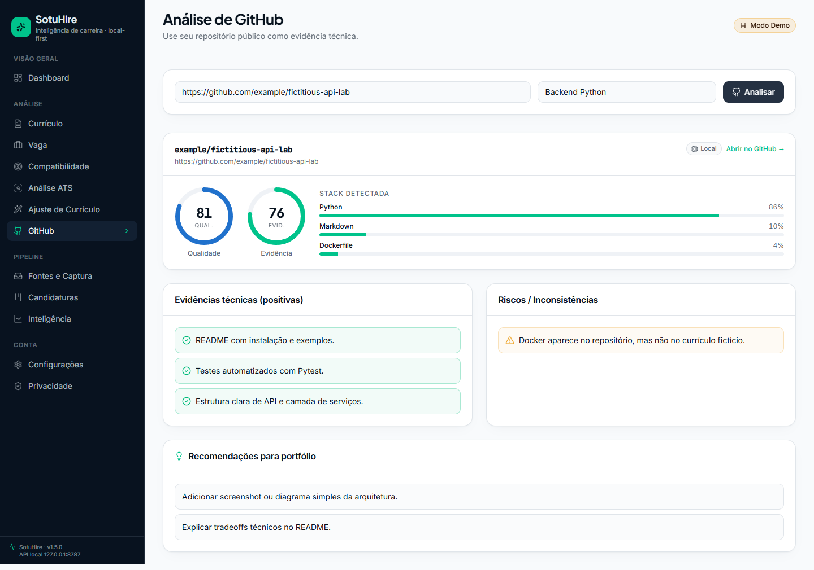

### Fontes e Captura

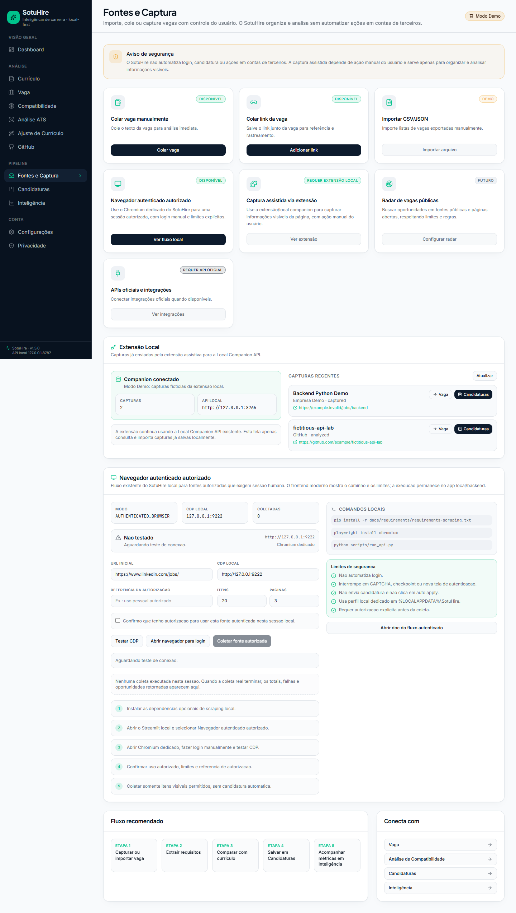

### Candidaturas

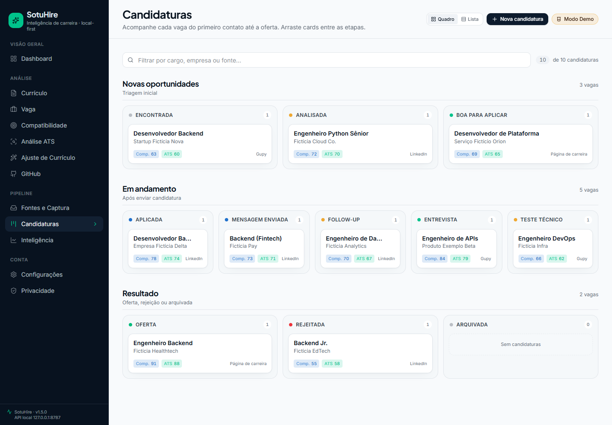

### Inteligência de Candidaturas

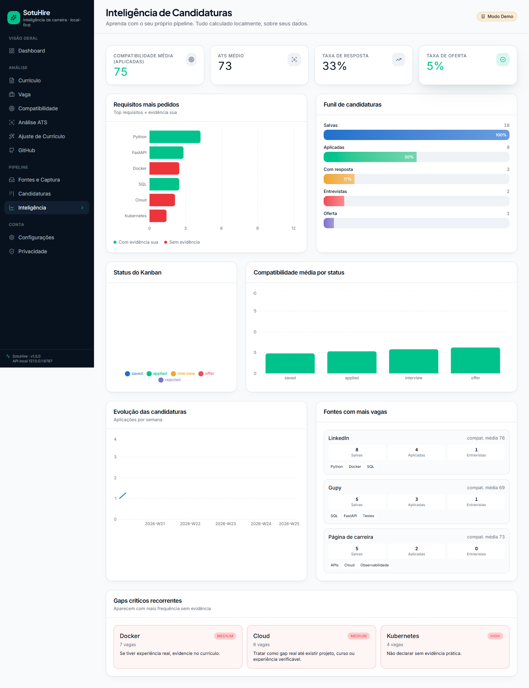

### Configurações e IA

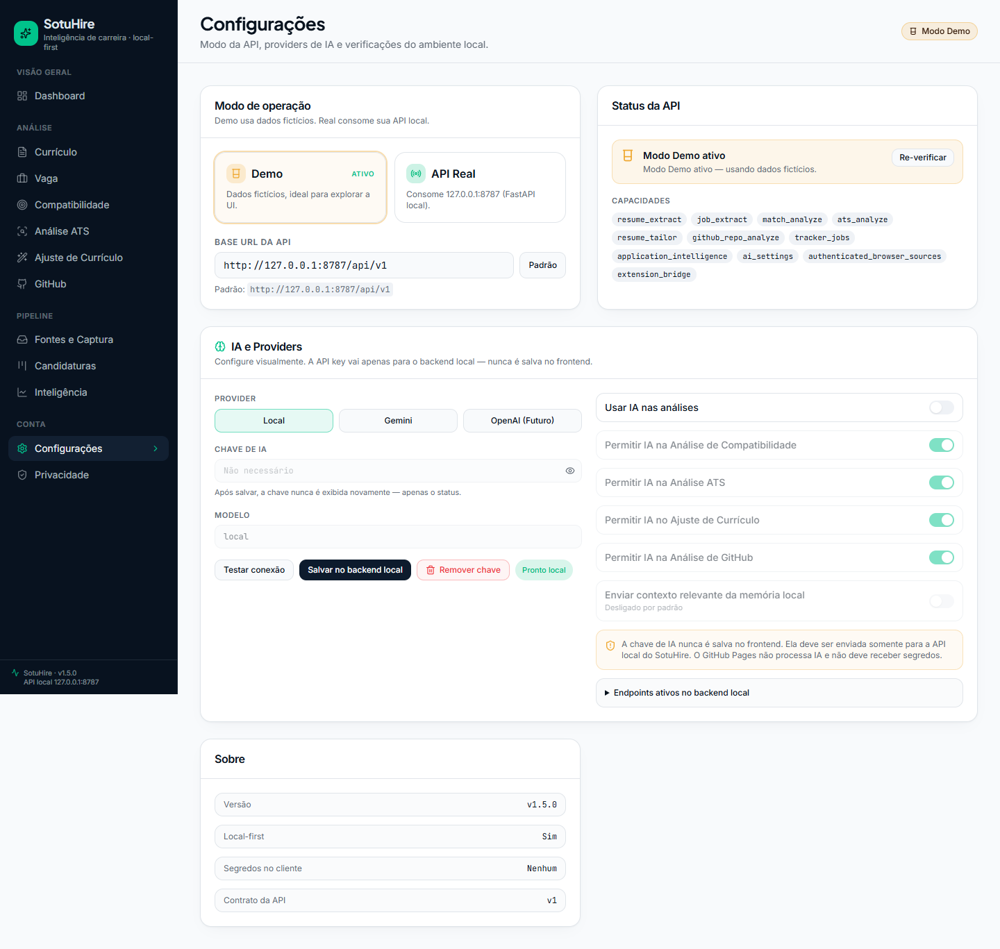

### Privacidade

## Streamlit local/dev

O Streamlit continua disponível como modo legado/dev/local debug e não foi removido pela integração
web-first.

