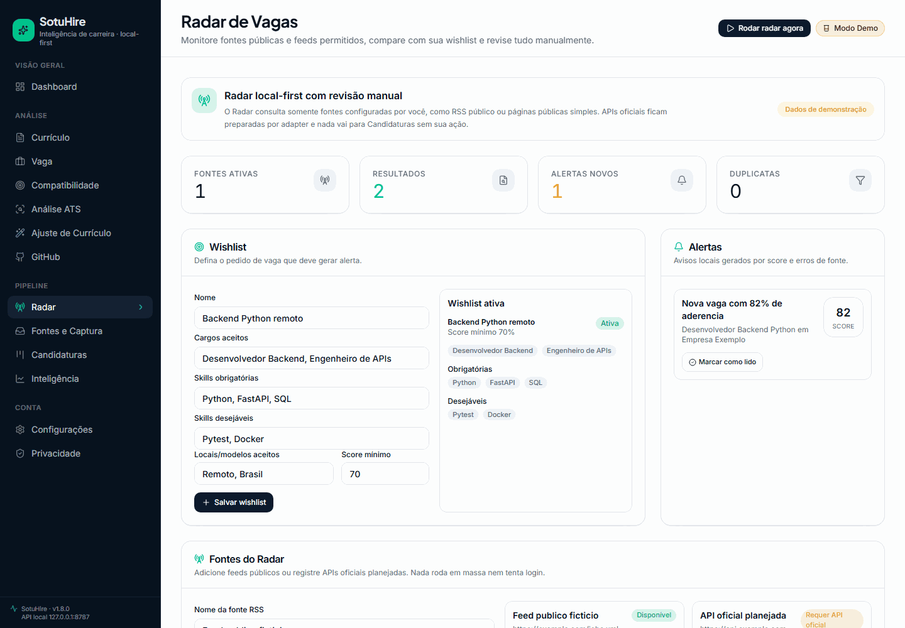
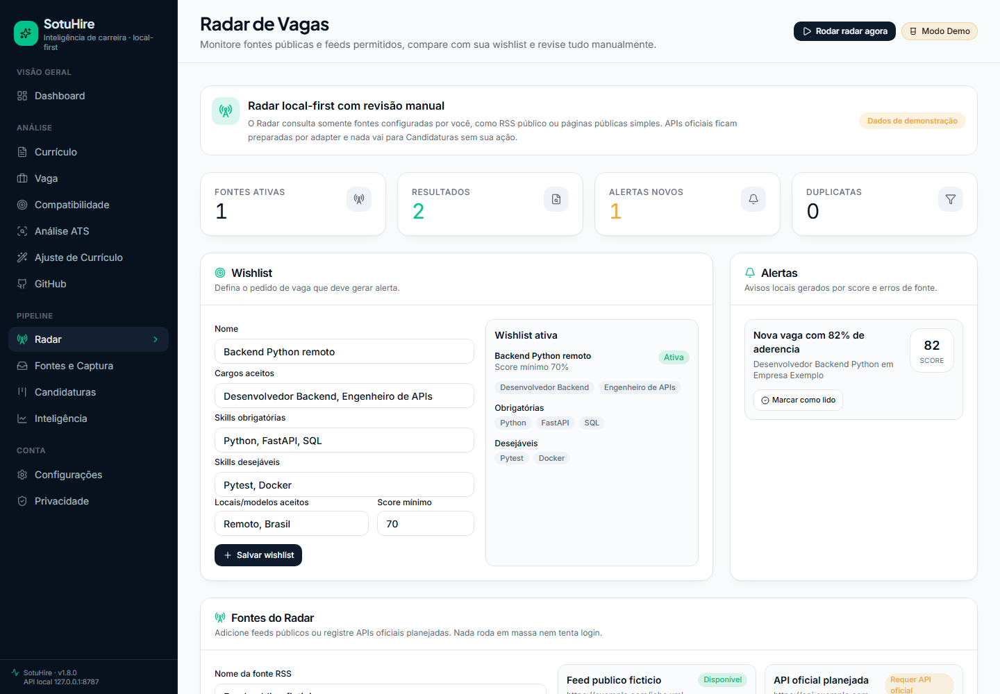
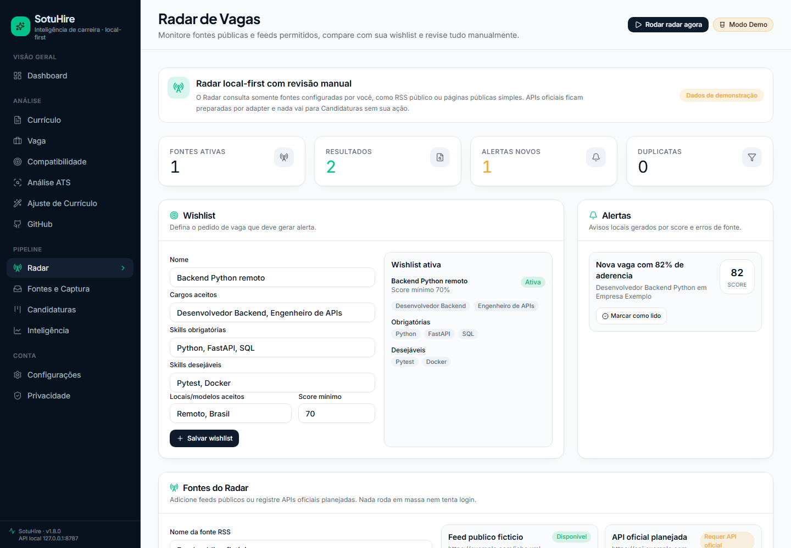
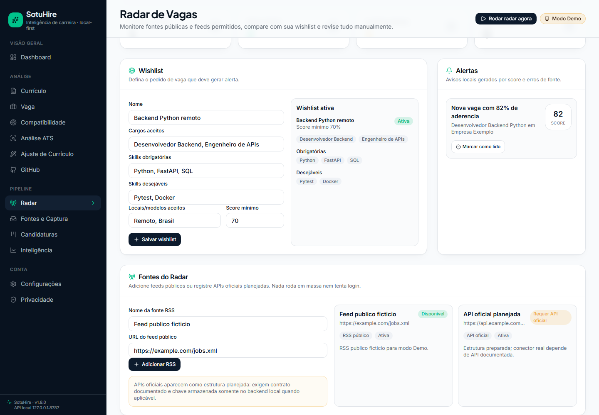
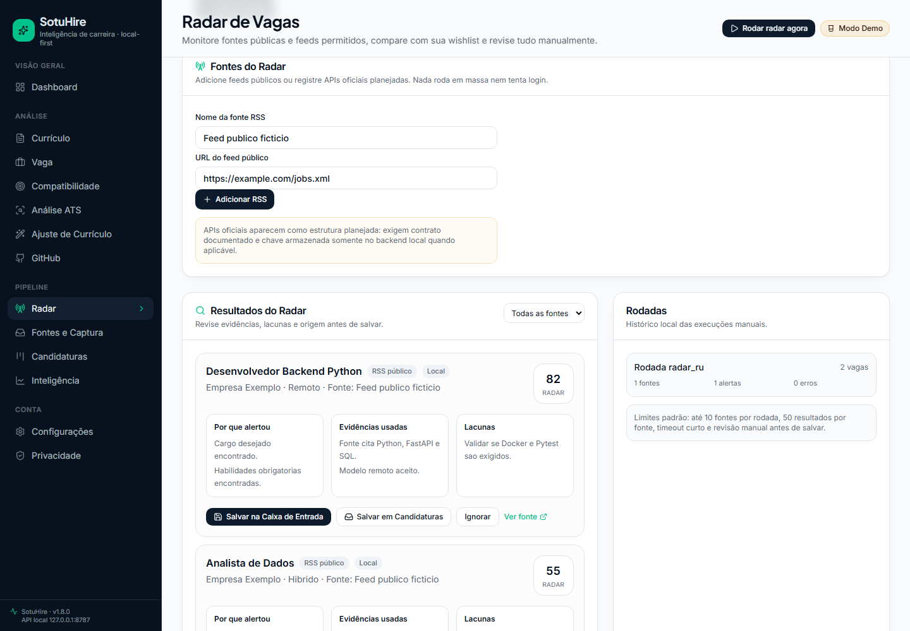
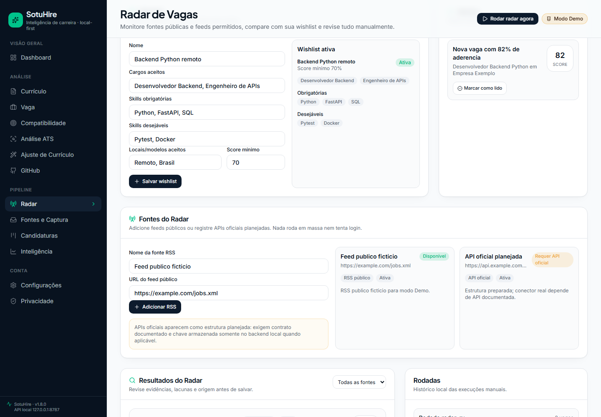
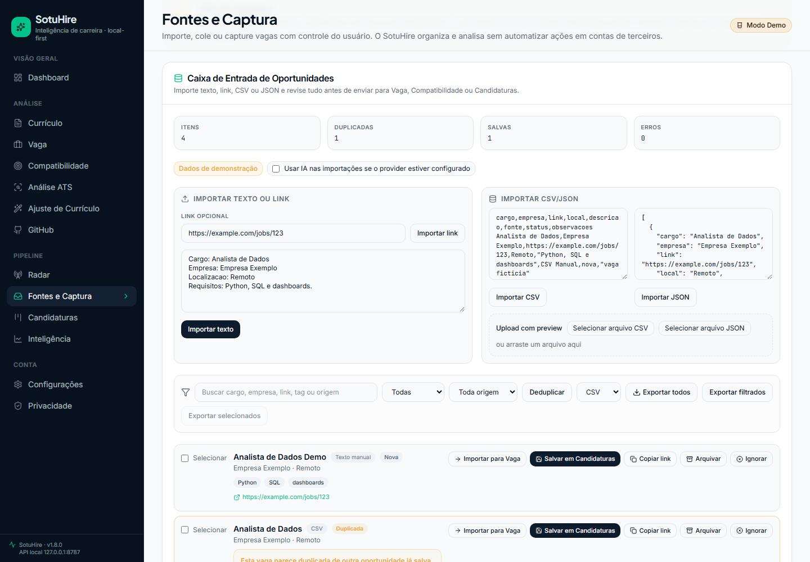
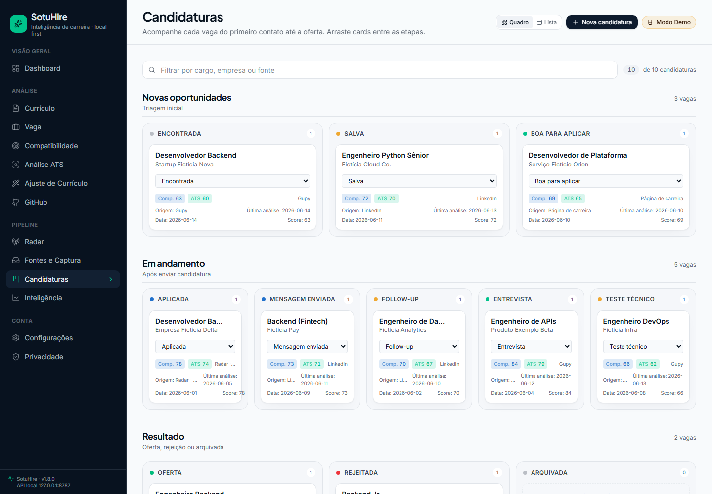

# Visual preview v1.8.0

Esta página registra o estado visual atual do frontend moderno do SotuHire. A série v1.8 usa
capturas Playwright com viewport fixo `1440x1000`, `deviceScaleFactor=1` e `fullPage=false`, sem
chrome do navegador, sem marca d'água, sem dados reais e sem API keys.

## Walkthrough

## Radar de Vagas

### Resumo

### Wishlist

### Fontes

### Resultados

### Alertas

## Integrações

### Caixa de Entrada com origem Radar

### Kanban com origem Radar

## Padrão visual

- viewport: `1440x1000`;
- `deviceScaleFactor=1`;
- `fullPage=false`;
- dados fictícios;
- sem browser chrome;
- sem Lovable, Lightshot ou marca d'água;
- sem tokens ou chaves;
- série atual priorizada no README raiz para evitar mistura de proporções.
