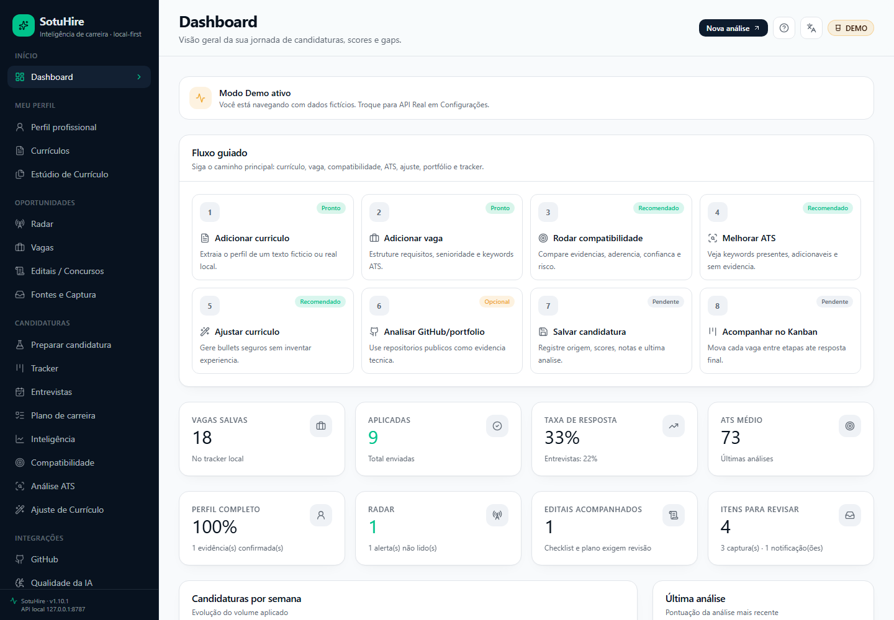
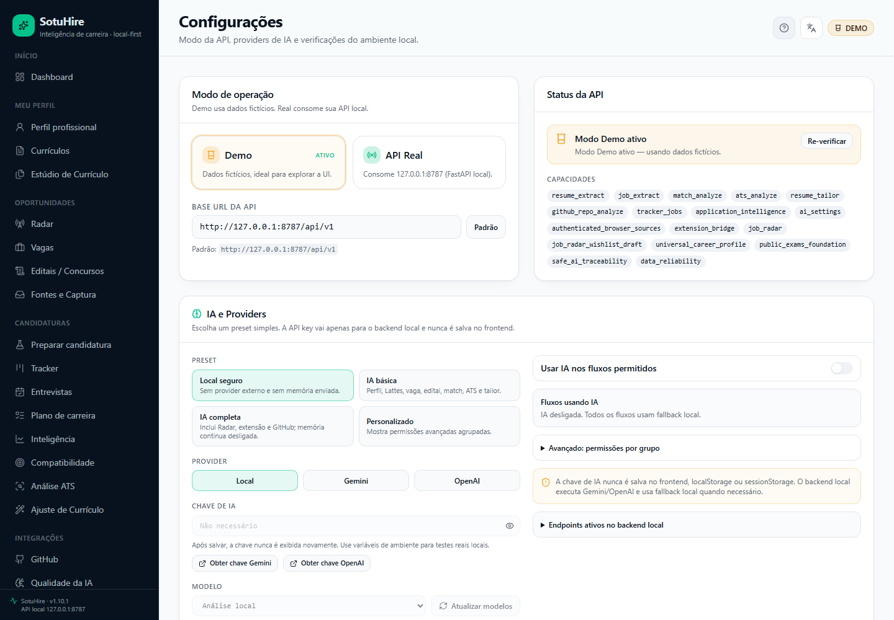
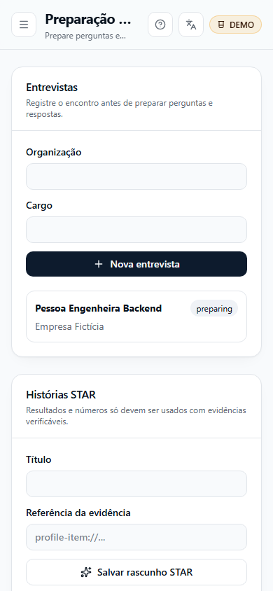
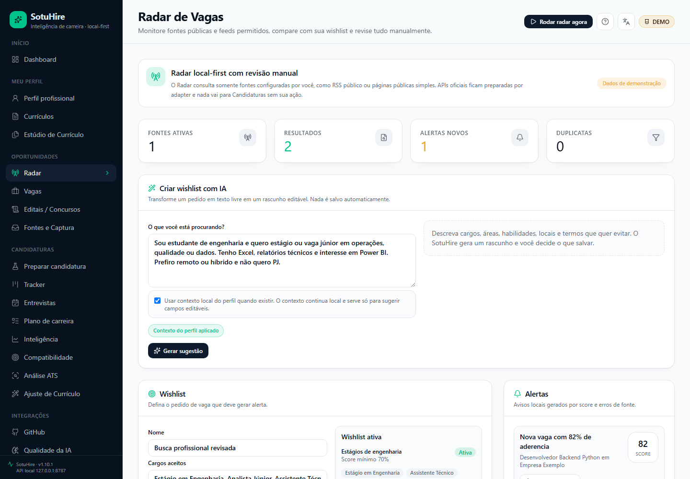

# Visual preview

Esta página registra a série visual atual da v1.10.1. As capturas são determinísticas, usam dados
fictícios e não contêm chaves, PII, caminhos pessoais, chrome do navegador ou marca d'água.

## Jornada atual

## Aparência e idioma

| Home claro em PT-BR | Home escuro com shell en-US |
|---|---|
|  |  |

## Ajuda e mobile

| Help Drawer | Entrevistas em viewport móvel |
|---|---|
|  |  |

## Fluxos de carreira

| Fontes oficiais no Radar | Interview, STAR e follow-up |
|---|---|
|  |  |

Capturas de releases anteriores permanecem no diretório de assets como histórico, mas não são
apresentadas aqui como estado atual.
