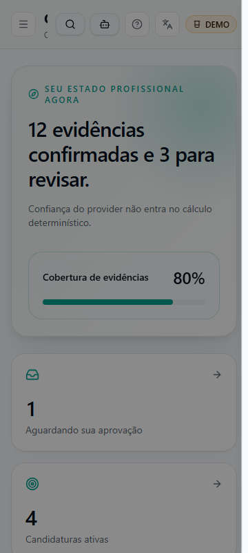

# Prévia visual v2.0

Esta série mostra o fluxo atual com dados fictícios de demonstração. Nenhuma captura comprova
execução externa ou candidatura real.

## Jornada principal

| Career Cockpit | Approval Queue |
| --- | --- |
|  |  |

| Evidence Inbox | Portfólio |
| --- | --- |
|  |  |

| Mobile Cockpit | Mobile Copilot |
| --- | --- |
|  |  |

O [inventário visual](../00-audit/v2.0-screenshot-inventory.md) registra as 20 capturas recapturadas,
resoluções e superfícies cobertas. Assets anteriores permanecem apenas como histórico.
