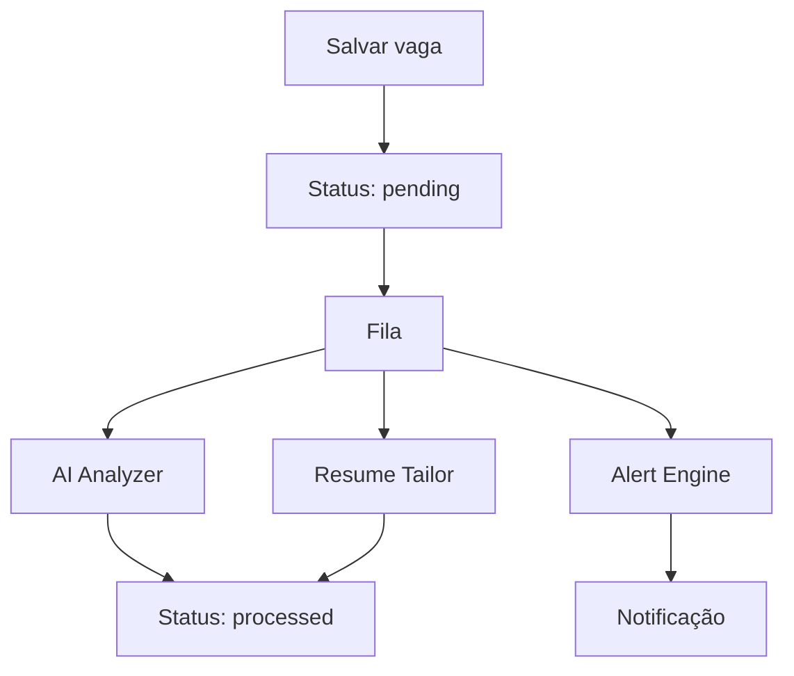

# Background jobs e processamento assíncrono

Análise de IA, scraping, geração de currículo e alertas podem demorar. Por isso, o SotuHire deve separar ações rápidas da interface de tarefas demoradas.

## Por que filas importam

Sem fila, o usuário clica em analisar e a interface trava. Com fila, o sistema salva a vaga, exibe status pendente e processa em segundo plano.

## Fluxo futuro

## Opções em Python

- MVP: execução síncrona simples.
- Local simples: `APScheduler`.
- Fila leve: `RQ`.
- Fila robusta: `Celery`.
- Alternativa moderna: `Dramatiq`.

## Regra de escopo

Não adicionar fila antes do MVP funcionar. Primeiro valida fluxo; depois otimiza execução.

## Tarefas candidatas a background

- análise de match;
- geração de currículo direcionado;
- busca em fontes públicas;
- deduplicação;
- alerta Telegram/e-mail;
- refresh de vagas salvas;
- leitura de GitHub/portfólio.
