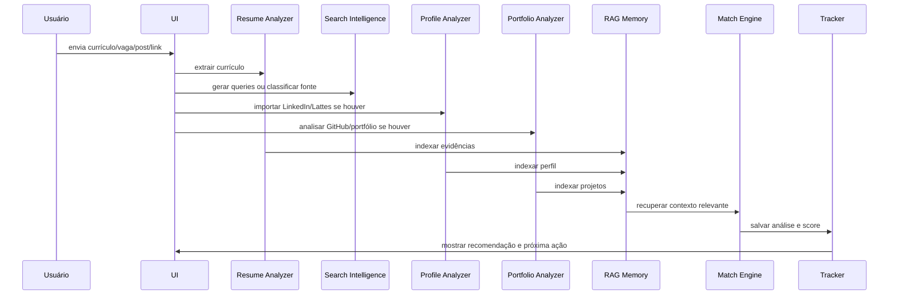
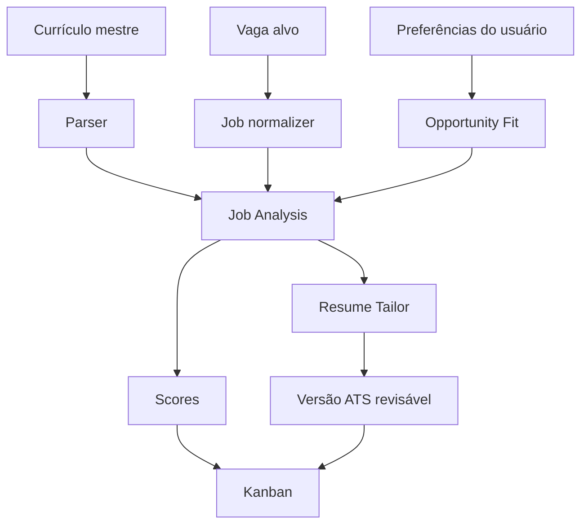

# Fluxo de dados

## Fluxo do MVP 1

```text
1. Usuário envia PDF
2. Usuário cola descrição da vaga
3. Sistema extrai texto do currículo
4. Sistema valida tamanho e legibilidade
5. Sistema aplica sinais ATS básicos
6. Sistema envia currículo + vaga para IA
7. IA retorna JSON estruturado
8. Sistema valida JSON
9. Sistema aplica regras de negócio determinísticas
10. Sistema exibe relatório
```

## Entrada

### Currículo

O currículo pode conter:

- nome;
- formação;
- experiência;
- projetos;
- habilidades;
- ferramentas;
- idiomas;
- links;
- certificações.

No MVP, o parser não precisa entender tudo perfeitamente. Primeiro, basta extrair texto com qualidade aceitável.

### Descrição da vaga

A descrição da vaga pode ser:

- anúncio formal;
- texto copiado de site;
- post de LinkedIn;
- mensagem de recrutador;
- texto de indicação;
- vaga de Gupy/Greenhouse/Lever/Ashby copiada.

## Processamento

### Extração de texto

O sistema usa PyMuPDF ou biblioteca equivalente para converter PDF em texto.

Cuidados:

- se o PDF for imagem escaneada, o texto pode sair vazio;
- se o currículo tiver muitas colunas, a ordem pode sair estranha;
- se tiver ícones sem texto, o ATS pode não reconhecer.

### Pré-validação

Antes de chamar IA, o sistema deve validar:

- currículo tem texto suficiente?
- vaga tem texto suficiente?
- arquivo tem tamanho aceitável?
- entrada parece vazia?

### Análise ATS

A análise ATS inicial pode ser determinística:

- presença de seções comuns;
- texto extraível;
- quantidade de caracteres;
- links detectados;
- palavras-chave técnicas;
- possível problema de formatação.

### Análise de IA

A IA interpreta contexto e gera análise estruturada. Ela é boa para linguagem natural, mas não deve ser a única responsável por regras objetivas.

### Regras determinísticas

Depois da IA, o sistema pode ajustar recomendação com regras claras:

- vaga sênior reduz recomendação;
- termos como `5+ anos` reduzem aderência;
- estágio/júnior aumenta prioridade para perfil inicial;
- requisitos compatíveis aumentam confiança.

## Saída

A saída deve ser estruturada:

```json
{
  "match_score": 82,
  "recommendation": "Aplicar",
  "seniority_fit": "Estágio/Júnior",
  "strong_points": [],
  "weak_points": [],
  "missing_keywords": [],
  "ats_notes": [],
  "recruiter_message": ""
}
```

## Riscos do fluxo

- IA pode inventar competência;
- PDF pode ser lido errado;
- vaga pode ser ambígua;
- score pode parecer preciso demais;
- o usuário pode interpretar recomendação como verdade absoluta.

Por isso, o relatório sempre deve explicar o motivo da recomendação.

---

# Fluxo de dados expandido



## Fluxo consolidado com Resume Tailor e preferências



Esse fluxo mantém o usuário no controle e separa análise, decisão e geração de currículo.
