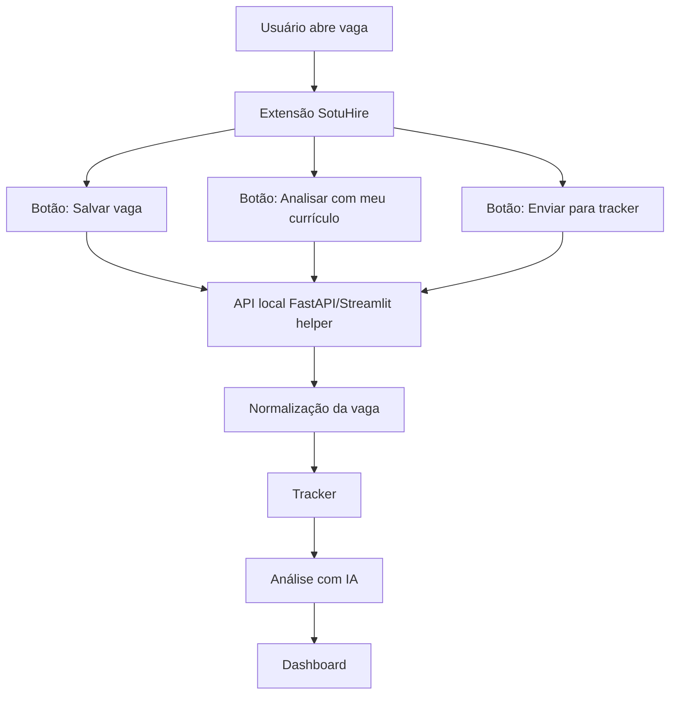

# Local Companion App e extensão assistiva

A arquitetura de extensão assistiva permite que o usuário navegue normalmente em portais de vagas e envie a vaga aberta para o SotuHire local. Essa abordagem reduz o incentivo a scraping agressivo e mantém a revisão humana no centro.

## Inspiração

O benchmark `LA_Jobs_AI_CLAUDE` mostra um fluxo útil: extensão Chrome captura dados da vaga e envia para uma API local. O SotuHire deve aproveitar o conceito, mas com botões próprios e guardrails.

## Fluxo recomendado

## O que a extensão pode coletar

Com ação explícita do usuário:

- título da vaga;
- empresa;
- descrição visível;
- URL;
- localização;
- modalidade quando visível;
- fonte;
- data de coleta.

## O que a extensão não deve fazer

- clicar em aplicar automaticamente;
- enviar mensagem automática;
- raspar perfis em massa;
- monitorar toda navegação sem consentimento;
- tentar burlar login, captcha ou bloqueios.

## Links úteis

- [Chrome Extension Storage API](https://developer.chrome.com/docs/extensions/reference/api/storage)
- [Chrome Extensions docs](https://developer.chrome.com/docs/extensions)

## Implementação futura

O MVP não precisa de extensão. O primeiro passo pode ser uma caixa de texto onde o usuário cola a vaga. A extensão entra depois, quando o backend local estiver estável.
