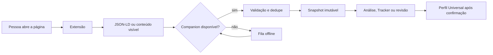

# Local Companion e extensão assistiva

A arquitetura permite que a pessoa navegue normalmente, escolha uma página e envie somente os
sinais necessários ao SotuHire local. Isso evita scraping agressivo e mantém revisão humana,
proveniência e snapshots no centro.

## Fluxo

## Responsabilidades

### Extensão

- extrair a aba atual após clique;
- priorizar `schema.org/JobPosting` para vagas;
- analisar GitHub/portfólio em modo independente;
- isolar chaves próprias no service worker;
- negociar compatibilidade por handshake;
- manter fila com dedupe, retry, backoff e export/import sanitizado.

### Local Companion

- aceitar apenas localhost;
- validar limites e sanitizar payloads;
- criar snapshots de vaga, edital, currículo e análise;
- usar contexto seguro e evidências confirmadas;
- enviar ao Tracker preservando o anúncio;
- expor provider/modelo/fallback sem devolver segredo.

### FastAPI e site

- listar e revisar capturas;
- importar vaga, edital, GitHub ou Tracker;
- mostrar compatibilidade e warnings;
- gerar candidatos revisáveis para o Perfil;
- manter backup/restore sem copiar storage do navegador.

## Dados coletáveis

Com ação explícita:

- título, empresa, localização e descrição;
- URL, domínio, fonte e data;
- JSON-LD de uma vaga pública;
- texto visível da página;
- README, commits, linguagens, topics e estrutura pública do GitHub;
- candidaturas já realizadas visíveis em páginas abertas manualmente.

## Fora de escopo

- auto-apply, inscrição ou mensagem automática;
- login, CAPTCHA ou captura de credenciais;
- cookie, token, sessão, header autenticado ou storage de terceiros;
- monitoramento contínuo da navegação;
- crawling autenticado disfarçado de captura assistida;
- decisão crítica baseada somente em IA.

## Segurança de IA

A chave do SotuHire fica no backend. Uma chave própria Gemini/OpenAI usa sessão por padrão e
IndexedDB apenas com consentimento; ela nunca usa `chrome.storage.sync` nem entra no payload
conectado. O provider escolhido recebe conteúdo somente quando a pessoa inicia a análise.

## Documentos relacionados

- [Local Companion API](local-companion-api.md)
- [Extension Profile Bridge](extension-profile-bridge.md)
- [Regras de captura](../03-business-rules/browser-assisted-capture-rules.md)
- `browser-extension/README.md`
