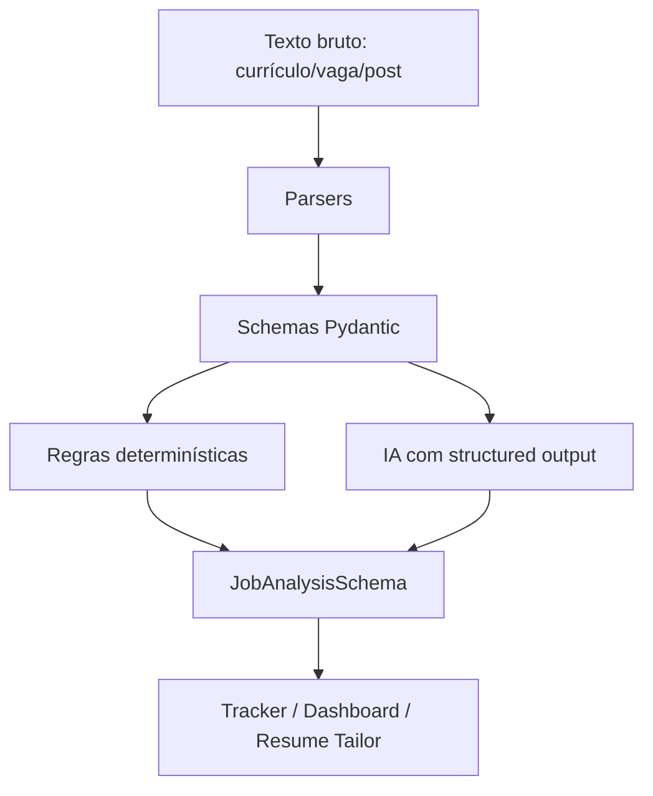

# MVP Core Schemas

O núcleo do SotuHire deve começar pelos schemas, não pela interface. A interface muda, o provedor de IA muda e a fonte de vagas muda, mas os contratos de dados precisam permanecer estáveis.

## Por que começar por schemas

Schemas fortes permitem:

- validar respostas da IA;
- salvar dados no banco sem gambiarra;
- testar regras de negócio;
- evitar JSON quebrado;
- trocar Gemini, OpenAI, Claude, Groq ou OpenRouter sem reescrever o produto inteiro.

## Camadas



## Schemas principais

- `UserPreferences`
- `JobAnalysisSchema`
- `ResumeTailorOutput`
- `TailoredResumeSection`
- `JSONResume`
- `CareerEvidence`

## Regra de engenharia

A IA nunca deve escrever diretamente no banco. Primeiro ela retorna um objeto tipado, depois o sistema valida e só então salva.

## Erro que deve ser evitado

Não usar regex para extrair JSON de texto livre:

```text
preg_match('/\{.*\}/s', $content)
```

Esse padrão é frágil porque a IA pode incluir texto antes/depois, objetos parciais ou vírgulas inválidas.

## Caminho correto

Usar structured output com schema e Pydantic:

- [Gemini Structured Outputs](https://ai.google.dev/gemini-api/docs/structured-output)
- [Pydantic](https://docs.pydantic.dev/)
- [JSON Schema](https://json-schema.org/)

## Próximo passo do MVP

1. Validar schemas.
2. Criar análise fake/determinística.
3. Conectar Gemini.
4. Salvar histórico.
5. Exibir Streamlit.
