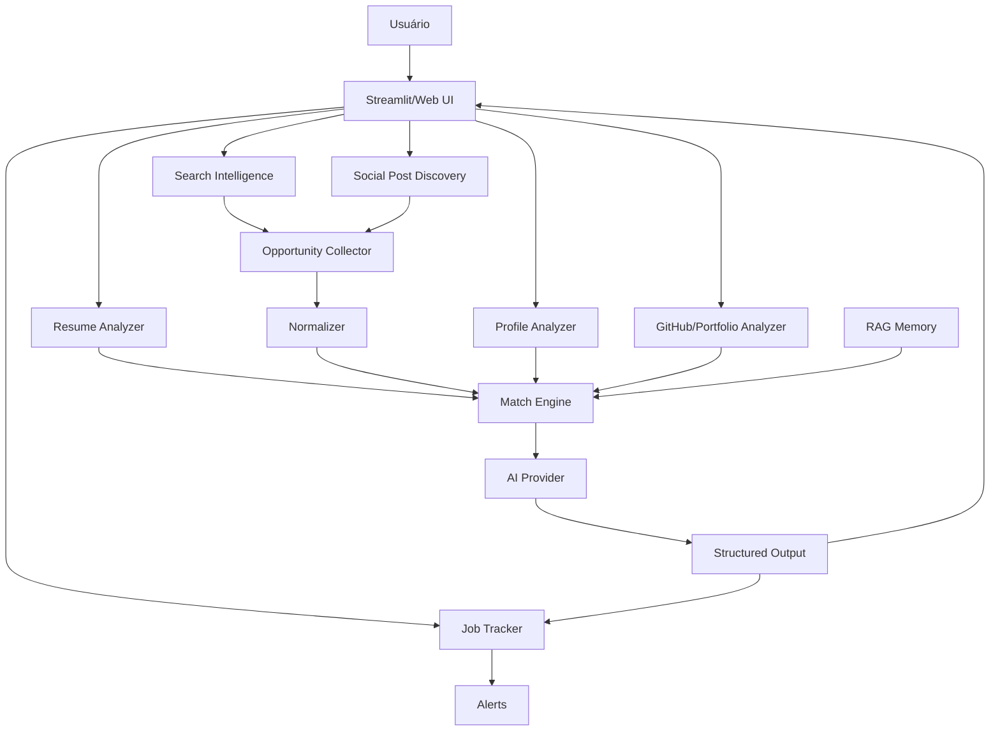

# Arquitetura

## Objetivo da arquitetura

A arquitetura do SotuHire precisa equilibrar simplicidade e qualidade. O MVP não deve virar um sistema gigante, mas também não deve ser um único `app.py` com tudo misturado.

A abordagem recomendada é uma arquitetura modular simples:

- Streamlit fica responsável pela interface;
- módulos cuidam da lógica;
- regras de negócio ficam isoladas;
- IA fica atrás de um serviço simples;
- testes cobrem lógica determinística.

## Camadas

### Interface

Arquivo principal: `app.py`

Responsabilidades:

- renderizar tela;
- receber upload;
- receber texto da vaga;
- chamar serviços;
- exibir relatório;
- tratar erros de entrada.

Não deve conter:

- prompt gigante;
- regra de senioridade;
- cálculo de match;
- extração complexa;
- lógica de banco.

### Módulos de domínio

Arquivos em `modules/`.

Responsabilidades:

- parsing de currículo;
- análise ATS;
- regras de negócio;
- matching;
- formatação de saída;
- geração de mensagens.

### Serviço de IA

Arquivo sugerido: `modules/ai_analyzer.py`

Responsabilidades:

- montar chamada para LLM;
- enviar prompt;
- receber resposta;
- validar JSON;
- tratar erro de API.

### Prompts

Arquivo sugerido: `modules/prompts.py`

Responsabilidades:

- manter prompts versionados;
- separar instrução de sistema, tarefa e formato;
- facilitar testes e revisão.

### Testes

Pasta: `tests/`

Responsabilidades:

- testar regras de negócio;
- testar classificação de score;
- testar parser com fixtures;
- testar tratamento de entradas inválidas.

## Fluxo principal

```text
Usuário
  ↓
Streamlit app.py
  ↓
cv_parser.extract_text_from_pdf()
  ↓
ats_analyzer.analyze_resume_structure()
  ↓
business_rules.extract_rule_signals()
  ↓
ai_analyzer.analyze_match()
  ↓
job_matcher.combine_ai_and_rules()
  ↓
application_helper.generate_message()
  ↓
UI exibe relatório
```

## Por que o MVP não começou com FastAPI + React

FastAPI + React pode ser bom no futuro, mas no MVP inicial adiciona custo desnecessário:

- duas aplicações para manter;
- autenticação mais complexa;
- CORS;
- deploy mais chato;
- mais boilerplate;
- mais pontos de falha.

Streamlit é suficiente para validar o produto rápido.

## Frontend API Layer v1.2.0

A v1.2.0 adiciona FastAPI como camada HTTP local e fina em `apps/api`, sem substituir o Streamlit e
sem duplicar regras do core.

```text
Frontend moderno -> FastAPI /api/v1 -> modules/ -> stores locais
Streamlit         -> modules/ -> stores locais
Extensao          -> Local Companion API -> modules/ -> stores locais
```

Responsabilidades da FastAPI:

- expor OpenAPI em `/openapi.json` e docs interativas em `/docs`;
- publicar endpoints versionados para resume/job extraction, match, ATS, Tailor, GitHub Analyzer e
  tracker;
- aplicar CORS restrito por default;
- devolver DTOs Pydantic estaveis para Lovable/React;
- manter Match, ATS, Tailor, GitHub Analyzer, tracker e Application Intelligence no backend/core.

Detalhes: [Frontend API Layer](frontend-api-layer.md).

## Por que não começar com microserviços

Microserviços seriam overengineering. O SotuHire ainda não tem tráfego, múltiplas equipes, escala independente nem necessidade de deploy isolado por serviço.

Para o MVP, módulos Python são mais simples e suficientes.


## Módulos de coleta

Com scraping no roadmap, a arquitetura passa a incluir uma camada de fontes:

```text
modules/
├── sources/
│   ├── base.py
│   ├── manual_source.py
│   ├── public_page_source.py
│   ├── normalizer.py
│   └── deduplication.py
```

Essa camada não deve conhecer Streamlit nem regras de UI. Ela apenas coleta e normaliza oportunidades.

Fluxo:

```text
Source Connector -> Raw Job -> Normalizer -> Normalized Job -> Business Rules -> AI Analyzer -> Result
```

Cada conector deve ser substituível. Se uma fonte quebrar, o restante do app continua funcionando.

---

# Arquitetura expandida



## Camadas

### Interface

- Streamlit no MVP.
- Futuro web app.
- Futuro extension assistant.

### Domínio

- regras de ATS;
- regras de matching;
- regras de senioridade;
- regras de fonte;
- regras de score de perfil;
- regras de portfolio.

### Dados

- SQLite no MVP;
- arquivos locais;
- JSON estruturado;
- futuro PostgreSQL/pgvector.

### IA

- prompts versionados;
- JSON schema;
- AIProvider;
- RAG;
- avaliação automatizada.

### Integrações

- portais públicos;
- entrada manual;
- scraping responsável;
- exportação CSV do LinkedIn;
- GitHub API pública quando possível;
- alertas.

## Complemento arquitetural: núcleo tipado antes da interface

O SotuHire deve evitar começar pela extensão ou por scraping complexo. A fundação correta é um núcleo tipado:

```text
schemas -> regras determinísticas -> IA estruturada -> tracker/dashboard
```

Esse núcleo permite que Streamlit, FastAPI, extensão Chrome, scraper e RAG usem os mesmos contratos de dados.

Novos módulos arquiteturais:

- `modules/schemas/`: Pydantic e contratos de dados.
- `modules/preferences/`: cálculo de Opportunity Fit.
- `modules/resume_tailor/`: adaptação segura de currículo.
- `modules/public_exams/`: modo concurso futuro, isolado.

PyTorch e agentes avançados ficam como camada futura opcional, sem entrar na dependência padrão.
