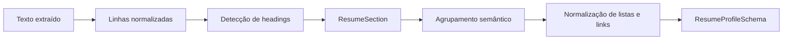

# Semântica do Parser de Currículo

## Objetivo

O parser da v0.4.2 transforma texto extraído de TXT, PDF ou DOCX em fatos revisáveis sem confundir cada linha com uma experiência ou projeto.

O schema público permanece compatível: experiências, projetos e formação ainda são listas de strings. A diferença é que cada string representa um bloco completo e legível.

## Pipeline



## ResumeSection

Cada heading inicia uma seção interna:

```python
@dataclass
class ResumeSection:
    name: str
    title: str
    lines: list[str]
```

As linhas permanecem na seção até o próximo heading reconhecido. A normalização remove diferenças de caixa e acentos apenas para classificação; o texto original continua disponível para apresentação.

## Aliases

Aliases cobrem variações como:

- `PROJETOS SELECIONADOS`, `PROJETOS RELEVANTES` e `PROJETOS DESTACADOS`;
- `COMPETÊNCIAS TÉCNICAS`, `TECNOLOGIAS` e `STACK TÉCNICA`;
- `FORMAÇÃO E CURSOS` e `FORMAÇÃO ACADÊMICA E CURSOS`;
- `EXPERIÊNCIA TÉCNICA`, `ATUAÇÃO PROFISSIONAL` e `HISTÓRICO PROFISSIONAL`.

## Experiências

Uma nova experiência só começa quando há sinais suficientes de cabeçalho, como período combinado com cargo ou separadores de empresa/cargo. Linhas seguintes são preservadas como descrição até outro cabeçalho confiável.

Esse comportamento evita transformar responsabilidades, resultados e tecnologias em experiências separadas.

## Projetos

Projetos nomeados, por exemplo `Monitor IoT: ...`, iniciam blocos. Linhas seguintes continuam no mesmo projeto até outro nome ou marcador confiável.

Na ausência de headings, a inferência permanece conservadora e utiliza apenas linhas com sinais explícitos de projeto.

## Formação e cursos

Formação acadêmica e técnica é agrupada separadamente de cursos complementares quando ambos aparecem sob um heading combinado. O parser não inventa instituições, datas ou títulos ausentes.

## Skills e soft skills

Listas são quebradas por vírgula, ponto e vírgula, barra, barra vertical e marcadores. Soft skills também podem ser separadas pela conjunção `e`.

Skills técnicas longas são reduzidas a chips curtos ou itens reconhecidos pelo catálogo. O texto bruto continua preservado para revisão.

## Resumo

Um resumo explícito usa no máximo três linhas relevantes. Sem seção de resumo, a síntese local usa somente a primeira formação detectada e as principais skills, sem inferir experiência ou objetivos inexistentes.

## Links

LinkedIn, GitHub, portfólio, URLs com protocolo e endereços iniciados por `www.` são detectados. A UI adiciona `https://` apenas ao destino clicável e mostra rótulos compactos.

## Limites

O parser é heurístico e local. Layouts PDF em múltiplas colunas ainda podem produzir ordem de linhas imperfeita. A revisão humana permanece parte obrigatória do fluxo.
