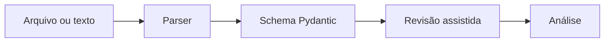

# Arquitetura de parsers

## Objetivo

Os parsers reduzem preenchimento manual sem transformar detecção heurística em verdade absoluta. Toda extração passa por revisão assistida na interface.

## Componentes

```text
modules/parsers/
├── job_description_parser.py
└── resume_parser.py

modules/schemas/
├── job_posting.py
└── resume_profile.py
```

## Job Description Parser

Extrai quando possível:

- cargo;
- empresa;
- localização;
- modalidade;
- faixa salarial;
- contrato;
- senioridade;
- skills obrigatórias;
- skills desejáveis;
- inglês obrigatório;
- keywords ATS.

O parser usa labels, expressões regulares, catálogo leve de skills e normalização de texto. Campos não detectados permanecem vazios ou `unknown`.

## Resume Parser

Suporta:

- TXT por UTF-8 com fallback de caracteres;
- PDF com PyMuPDF;
- DOCX com python-docx.

Extrai nome, resumo, formação, experiências, projetos, skills, links e keywords. O conteúdo bruto permanece apenas na sessão atual e não é salvo pelo tracker.

## Fluxo



## Limites

- layouts complexos podem exigir correção humana;
- OCR de PDF escaneado não faz parte da v0.4;
- o parser não acessa LinkedIn ou fontes privadas;
- nenhum campo detectado deve ser tratado como fato sem revisão.
