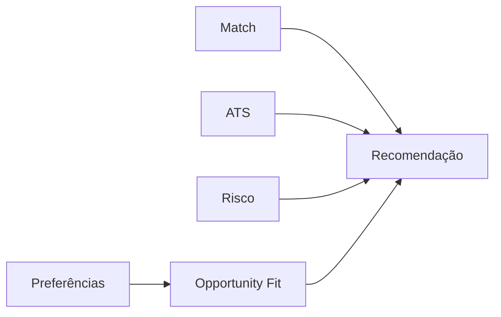

# Regras do Opportunity Fit Score na v0.1

Este documento registra o contrato operacional do Opportunity Fit Score implementado no **SotuHire v0.1 — MVP Core**.

## Objetivo

O Match Score responde se o currículo parece aderente aos requisitos. O Opportunity Fit Score responde se a oportunidade combina com as prioridades pessoais informadas pelo usuário.

Esses scores não devem ser confundidos. Uma vaga tecnicamente boa pode ser inadequada por salário, modalidade, localização, contrato ou senioridade.

## Entradas

- `job["modality"]`;
- `job["location"]`;
- `job["salary_min"]`;
- `job["contract"]`;
- `job["seniority"]`;
- `UserPreferences`.

## Política de pontuação

| Sinal | Compatível | Ausente | Incompatível |
|---|---:|---:|---:|
| Modalidade | 100 | 60 | 25 |
| Localização | 100 | 60 | 35 |
| Salário | 100 ou proporcional | 60 | proporcional |
| Contrato | 100 | 60 | 30 |
| Senioridade | 100 | 60 | 5 a 45 |

Somente preferências configuradas entram na média ponderada. Quando o usuário não configura preferências, o resultado é neutro.

## Função pública

```python
calculate_opportunity_fit_score(job, preferences) -> int
```

O resultado é sempre um inteiro entre 0 e 100 e pode ser usado pela recomendação final sem dependência de Streamlit.

## Limites

- o score não infere preferências;
- salário ausente não significa salário ruim;
- texto de localização é comparado de forma simples no MVP;
- pesos customizados não podem ser negativos;
- explicações detalhadas podem evoluir depois da validação da heurística.

## Relação com a recomendação

O Opportunity Fit Score participa de `build_recommendation()`, mas não decide sozinho. Match, ATS e risco também importam.



## Testes

- modalidade, localização e salário alteram o score;
- vaga vazia não quebra;
- preferências vazias geram resultado neutro;
- valores extremos permanecem entre 0 e 100.

Veja também [Opportunity Fit Score](opportunity-fit-score.md) para a visão de negócio mais ampla.
