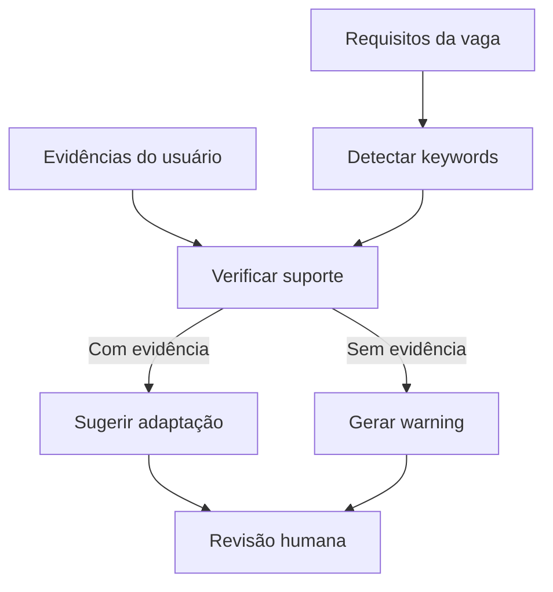

# Regras de negócio do Resume Tailor

O Resume Tailor precisa ser útil sem virar uma máquina de inventar credenciais. As regras abaixo protegem o usuário e tornam o módulo testável.

## Regra 1: verdade acima de persuasão

Todo texto adaptado precisa vir de uma evidência real. Quando não houver evidência, o sistema deve gerar aviso.

## Regra 2: reescrever não é inventar

Permitido:

- reescrever com linguagem mais clara;
- trocar ordem das seções;
- aproximar termos do vocabulário da vaga;
- destacar projeto relevante;
- resumir experiência longa.

Proibido:

- criar números sem fonte;
- criar certificado;
- criar senioridade;
- transformar estudo em experiência profissional;
- aumentar tempo de experiência.

## Regra 3: evidência obrigatória por seção

Cada seção adaptada deve ter:

- `original_text`;
- `tailored_text`;
- `reason_for_change`;
- `evidence_source`;
- `invented_information`.

## Regra 4: warning é melhor que mentira

Se a vaga pede `Power BI` e o usuário não tem evidência disso, a saída deve ser:

```text
Warning: a vaga pede Power BI, mas não há evidência suficiente no currículo mestre.
```

Não deve ser:

```text
Experiência avançada com Power BI.
```

## Regra 5: foco por contexto

O mesmo histórico pode ter pesos diferentes por vaga:

- indústria/aeroespacial: destacar formação técnica, matemática, projetos industriais;
- dados: destacar SQL, Python, BI, estatística;
- web: destacar frontend/backend, APIs, deploy;
- QA: destacar testes, automação, bug reports;
- suporte: destacar comunicação, diagnóstico e atendimento.

## Testes esperados

- não permitir `invented_information=True` sem warning;
- preservar fontes de evidência;
- ranquear seções conforme vaga;
- detectar termos industriais quando aplicável;
- sugerir keywords sem afirmar experiência inexistente.

## Contrato da v0.1

Na v0.1, o Resume Tailor não gera um arquivo final. Ele retorna sugestões estruturadas para revisão humana.

Cada sugestão precisa satisfazer:

1. `invented_information` permanece `false`;
2. `evidence_source` não está vazio;
3. a keyword sugerida já aparece em alguma evidência fornecida;
4. o texto adaptado não aumenta senioridade, tempo, impacto ou domínio técnico;
5. warnings deixam explícito quando a vaga pede algo não comprovado.

Fontes aceitas de evidência:

- currículo mestre / JSON Resume;
- currículo colado na interface;
- GitHub ou portfólio fornecido pelo usuário;
- Lattes fornecido pelo usuário;
- LinkedIn fornecido pelo usuário;
- outras evidências explicitamente fornecidas.

## Fluxo seguro



## Regra de bloqueio

Uma seção com `invented_information=True` é inválida para exportação. O sistema deve rejeitar esse estado no schema ou interromper a sugestão antes de apresentá-la como segura.
