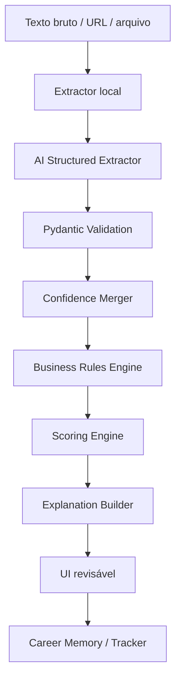

# Orquestração de IA e confiança

## Objetivo

Este documento define como o SotuHire deve usar Gemini ou outro provedor de IA dentro do site, da Local Companion API e da extensão, sem depender exclusivamente de heurísticas simples e sem entregar decisões cegas ao modelo.

A regra central é:

```text
IA interpreta e estrutura. Código valida, calcula, limita e registra.
```

## Por que mudar

Na v0.9.0, o SotuHire já usa análise local, Gemini opcional, memória, RAG e extensão assistiva. Porém, partes importantes ainda podem depender de parsers heurísticos e scores simples.

A próxima fase deve permitir que a IA ajude melhor em:

- extração de currículo;
- extração de vaga;
- classificação de domínio;
- classificação de requisitos;
- análise ATS;
- matching explicável;
- Resume Tailor;
- GitHub/Portfolio Analyzer;
- geração de bullets seguros;
- competências transferíveis;
- detecção de gaps críticos.

## Arquitetura recomendada



## Papel de cada camada

### Extractor local

Responsável por:

- extrair texto de PDF, DOCX ou input colado;
- limpar caracteres quebrados;
- detectar campos básicos;
- oferecer fallback offline;
- produzir evidências brutas.

### AI Structured Extractor

Responsável por:

- transformar texto bruto em JSON;
- classificar requisitos;
- detectar domínio profissional;
- estimar senioridade;
- identificar gaps;
- gerar explanation draft;
- atribuir confidence por campo.

### Pydantic Validation

Responsável por:

- garantir tipos corretos;
- bloquear campos fora do schema;
- validar enums;
- limitar scores;
- rejeitar JSON inválido;
- normalizar campos vazios.

### Confidence Merger

Responsável por comparar:

- parser local;
- IA estruturada;
- memória existente;
- preferências do usuário;
- evidências de portfólio.

Se parser local e IA discordarem, o campo deve ir para revisão.

### Business Rules Engine

Responsável por:

- aplicar regras de domínio;
- tratar credenciais críticas;
- impedir sugestões antiéticas;
- separar obrigatório de desejável;
- detectar knockout gaps;
- evitar overclaiming.

### Scoring Engine

Responsável por calcular:

- Match Score;
- ATS Score;
- Opportunity Fit Score;
- Risk Score;
- Portfolio Score;
- Readiness Score;
- Confidence Score.

A IA pode sugerir sinais, mas o score final deve ser calculado pelo código.

## Contrato de confidence

Todo output de IA que entra no produto deve carregar confidence.

Escala:

```text
0.00-0.39: baixa confiança, precisa revisão
0.40-0.69: confiança moderada, mostrar aviso
0.70-0.89: boa confiança, ainda revisável
0.90-1.00: alta confiança, uso seguro com validação
```

Campos críticos exigem confidence maior:

- nome;
- formação;
- registro profissional;
- certificação;
- senioridade;
- requisito obrigatório;
- salário;
- localidade;
- modalidade;
- experiência profissional.

## Campos que sempre exigem cuidado

A IA nunca deve confirmar sozinha:

- registro profissional ativo;
- certificação ativa;
- diploma concluído;
- fluência em idioma;
- experiência profissional formal;
- tempo de experiência;
- resultados numéricos;
- atuação clínica;
- atuação hospitalar;
- participação em empresa real;
- deploy em produção;
- usuários reais;
- receita, impacto financeiro ou métricas.

Se não houver evidência clara, o campo deve retornar como `unknown`, `not_evidenced` ou confidence baixo.

## Provider strategy

O SotuHire deve aceitar provedores diferentes, mas com contrato comum.

Interface conceitual:

```python
class AIProvider:
    def generate_structured(self, prompt_id: str, payload: dict, schema: type[BaseModel]) -> BaseModel:
        ...
```

Provedores possíveis:

- Gemini;
- OpenAI;
- OpenRouter;
- Ollama;
- provider mockado para testes.

A troca de provider não deve alterar regras de negócio.

## Prompt Registry

Todos os prompts devem ser versionados.

Formato sugerido:

```python
@dataclass
class PromptSpec:
    id: str
    version: str
    system_prompt: str
    user_template: str
    output_schema: type[BaseModel]
    temperature: float = 0.1
    max_output_tokens: int | None = None
```

Exemplos:

- `resume_extraction_v1`;
- `job_extraction_multi_domain_v1`;
- `match_analysis_evidence_based_v1`;
- `ats_analysis_v1`;
- `resume_tailor_v1`;
- `github_repo_analysis_v2`;
- `github_profile_analysis_v1`;
- `hidden_job_detection_v1`.

## JSON Guard

Fluxo recomendado quando a IA retorna algo inválido:

1. tentar parsear JSON;
2. remover wrappers de markdown se existirem;
3. validar schema Pydantic;
4. se falhar, fazer uma tentativa de reparo com prompt curto;
5. se falhar novamente, retornar erro revisável;
6. nunca salvar output inválido como análise final.

## Comparação heurística + IA

A IA não substitui o parser local.

Ela complementa.

Exemplo:

| Campo | Parser local | IA | Decisão |
|---|---|---|---|
| Nome | Rafael | Rafael | aceitar |
| Senioridade | unknown | junior | revisar |
| COREN | não encontrado | ativo | rejeitar sem evidência |
| Java | encontrado | encontrado | aceitar |
| Docker | não encontrado | gap | aceitar como gap |

## Modo rápido e modo profundo

### Modo rápido

- parser local;
- prompt curto;
- menos contexto;
- custo menor;
- bom para triagem.

### Modo profundo

- parser local;
- IA estruturada;
- memória relevante;
- evidências de portfólio;
- GitHub Analyzer 2.0;
- explicação detalhada;
- confidence por campo;
- output validado.

## Como isso entra no site

Páginas sugeridas:

- Análise de currículo;
- Análise de vaga;
- Match currículo x vaga;
- ATS Review;
- Resume Tailor;
- GitHub/Portfolio Analyzer;
- Perfil profissional;
- Configuração de IA.

Cada página deve mostrar:

- resultado;
- confidence;
- evidências;
- campos incertos;
- botão para revisar;
- botão para salvar.

## Como isso entra na extensão

A extensão deve ser ponte, não cérebro.

Responsabilidades da extensão:

- detectar página atual;
- extrair URL, texto visível e metadados básicos;
- permitir clique explícito;
- enviar payload para localhost;
- mostrar resultado resumido;
- abrir resultado completo no site quando necessário.

Responsabilidades do backend/site:

- analisar profundamente;
- chamar IA;
- validar schema;
- cruzar com currículo;
- salvar no tracker;
- salvar na memória;
- gerar relatório completo.

## Observabilidade

Cada análise com IA deve salvar metadados técnicos sem expor dados sensíveis:

```json
{
  "prompt_id": "resume_extraction_v1",
  "prompt_version": "1.0.0",
  "provider": "gemini",
  "model": "configured-model",
  "input_hash": "sha256",
  "schema_name": "ResumeExtractionOutput",
  "validation_status": "valid",
  "confidence_overall": 0.82
}
```

## Critério de pronto

A orquestração estará pronta quando:

- todo prompt produtivo tiver schema;
- todo schema tiver teste;
- todo output de IA tiver validação;
- todo campo crítico tiver confidence;
- todo erro de JSON tiver fallback;
- a UI mostrar revisão para baixa confiança;
- os scores finais forem calculados por código;
- a extensão não precisar carregar prompt gigante próprio para análise profunda.
