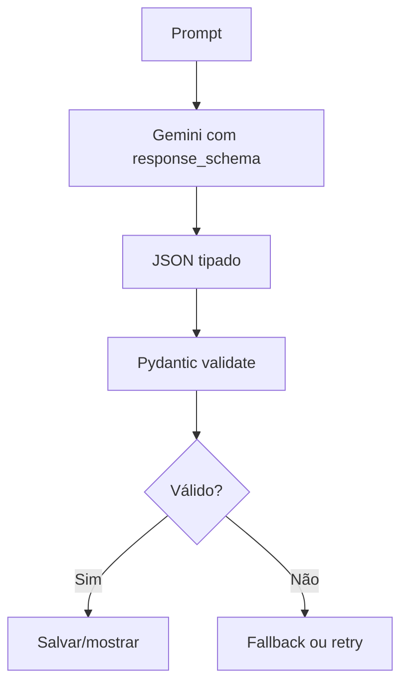
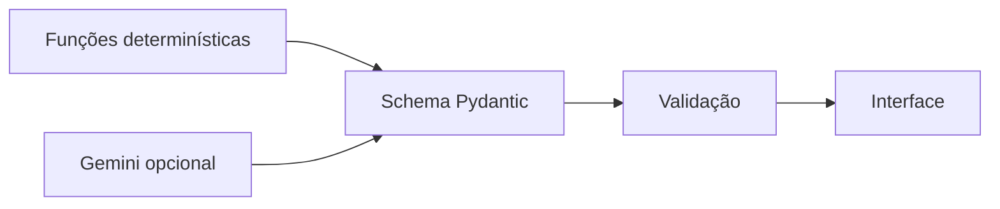

# Gemini Structured Output e Pydantic

O SotuHire deve usar saída estruturada sempre que a IA gerar dados que serão salvos, exibidos em dashboard ou usados por outro módulo.

A documentação oficial do Gemini explica que modelos podem ser configurados para gerar respostas que seguem um JSON Schema, tornando a extração de dados mais previsível e tipada. Também há suporte prático para definir schemas com Pydantic no SDK Python.

Links:

- [Gemini Structured Outputs](https://ai.google.dev/gemini-api/docs/structured-output)
- [Pydantic](https://docs.pydantic.dev/)
- [JSON Schema](https://json-schema.org/)

## Por que usar structured output

Sem schema, a IA pode retornar:

```text
Claro! Aqui está sua análise: { ... }
```

ou um JSON inválido. Com schema, o sistema força a saída esperada e valida antes de usar.

## Fluxo recomendado



## Schemas do SotuHire

- `JobAnalysisSchema`
- `ResumeTailorOutput`
- `UserPreferences`
- `CareerEvidence`
- `JSONResume`

## Regra

Qualquer resposta de IA que afete decisão do usuário deve ter schema.

## Estado na v0.1

Gemini não é dependência obrigatória do runtime da v0.1. O núcleo determinístico funciona offline e produz um `JobAnalysisSchema` válido.

A integração futura com Gemini Structured Outputs deve:

1. reutilizar os mesmos schemas Pydantic do núcleo;
2. solicitar JSON tipado em vez de texto livre;
3. validar toda resposta antes de exibir ou salvar;
4. rejeitar scores fora de 0 a 100;
5. rejeitar recomendações fora dos valores permitidos;
6. manter a regra anti-invenção do Resume Tailor;
7. oferecer fallback determinístico quando a API falhar.

## Fronteira entre IA e regras

Regras de score, preferência, segurança e recomendação permanecem testáveis sem chamada externa. A IA pode ajudar a explicar, resumir ou sugerir redação, mas não deve contornar validações.



Essa fronteira mantém custo, privacidade e falhas de rede fora do caminho crítico do MVP.

## Provider preparado na v0.3

O `GeminiProvider` usa o SDK opcional `google-genai` e configura:

```python
response_mime_type="application/json"
response_schema=JobAnalysisSchema
```

O provider valida `response.parsed` ou o JSON retornado com Pydantic. Sem `GEMINI_API_KEY` ou sem o SDK opcional, `analyze_structured()` retorna o resultado local e informa que houve fallback.

Instalação opcional:

```bash
pip install -r requirements-ai.txt
```

Configuração:

```text
DEFAULT_AI_PROVIDER=gemini
GEMINI_API_KEY=...
```

O default permanece `mock` para testes, privacidade, custo previsível e funcionamento offline.
