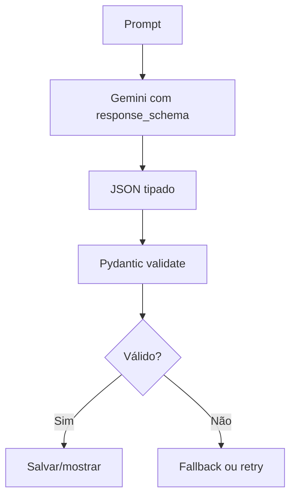

# Gemini Structured Output e Pydantic

O SotuHire deve usar saída estruturada sempre que a IA gerar dados que serão salvos, exibidos em dashboard ou usados por outro módulo.

A documentação oficial do Gemini explica que modelos podem ser configurados para gerar respostas que seguem um JSON Schema, tornando a extração de dados mais previsível e tipada. Também há suporte prático para definir schemas com Pydantic no SDK Python.

Links:

- [Gemini Structured Outputs](https://ai.google.dev/gemini-api/docs/structured-output)
- [Pydantic](https://docs.pydantic.dev/)
- [JSON Schema](https://json-schema.org/)

## Por que usar structured output

Sem schema, a IA pode retornar:

```text
Claro! Aqui está sua análise: { ... }
```

ou um JSON inválido. Com schema, o sistema força a saída esperada e valida antes de usar.

## Fluxo recomendado



## Schemas do SotuHire

- `JobAnalysisSchema`
- `ResumeTailorOutput`
- `UserPreferences`
- `CareerEvidence`
- `JSONResume`

## Regra

Qualquer resposta de IA que afete decisão do usuário deve ter schema.
