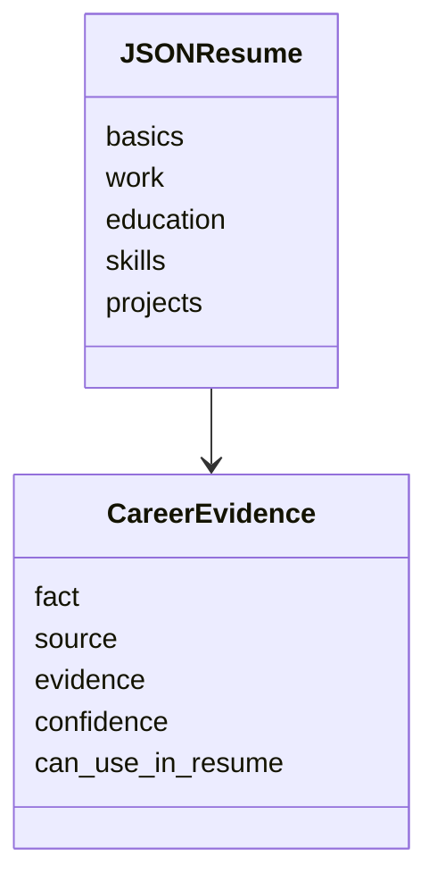

# JSON Resume, currículo mestre e Pydantic

O SotuHire não deve inventar um formato caótico para currículo. O padrão [JSON Resume](https://jsonresume.org/schema) é uma boa inspiração por ser aberto, orientado a JSON e focado em currículos.

## O que aproveitar do JSON Resume

O schema oficial inclui seções como:

- `basics`;
- `work`;
- `volunteer`;
- `education`;
- `awards`;
- `certificates`;
- `publications`;
- `skills`;
- `languages`;
- `interests`;
- `references`;
- `projects`.

## O que o SotuHire adiciona

O SotuHire precisa de metadados além do currículo:

- fonte da evidência;
- confiança;
- última verificação;
- se pode ser usado em currículo;
- relação com vagas alvo;
- origem: PDF, Lattes, LinkedIn, GitHub, portfólio.

## Estrutura recomendada



## Benefício

Com esse modelo, o Resume Tailor pode adaptar o currículo com rastreabilidade.

## Contrato mínimo da v0.1

O schema `JSONResume` da v0.1 é propositalmente parcial. Ele representa:

- `basics`;
- `work`;
- `education`;
- `skills`;
- `projects`;
- `certificates`;
- `languages`;
- `evidence`.

`CareerEvidence` registra fato, fonte, evidência, confiança, permissão de uso e data de verificação opcional.

## Validação anti-invenção

Uma sugestão só pode virar fato no currículo quando existir evidência utilizável. O Resume Tailor deve considerar currículo mestre, GitHub, Lattes, LinkedIn, portfólio e outras fontes fornecidas pelo usuário, sem coletá-las silenciosamente.

```text
requisito da vaga + evidência existente = keyword segura para sugerir
requisito da vaga sem evidência = gap ou warning
```

Os schemas Pydantic também limitam scores, recomendações e modalidades aceitas. Gemini Structured Outputs poderá produzir os mesmos contratos no futuro, mas a validação local continua obrigatória.
