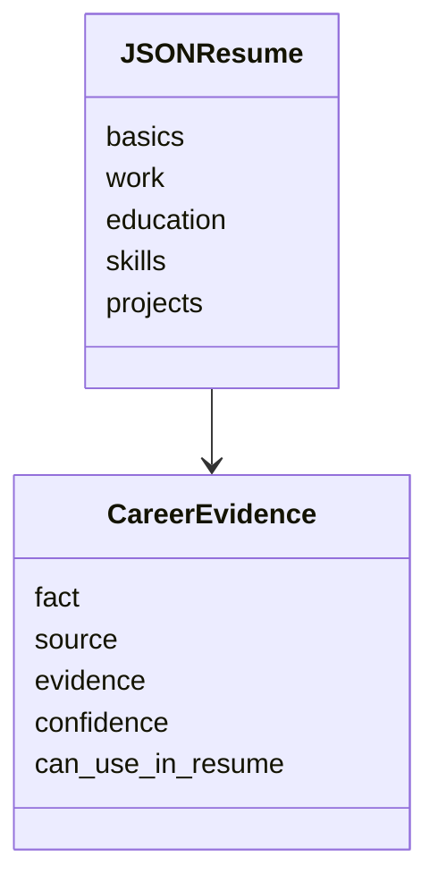

# JSON Resume, currículo mestre e Pydantic

O SotuHire não deve inventar um formato caótico para currículo. O padrão [JSON Resume](https://jsonresume.org/schema) é uma boa inspiração por ser aberto, orientado a JSON e focado em currículos.

## O que aproveitar do JSON Resume

O schema oficial inclui seções como:

- `basics`;
- `work`;
- `volunteer`;
- `education`;
- `awards`;
- `certificates`;
- `publications`;
- `skills`;
- `languages`;
- `interests`;
- `references`;
- `projects`.

## O que o SotuHire adiciona

O SotuHire precisa de metadados além do currículo:

- fonte da evidência;
- confiança;
- última verificação;
- se pode ser usado em currículo;
- relação com vagas alvo;
- origem: PDF, Lattes, LinkedIn, GitHub, portfólio.

## Estrutura recomendada

## Benefício

Com esse modelo, o Resume Tailor pode adaptar o currículo com rastreabilidade.
