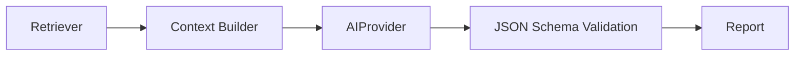
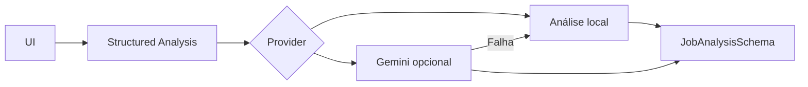

# Estratégia de Provedores de IA

O SotuHire deve começar simples, mas nascer preparado para trocar de provedor de IA sem reescrever regra de negócio.

## Objetivo

Separar:

```text
regra de negócio != prompt != provedor de IA != interface
```

O módulo de análise deve depender de uma interface `AIProvider`, não diretamente de Gemini, OpenAI ou outro serviço.

## Providers planejados

| Provider | Uso | Momento |
|---|---|---|
| Gemini | MVP inicial e structured output | v0.1/v0.2 |
| OpenAI | alternativa para modelos robustos | futuro |
| OpenRouter | escolha de múltiplos modelos por API compatível | futuro |
| Ollama | modo local/offline e privacidade | futuro |

Links:

- [Gemini API](https://ai.google.dev/)
- [OpenAI API](https://platform.openai.com/docs)
- [OpenRouter](https://openrouter.ai/docs/quickstart)
- [Ollama](https://ollama.com/)

## Interface proposta

```python
class AIProvider:
    def generate_json(self, prompt: str, schema: dict) -> dict:
        """Generate a JSON-compatible response according to a schema."""
        raise NotImplementedError
```

## Regras

- Toda resposta crítica deve ser JSON estruturado.
- O prompt deve pedir evidências e não apenas opinião.
- O schema deve validar score, gaps, pontos fortes e recomendação.
- O provider não deve conhecer UI.
- O provider não deve salvar dados sem autorização.
- O provider deve receber apenas contexto necessário.

## Relação com RAG

O RAG monta contexto. O provider apenas gera saída.



## OpenRouter

OpenRouter pode ser útil porque permite alternar modelos mantendo uma API parecida com OpenAI. Isso ajuda quando:

- um modelo fica caro;
- um modelo fica indisponível;
- um modelo é melhor para português;
- o usuário quer escolher custo/qualidade;
- o projeto quer comparar respostas.

## Ollama/local

Ollama pode ser útil para:

- privacidade;
- testes locais;
- reduzir custo;
- demos offline;
- análise de documentos menos sensíveis.

Limitação: modelos locais podem ser mais fracos, lentos ou exigir máquina melhor.

## Decisão de arquitetura

No MVP, usar um provider simples. Na arquitetura, deixar interface pronta.

```text
Não implementar múltiplos providers antes do MVP.
Mas não acoplar o código a um provider só.
```

## Complemento: Claude, Groq e OpenRouter como providers, não como acoplamento

Benchmarks externos podem usar Groq, Claude, Gemini ou OpenAI. O SotuHire não deve acoplar regra de negócio a nenhum deles.

A interface ideal é:

```text
AIProvider.analyze_job()
AIProvider.tailor_resume()
AIProvider.generate_message()
```

Assim, Gemini pode ser o MVP e Claude/Groq/OpenRouter podem entrar depois sem reescrever o produto.
## Implementação v0.3/v0.4

A camada atual usa `modules/ai/providers/`:

- `base.py`: contrato `AIProvider`;
- `mock_provider.py`: implementação compatível da análise local determinística;
- `gemini_provider.py`: integração opcional com Gemini Structured Outputs;
- `structured_analysis.py`: roteamento e fallback local.

`DEFAULT_AI_PROVIDER=local` é a configuração segura. Quando `gemini` é selecionado sem chave ou SDK, o app não quebra: registra warning e usa o provider local.

O provider não pode ignorar schemas Pydantic, inventar fatos ou contornar regras determinísticas. O SDK Gemini fica em `requirements-ai.txt`, fora das dependências obrigatórias.



## Configuração canônica na v0.4.2

```env
DEFAULT_AI_PROVIDER=local
GEMINI_API_KEY=
GEMINI_MODEL=gemini-2.5-flash
```

Para usar Gemini, altere `DEFAULT_AI_PROVIDER=gemini`, informe a chave e instale:

```bash
pip install -r requirements-ai.txt
```

`LLM_PROVIDER` e `LLM_MODEL` continuam aceitos como aliases para instalações antigas. As variáveis novas têm precedência quando ambas estão configuradas.

## Contrato de fallback

O resultado estruturado registra:

- `requested_provider`: provider solicitado;
- `provider`: provider realmente usado;
- `fallback_used`: confirmação explícita do fallback;
- `warning`: motivo resumido e ação necessária.

A interface nunca apresenta `mock` ao usuário. O nome exibido é `Análise local`. Quando Gemini não possui chave, o aviso é `Gemini não configurado. Usando análise local.`. Quando falta o SDK, a orientação é `Instale requirements-ai.txt para usar Gemini.`.

## Evolução na v0.5.0

A sidebar passa a oferecer `Configurar IA`, evitando que a pessoa precise editar `.env` manualmente. O wizard:

- mostra análise selecionada e análise realmente usada;
- verifica chave e SDK;
- abre o Google AI Studio;
- aceita a chave em campo seguro;
- testa uma chamada mínima somente após clique explícito;
- salva configuração em `.streamlit/secrets.toml`;
- ativa Gemini no rerun seguinte.

As mensagens principais evitam termos internos. `provider`, `fallback` e nomes de implementação aparecem apenas no expander de detalhes técnicos.

O alias `GOOGLE_API_KEY` é aceito para compatibilidade, mas `GEMINI_API_KEY` continua sendo o padrão documentado.

Veja [Setup local do Gemini](gemini-local-setup.md).

## Diagnóstico real na v0.6.0

O wizard separa duas perguntas:

1. `Testar Gemini simples`: valida chave, modelo, SDK e configuração com uma chamada mínima sem schema.
2. `Testar Gemini estruturado`: valida o caminho real do SotuHire com `response_json_schema`.

Se o teste simples passa e o estruturado falha, o problema está no schema ou payload. Se ambos falham, a causa provável é chave, modelo, quota, região ou projeto.

O payload estruturado usa somente o subconjunto necessário de JSON Schema, sem metadados Pydantic incompatíveis. O diagnóstico registra código, categoria, modelo, versão do SDK, origem da variável e tipo de chamada, mas nunca mostra a chave.

## Memória relevante na v0.8.0

O contrato `AIProvider.analyze` aceita `memory_context`, mas providers externos não o recebem por
padrão. A UI mantém **Enviar contexto relevante para Gemini** desabilitado até uma ação explícita.

Quando habilitado, `structured_analysis.py` resume apenas as evidências recuperadas para a vaga
atual. O arquivo completo de memória, itens não relacionados e dados fora do top-k não entram no
prompt. Se Gemini falhar, o fallback local ainda pode usar as evidências recuperadas.
