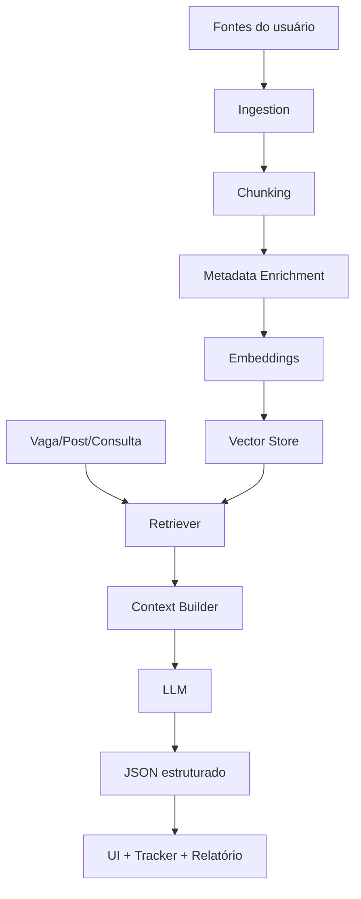

# RAG e Memória de Carreira

Este documento define como o SotuHire pode usar **RAG — Retrieval-Augmented Generation** para melhorar análises, recomendações e personalização sem depender apenas de prompts soltos.

A ideia é inspirada na lógica adaptativa do SoturAI: guardar evidências, recuperar contexto relevante e tomar decisões com base em histórico. No SotuHire, a memória não é de mercado financeiro; é memória de carreira.

## Por que usar RAG?

Sem RAG, a IA analisa apenas o texto atual:

```text
currículo atual + vaga atual -> resposta atual
```

Com RAG, o SotuHire pode recuperar contexto:

```text
currículo + vaga + projetos + LinkedIn + GitHub + histórico + preferências -> resposta contextualizada
```

## O que entra na base de conhecimento

### Documentos do usuário

- currículo ATS;
- currículo tradicional;
- Currículo Lattes;
- exportação CSV do LinkedIn;
- perfil GitHub;
- portfólio pessoal;
- artigos técnicos;
- certificados;
- projetos acadêmicos;
- projetos pessoais;
- experiências profissionais;
- preferências de vaga.

### Documentos de oportunidade

- descrição de vaga;
- post de recrutador;
- página de empresa;
- requisitos extraídos;
- mensagem enviada;
- resposta recebida;
- status da candidatura.

### Dados derivados

- keywords fortes do usuário;
- gaps recorrentes;
- senioridade alvo;
- fontes que funcionam;
- vagas que deram entrevista;
- vagas que geraram rejeição;
- projetos que melhor combinam com determinada área.

## Arquitetura RAG



## Metadados obrigatórios

Cada chunk deve ter metadados para evitar bagunça:

```json
{
  "source_type": "github_repository",
  "source_name": "SotuHire",
  "owner": "user",
  "created_at": "2026-06-12",
  "updated_at": "2026-06-12",
  "tags": ["python", "ai", "job-search"],
  "visibility": "public",
  "trust_level": "high"
}
```

## Tipos de coleção

```text
career_profile
resume_versions
job_descriptions
social_posts
applications
portfolio_projects
linkedin_exports
lattes_exports
github_repositories
messages_and_followups
```

## Estratégia de implementação

### MVP sem banco vetorial pesado

No começo, o SotuHire pode usar busca simples:

- normalização de texto;
- palavras-chave;
- TF-IDF;
- similaridade por cosseno;
- SQLite para armazenar documentos.

### Evolução com embeddings

Depois:

- [Sentence Transformers](https://www.sbert.net/);
- [Chroma](https://www.trychroma.com/);
- [FAISS](https://github.com/facebookresearch/faiss);
- [pgvector](https://github.com/pgvector/pgvector) quando migrar para PostgreSQL.

### Evolução local-first

Para privacidade:

- permitir modo sem nuvem;
- permitir embeddings locais;
- permitir [Ollama](https://ollama.com/) no futuro;
- salvar chaves em `.env` ou secrets;
- evitar enviar documentos inteiros sem necessidade.

## Relação com providers

O RAG deve ser independente do provedor de IA.

```text
Retriever -> Context Builder -> AIProvider -> Structured Output
```

Provedores possíveis:

- Gemini;
- OpenAI;
- OpenRouter;
- Ollama local.

Ver: [Provider Strategy](./provider-strategy.md).

## Exemplo de consulta RAG

Pergunta:

```text
Essa vaga de estágio em dados combina comigo?
```

Contexto recuperado:

- resumo do currículo ATS;
- projetos GitHub com Python/SQL;
- certificados relevantes;
- experiências acadêmicas;
- histórico de vagas parecidas;
- LinkedIn headline;
- gaps recorrentes.

Saída:

```json
{
  "match_score": 81,
  "ats_score": 73,
  "linkedin_score": 68,
  "portfolio_score": 77,
  "evidence": [
    "Projeto SotuHire usa Python e IA",
    "Currículo menciona SQL, mas sem resultados quantificados",
    "LinkedIn precisa reforçar cargo-alvo"
  ],
  "recommended_action": "Aplicar com ajuste no resumo e mensagem curta ao recrutador"
}
```

## RAG não deve virar caixa-preta

Toda recomendação importante deve mostrar evidências:

- qual trecho do currículo sustentou a nota;
- qual projeto sustentou o Portfolio Score;
- qual requisito da vaga gerou gap;
- qual parte do LinkedIn precisa melhorar;
- qual histórico influenciou a recomendação.

## Critérios de aceitação

- O sistema deve recuperar contexto relevante, não tudo.
- O sistema deve citar internamente as fontes usadas na análise.
- O usuário deve conseguir apagar dados.
- O usuário deve conseguir reprocessar a base.
- A resposta deve continuar em JSON estruturado.
- O RAG deve respeitar privacidade e minimização de dados.

## Não objetivos

- Não guardar dados sensíveis desnecessários.
- Não criar perfil oculto do usuário.
- Não compartilhar base com terceiros.
- Não usar RAG para inventar experiências.
- Não sugerir mentir no currículo.

## Complemento: RAG simples antes de ML pesado

O SotuHire pode usar RAG sem PyTorch no MVP. A primeira versão pode ser lexical e baseada em evidências pequenas:

```text
currículo mestre -> chunks -> busca por termos -> evidências -> análise estruturada
```

Depois, quando houver dados reais, a camada pode evoluir para embeddings locais e reranking. PyTorch e modelos próprios ficam como futuro opcional, não como requisito atual.
