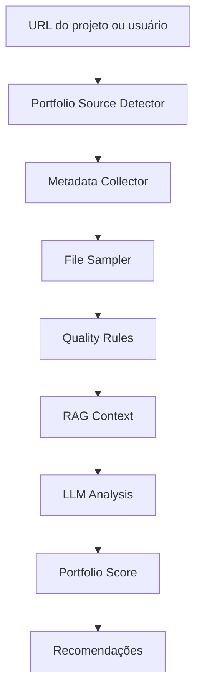

# GitHub e Portfolio Analyzer

O **GitHub/Portfolio Analyzer** avalia se os projetos públicos do usuário ajudam ou atrapalham uma candidatura.

A inspiração técnica vem de ferramentas como [RepoLogs](https://github.com/VictoriaSCorreia/RepoLogs_GithubExtension), que analisam repositórios públicos com IA e selecionam arquivos relevantes em vez de enviar o repositório inteiro.

## Objetivo

Responder:

- Quais repositórios combinam com a vaga?
- Quais projetos devem aparecer no currículo?
- Qual projeto deve ser fixado no GitHub?
- O README está bom?
- Existem testes?
- Existe demo?
- A stack é visível?
- O projeto prova alguma habilidade da vaga?

## Fontes aceitas

- [GitHub](https://github.com/)
- [GitLab](https://gitlab.com/)
- [Bitbucket](https://bitbucket.org/)
- [Kaggle](https://www.kaggle.com/)
- [Hugging Face](https://huggingface.co/)
- [npm](https://www.npmjs.com/)
- [PyPI](https://pypi.org/)
- [Docker Hub](https://hub.docker.com/)
- [Vercel](https://vercel.com/)
- [Netlify](https://www.netlify.com/)
- [Dev.to](https://dev.to/)
- [Medium](https://medium.com/)
- [Behance](https://www.behance.net/)
- [Dribbble](https://dribbble.com/)
- portfólio pessoal.

## Arquitetura



## File sampling inteligente

Para GitHub, o sistema deve priorizar:

- README.md;
- pyproject.toml;
- package.json;
- requirements.txt;
- Dockerfile;
- docker-compose.yml;
- .github/workflows;
- src/ ou modules/;
- tests/;
- docs/;
- arquivos principais da stack.

Não deve enviar tudo para IA sem necessidade.

## Métricas

```json
{
  "portfolio_score": 82,
  "readme_score": 90,
  "tests_score": 70,
  "architecture_score": 78,
  "job_alignment_score": 86,
  "security_flags": [],
  "recommended_repositories": ["SotuHire", "SoturAI", "SotuRail"]
}
```

## Regras de avaliação

### README

- explica o problema;
- mostra instalação;
- mostra uso;
- tem screenshots/GIF;
- tem roadmap;
- tem stack;
- tem licença;
- tem status do projeto.

### Código

- estrutura modular;
- nomes claros;
- separação de responsabilidades;
- testes;
- lint/format;
- CI;
- tratamento de erro;
- ausência de secrets.

### Alinhamento com vaga

- projeto usa stack pedida;
- resolve problema parecido;
- mostra maturidade técnica;
- tem documentação suficiente para recrutador entender rápido.

## Relação com SotuAI e SotuRail

O SotuHire pode usar projetos como SotuAI e SotuRail como evidências de:

- autonomia técnica;
- construção de produto;
- automação;
- IA;
- dados;
- documentação;
- publicação de pacote;
- visão de roadmap;
- capacidade de manter projeto.

Não deve exagerar. Deve transformar evidências reais em linguagem de currículo.

Exemplo:

```text
Projeto SotuRail demonstra publicação e manutenção de pacote, documentação e visão de produto.
Projeto SoturAI demonstra interesse em IA aplicada, automação e análise adaptativa.
Projeto SotuHire demonstra arquitetura, produto, regras de negócio, QA e IA aplicada à carreira.
```

## Saída para currículo

O módulo pode sugerir bullets:

```text
- Desenvolvi um copiloto de carreira com Python, IA generativa, análise ATS, scraping responsável e arquitetura modular.
- Estruturei documentação técnica com MkDocs, regras de negócio, CI, Ruff e testes automatizados.
- Projetei módulos de match, perfil, portfólio, RAG, job tracker e alertas.
```

## Cuidados

- Não analisar repositórios privados sem permissão.
- Não expor secrets.
- Não afirmar qualidade sem evidência.
- Não inventar métricas de impacto.
- Não baixar conteúdo excessivo.
- Não avaliar pessoas; avaliar projetos e sinais técnicos.
