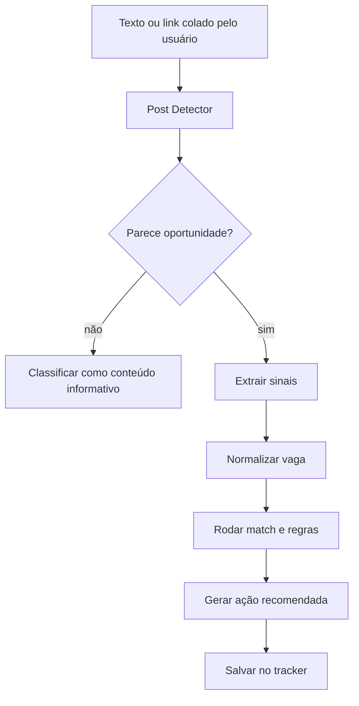

# Social Post Discovery e Hidden Jobs Radar

O **Social Post Discovery** é a camada que detecta oportunidades em posts, comentários e textos informais.

Muitas vagas aparecem primeiro em publicações como:

- "estamos contratando";
- "vaga aberta";
- "time crescendo";
- "procuro dev júnior";
- "me chama no inbox";
- "envie currículo";
- "indicação para estágio";
- "oportunidade remota".

Essas oportunidades podem aparecer antes da publicação formal em um portal.

## Entrada segura

O SotuHire deve priorizar entrada manual:

- usuário cola texto do post;
- usuário cola link público;
- usuário usa extensão assistiva com clique explícito;
- usuário salva uma publicação manualmente.

Não é objetivo raspar feed logado em massa.

## Fluxo



## Sinais de oportunidade

### Sinais fortes

- cargo explícito;
- empresa citada;
- recrutador ou funcionário identificado;
- link de vaga;
- e-mail ou instrução de contato;
- stack/requisitos;
- local ou modalidade;
- prazo ou urgência.

### Sinais médios

- "time crescendo";
- "estamos aumentando a equipe";
- "novas posições";
- "indicações abertas";
- "conhece alguém?".

### Sinais fracos

- conselho genérico;
- post motivacional;
- anúncio de curso;
- venda de mentoria;
- conteúdo sem vaga clara.

## Saída estruturada

```json
{
  "is_opportunity": true,
  "confidence": 0.86,
  "source_type": "linkedin_post",
  "company": "Empresa X",
  "role": "Analista de Dados Júnior",
  "seniority": "junior",
  "modality": "remote",
  "location": "Brasil",
  "contact_hint": "recrutador visível no post",
  "application_url": "https://...",
  "requirements": ["SQL", "Python", "Power BI"],
  "recommended_action": "analisar match antes de aplicar"
}
```

## Classificação de risco

| Risco | Exemplo | Ação |
|---|---|---|
| Baixo | post com link oficial de vaga e empresa clara | analisar e salvar |
| Médio | post com contato informal, mas sem link | pedir contexto e verificar empresa |
| Alto | promessa exagerada, salário irreal, dados sensíveis | alertar e não recomendar aplicação |

## Mensagens geradas

O módulo deve gerar mensagens curtas para contato, sempre com revisão humana.

```text
Olá, [nome]. Tudo bem?

Vi sua publicação sobre a oportunidade de [cargo] na [empresa].
Tenho interesse em [área/stack] e achei a vaga alinhada ao meu perfil.

Posso te enviar meu currículo ou existe um link oficial para candidatura?
```

## Relação com RAG

Posts úteis podem virar memória do usuário:

- post salvo;
- fonte;
- empresa;
- termos usados;
- resposta recebida;
- resultado da candidatura.

Com o tempo, o SotuHire pode identificar quais termos e canais geram mais respostas.

## Cuidados

- Não enviar mensagens em massa.
- Não capturar comentários privados.
- Não coletar dados pessoais desnecessários.
- Não inferir dados sensíveis de pessoas.
- Não prometer resultado.
- Não fazer engenharia social.

## Links úteis

- [LinkedIn User Agreement](https://www.linkedin.com/legal/user-agreement)
- [Hidden Jobs Radar](./hidden-jobs-radar.md)
- [Search Intelligence](./search-intelligence.md)
- [Follow-up Assistant](../07-development/follow-up-assistant.md)
