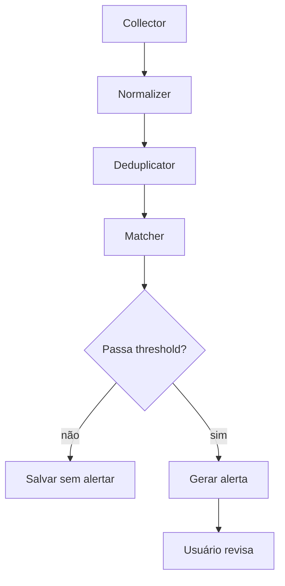

# Alertas de Vagas e Notificações

O SotuHire pode alertar o usuário sobre oportunidades novas, mas deve fazer isso com controle e transparência.

Inspiração prática: scrapers simples de vagas com Selenium, CSV e Telegram mostram que alertas têm valor. No SotuHire, essa ideia deve ser mais estruturada: coletar, normalizar, deduplicar, ranquear, analisar match e só então alertar.

Referência de inspiração: [AUTOMATED_JOBSEACRH_SCRAPER](https://github.com/VictoriaSCorreia/AUTOMATED_JOBSEACRH_SCRAPER).

## Tipos de alerta

- vaga nova com alto match;
- vaga nova em fonte prioritária;
- post informal detectado como oportunidade;
- follow-up pendente;
- candidatura parada há muitos dias;
- vaga salva sem análise;
- fonte com erro de conector.

## Canais

| Canal | Momento |
|---|---|
| UI Streamlit | MVP |
| e-mail | futuro |
| Telegram | futuro |
| Discord | futuro |
| Notificação da extensão | futuro |

## Fluxo



## Regras de alerta

- Não alertar tudo.
- Não alertar vaga com match baixo, salvo se usuário pedir.
- Não alertar fonte bloqueada.
- Não alertar duplicata.
- Não enviar alerta com dados sensíveis.
- Não gerar sensação de urgência artificial.

## Deduplicação

Usar:

- URL canônica;
- título normalizado;
- empresa normalizada;
- local/modalidade;
- hash da descrição;
- origem.

## Telegram

Telegram pode ser útil para alertas pessoais, mas deve ser opt-in.

Configuração esperada:

```env
TELEGRAM_BOT_TOKEN=
TELEGRAM_CHAT_ID=
```

## Critérios de aceitação

- O usuário controla canais.
- O usuário controla frequência.
- O usuário pode desligar alertas.
- O alerta mostra motivo.
- O alerta inclui link para análise no tracker.
