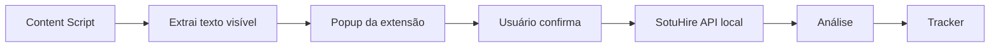

# Roadmap da Extensão Assistiva

A extensão do SotuHire deve ser assistiva, não agressiva.

Ela deve funcionar como ponte entre a página aberta e o app local/web do SotuHire.

## Objetivo

Adicionar botões úteis no navegador:

- Analisar vaga com meu currículo;
- Salvar vaga no tracker;
- Analisar post como oportunidade;
- Analisar repositório como portfólio;
- Gerar mensagem para recrutador;
- Enviar texto para o SotuHire local.

## Não objetivos

- Não aplicar automaticamente.
- Não enviar mensagem automaticamente.
- Não raspar feed logado em massa.
- Não coletar dados sem clique explícito.
- Não monitorar navegação inteira.

## Arquitetura



## APIs úteis

- [Chrome Extensions](https://developer.chrome.com/docs/extensions/)
- [chrome.storage](https://developer.chrome.com/docs/extensions/reference/api/storage)
- [Chrome Messaging](https://developer.chrome.com/docs/extensions/develop/concepts/messaging)

## Escopo por fase

### Fase 1

- popup simples;
- campo para URL do app local;
- botão copiar texto da página;
- botão enviar para análise.

### Fase 2

- detectar páginas de vaga;
- extrair título, empresa, descrição e link;
- salvar no tracker.

### Fase 3

- detectar posts de oportunidade;
- classificar texto informal;
- gerar mensagem.

### Fase 4

- analisar GitHub/portfólio;
- cache por URL/commit;
- exibir Portfolio Score.

## Privacidade

- Mostrar ao usuário o texto que será enviado.
- Permitir cancelar.
- Não salvar cookies.
- Não pedir permissões amplas sem necessidade.
- Não enviar dados para terceiros sem configuração.

## Relação com RepoLogs

RepoLogs inspira a ideia de botão contextual e análise em página aberta. O SotuHire adapta essa ideia para carreira:

- vaga aberta;
- post aberto;
- repositório aberto;
- perfil/portfólio aberto.

Referência: [RepoLogs GitHub Extension](https://github.com/VictoriaSCorreia/RepoLogs_GithubExtension).

## Complemento: botão próprio e API local

A extensão do SotuHire deve usar botões próprios:

- Salvar vaga no SotuHire.
- Analisar com meu currículo.
- Enviar para tracker.

Ela não deve depender do clique em botões nativos de candidatura, pois isso pode tornar a captura ambígua.

Fluxo recomendado:

```text
content script -> payload normalizado -> localhost -> tracker -> análise
```

Referência técnica: [Chrome Extension Storage API](https://developer.chrome.com/docs/extensions/reference/api/storage).

## Captura assistida da página atual

O roadmap passa a priorizar três ações explícitas na página aberta:

- Salvar vaga atual;
- Analisar vaga atual;
- Enviar para tracker.

A página pode estar aberta em uma sessão própria autenticada. A extensão deve extrair somente o conteúdo visível da aba atual após clique da pessoa usuária, mostrar preview e enviar um payload normalizado ao SotuHire.

Detalhes: [Browser Extension Assisted Capture](browser-extension-assisted-capture.md).

## Integrações autenticadas autorizadas

Uma integração autenticada futura exige API oficial ou permissão formal da plataforma. Ela deve ficar separada da captura assistida, documentar os limites concedidos e nunca reutilizar cookies da sessão para ampliar o escopo sem confirmação.
