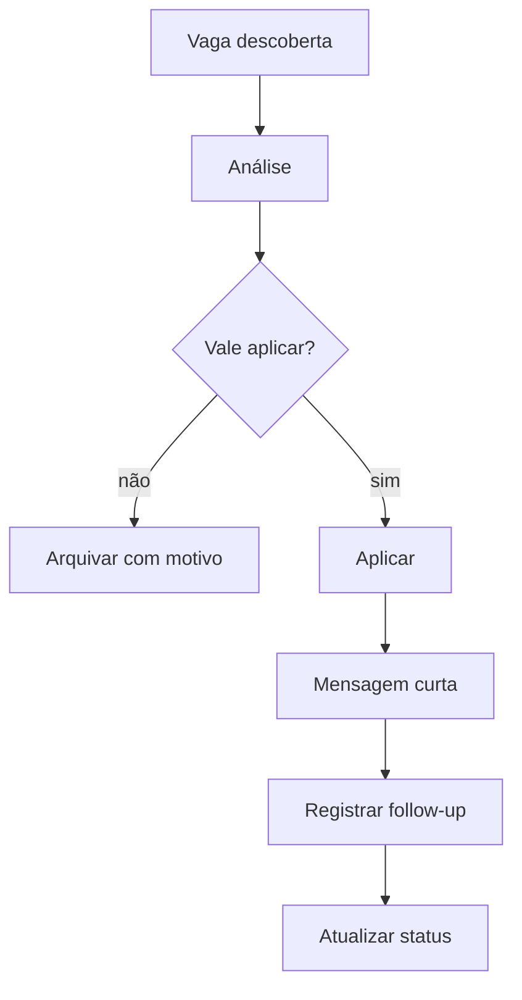

# Job Tracker e Kanban de Candidaturas

O Job Tracker é o módulo que transforma busca de vaga em processo rastreável.

Sem tracker, o usuário se perde em links, datas, mensagens e candidaturas repetidas. Com tracker, o usuário sabe onde aplicou, qual foi o score, quem contatou e quando fazer follow-up.

## Colunas do Kanban

```text
Encontrada
Analisada
Boa para aplicar
Aplicada
Mensagem enviada
Follow-up
Entrevista
Teste técnico
Rejeitada
Oferta
Arquivada
```

## Campos do card

```json
{
  "company": "Empresa X",
  "role": "Analista de Dados Júnior",
  "source": "LinkedIn Post",
  "url": "https://...",
  "modality": "remoto",
  "location": "Brasil",
  "match_score": 82,
  "ats_score": 74,
  "linkedin_score": 68,
  "portfolio_score": 80,
  "risk_score": 22,
  "status": "applied",
  "applied_at": "2026-06-12",
  "recruiter_name": "Nome",
  "next_follow_up_at": "2026-06-17",
  "notes": "Mensagem enviada após candidatura."
}
```

## Fluxo



## Status e regras

| Status | Significado | Próxima ação |
|---|---|---|
| Encontrada | vaga ainda não analisada | rodar match |
| Analisada | score calculado | decidir aplicar |
| Boa para aplicar | passou no checklist | ajustar currículo/mensagem |
| Aplicada | candidatura feita | registrar data |
| Mensagem enviada | contato feito | aguardar retorno |
| Follow-up | tempo de retorno passou | enviar mensagem curta |
| Entrevista | entrevista marcada | preparar roteiro |
| Teste técnico | teste recebido | preparar execução |
| Rejeitada | retorno negativo | registrar aprendizado |
| Oferta | proposta recebida | comparar condições |
| Arquivada | não vale seguir | guardar motivo |

## Métricas

O tracker deve gerar:

- vagas encontradas por fonte;
- taxa de aplicação;
- taxa de resposta;
- taxa de entrevista;
- score médio das vagas aplicadas;
- fontes que mais geram resposta;
- motivos de rejeição;
- tempo médio até follow-up.

## SQLite inicial

No MVP, usar SQLite.

Tabelas sugeridas:

```text
job_posts
applications
contacts
messages
scores
source_events
```

## Relação com alertas

O tracker deve disparar lembretes locais:

- follow-up pendente;
- vaga salva sem análise;
- vaga com alto match não aplicada;
- candidatura sem status há muitos dias.

Ver: [Alerts Roadmap](./alerts-roadmap.md).

## Complemento: campos inspirados em TrackedJob

O tracker deve armazenar mais do que título e link. Campos recomendados:

- título;
- empresa;
- descrição;
- URL;
- fonte;
- senioridade;
- stack;
- keywords;
- inglês exigido;
- remoto/híbrido/presencial;
- match score;
- ATS score;
- Opportunity Fit Score;
- Risk Score;
- LinkedIn Score;
- Portfolio Score;
- status;
- próximo follow-up.

Isso aproxima o SotuHire de um produto real de carreira, não apenas um analisador de texto.
