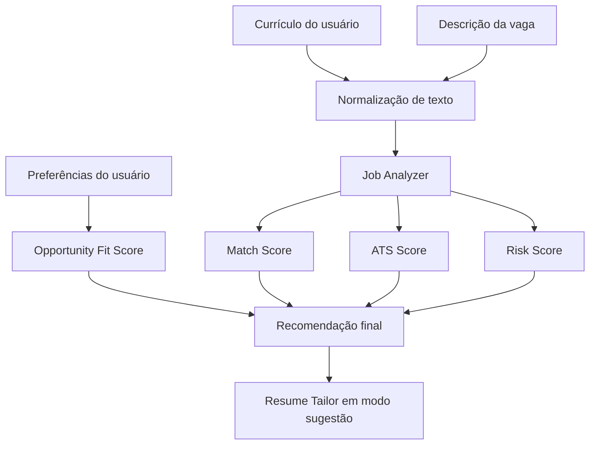

# Implementação do SotuHire v0.1 — MVP Core

## Objetivo

A v0.1 entrega um fluxo local e funcional para analisar currículo, vaga, ATS, prioridades pessoais e estratégia de candidatura. O resultado é explicável, tipado e revisável.

## Fluxo



## Módulos

| Módulo | Responsabilidade |
|---|---|
| `modules/core/text_utils.py` | normalização e extração simples de termos |
| `modules/ats/ats_score.py` | ATS Score simples e explicável |
| `modules/preferences/opportunity_fit.py` | aderência às preferências |
| `modules/analyzer/job_analyzer.py` | orquestração da análise |
| `modules/analyzer/recommendation.py` | recomendação e risco |
| `modules/resume_tailor/` | ranking e keywords apoiadas por evidência |
| `modules/schemas/` | contratos Pydantic |
| `app.py` | interface Streamlit sem regra de negócio |

## Entradas

- texto do currículo;
- descrição da vaga;
- localização;
- modalidade;
- salário mínimo divulgado;
- contrato;
- senioridade;
- preferências do usuário.

## Saídas

- Match Score;
- ATS Score;
- Opportunity Fit Score;
- Risk Score;
- recomendação;
- pontos fortes;
- gaps;
- palavras-chave ausentes;
- resumo direcionado;
- warnings e flags de risco.

## Regra anti-invenção

O Resume Tailor só sugere keywords presentes nas evidências fornecidas. Requisitos sem evidência aparecem como gap ou warning, nunca como experiência afirmada.

## Execução

```bash
python -m venv .venv
.venv\Scripts\activate
pip install -r requirements.txt
streamlit run app.py
```

## Qualidade

```bash
ruff check .
ruff format . --check
python -m pytest -q
```

## Fora do MVP

- scraping real;
- extensão Chrome;
- PyTorch e ML pesado;
- fine-tuning;
- multi-agent complexo;
- Concurso Mode funcional;
- auto-apply;
- envio automático para recrutador;
- DOCX/PDF final.

## Evolução próxima

1. validar as heurísticas com exemplos fictícios;
2. tornar Gemini Structured Outputs opcional;
3. adicionar RAG simples de carreira;
4. criar Job Tracker/Kanban;
5. evoluir Profile Score e GitHub/Portfolio Score.
