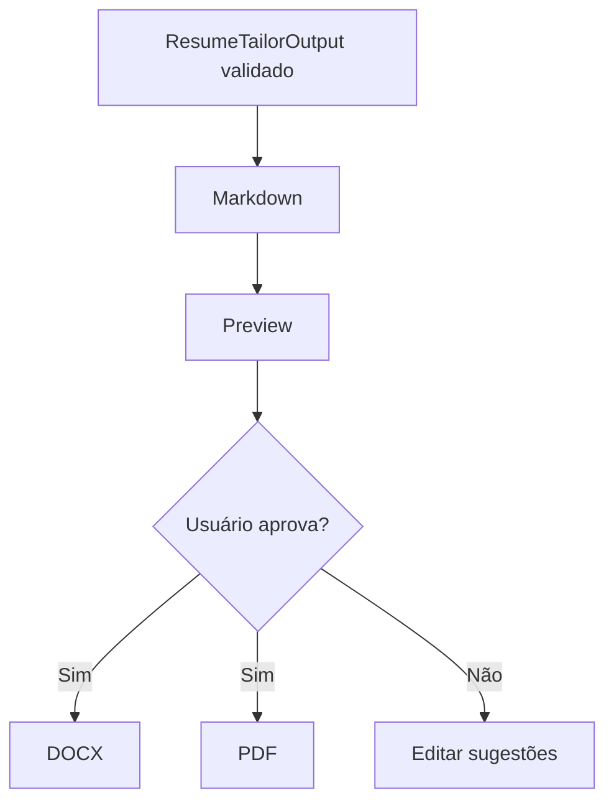

# Resume Tailor DOCX/PDF

A geração de currículo direcionado em DOCX/PDF é uma evolução natural, mas não deve vir antes das sugestões revisáveis em Markdown.

## Inspiração prática

O benchmark `LA_Jobs_AI_CLAUDE` mostra geração de currículo ATS em DOCX a partir de vaga e perfil. O SotuHire pode usar a mesma ideia em Python, com arquitetura mais modular e validação forte.

## Ordem correta

1. Gerar análise estruturada.
2. Gerar sugestões por seção.
3. Gerar Markdown revisável.
4. Gerar DOCX.
5. Gerar PDF.
6. Salvar histórico de versões.

## Bibliotecas possíveis

- `python-docx` para DOCX;
- `weasyprint` ou conversão externa para PDF;
- templates Markdown/Jinja2 para controle de layout.

## Guardrails

Antes de exportar:

- validar `invented_information=false`;
- exigir revisão humana;
- incluir warnings;
- preservar evidências;
- permitir baixar versão editável.

## Fluxo

