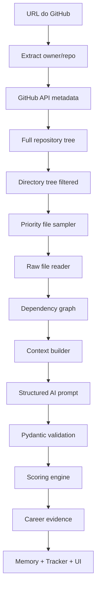

# v0.11.0 — GitHub Analyzer 2.0

## Objetivo

A v0.11.0 deve transformar a análise de GitHub/portfólio em um módulo profundo, inspirado no nível de pipeline do REPOLOGS, mas adaptado ao objetivo do SotuHire: carreira, currículo, vaga e evidência profissional.

A extensão não deve carregar toda a inteligência. Ela deve funcionar como ponte.

## Problema atual

A análise de GitHub da v0.9.0 é útil, mas ainda pode ser simples demais se depender principalmente de:

- DOM visível;
- README;
- commits visíveis;
- topics;
- linguagens;
- heurísticas locais;
- prompt curto de refinamento.

Isso ajuda como fallback, mas não avalia o repositório em profundidade.

## Direção correta

```text
Extensão captura owner/repo -> backend busca via GitHub API -> sampler seleciona arquivos -> IA analisa JSON -> código calcula scores -> SotuHire salva evidências.
```

## Arquitetura proposta

```text
modules/github_analyzer/
  github_client.py
  tree_builder.py
  sampler.py
  dependency_graph.py
  context_builder.py
  schemas.py
  prompts.py
  scoring.py
  service.py
```

## Fluxo



## GitHub Client

Responsável por:

- buscar metadados do repositório;
- buscar branch padrão;
- buscar árvore completa pelo SHA;
- buscar conteúdo raw de arquivos selecionados;
- respeitar limites;
- aplicar cache por commit SHA;
- tratar repo inexistente ou privado sem permissão.

## Tree Builder

Deve gerar:

- árvore completa filtrada;
- contagem por tipo de arquivo;
- presença de testes;
- presença de docs;
- presença de CI;
- presença de Docker;
- presença de manifests;
- presença de arquivos de segurança;
- presença de exemplos.

## File Sampler

Prioridade máxima:

- README;
- pyproject.toml;
- package.json;
- requirements.txt;
- go.mod;
- Cargo.toml;
- pom.xml;
- build.gradle;
- tsconfig.json;
- Dockerfile;
- docker-compose.yml;
- `.github/workflows/*`;
- arquivos principais de entrada;
- arquivos centrais importados por muitos outros.

Ignorar:

- node_modules;
- dist;
- build;
- .venv;
- __pycache__;
- arquivos binários;
- imagens;
- arquivos compactados;
- lock files grandes;
- outputs gerados;
- dumps;
- arquivos acima do limite configurado.

## Dependency Graph

O grafo deve detectar sinais simples:

- imports Python;
- imports JS/TS;
- require;
- exports;
- módulos centrais;
- arquivos com alto in-degree;
- entrypoints.

Não precisa ser perfeito. Ele serve para priorizar arquivos, não para compilar o projeto.

## Prompt estruturado

Usar `github_repo_analysis_v2` no catálogo de prompts.

A IA deve retornar:

- resumo executivo;
- project type;
- stack detectada;
- dimension scores;
- reasoning por dimensão;
- segurança;
- documentação;
- testes;
- arquitetura;
- manutenibilidade;
- valor de portfólio;
- evidências para currículo;
- bullets seguros;
- alinhamento com vaga;
- inconsistências;
- recomendações priorizadas;
- índice de evidências.

## Scores

Separar pelo menos:

- Technical Quality Score;
- Portfolio Value Score;
- Resume Evidence Score;
- Recruiter Readiness Score;
- Job Alignment Score;
- Security Risk Level;
- Documentation Score;
- Test Signal Score.

O score final não deve ser decidido apenas pela IA.

Regra:

```text
A IA retorna dimension_scores e reasoning.
O código calcula scores finais e aplica travas de calibração.
```

## Evidências

Toda afirmação importante deve ter fonte.

Exemplo:

```json
{
  "claim": "Demonstra uso de CI/CD",
  "source_file": ".github/workflows/ci.yml",
  "evidence_type": "workflow",
  "confidence": 0.91
}
```

## Comparação com vaga

Modo especial:

```text
Repo + currículo + vaga -> quais requisitos esse projeto comprova?
```

Saída esperada:

- requisitos atendidos pelo repo;
- requisitos não comprovados;
- bullets seguros para currículo;
- pontos para entrevista;
- melhorias no README para recrutador;
- gaps técnicos do projeto.

## UI no site

Criar página:

```text
Portfólio / GitHub Analyzer
```

Ações:

- analisar repo por URL;
- analisar perfil GitHub;
- comparar repo com vaga;
- comparar GitHub com currículo;
- gerar bullets para currículo;
- salvar evidência no perfil;
- abrir relatório completo.

## Extensão

A extensão deve:

- extrair URL;
- detectar owner/repo;
- chamar Local Companion API;
- mostrar resumo;
- abrir relatório no site.

Ela não precisa implementar o pipeline inteiro.

## TypeScript

Migrar a extensão para TypeScript é uma melhoria de manutenção, não requisito funcional.

Benefícios:

- contratos de payload mais claros;
- menos erro em content scripts;
- melhor build;
- integração com schemas compartilhados;
- melhor organização.

Mas a prioridade é o backend Python fazer a análise profunda.

## Critério de pronto

A v0.11.0 estará pronta quando:

- repo por URL for analisado pelo backend;
- árvore completa for coletada;
- sampler selecionar arquivos relevantes;
- prompt estruturado retornar JSON validado;
- score final for calculado por código;
- evidências por arquivo aparecerem no relatório;
- análise puder ser salva na Career Memory;
- repo puder ser comparado com uma vaga;
- extensão continuar funcionando como ponte.
