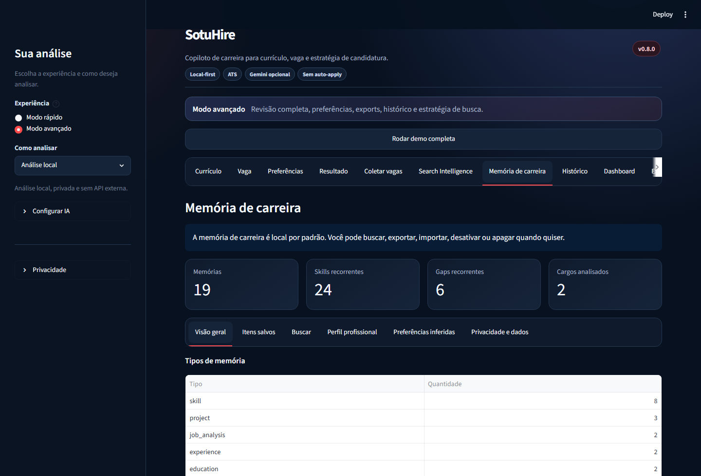
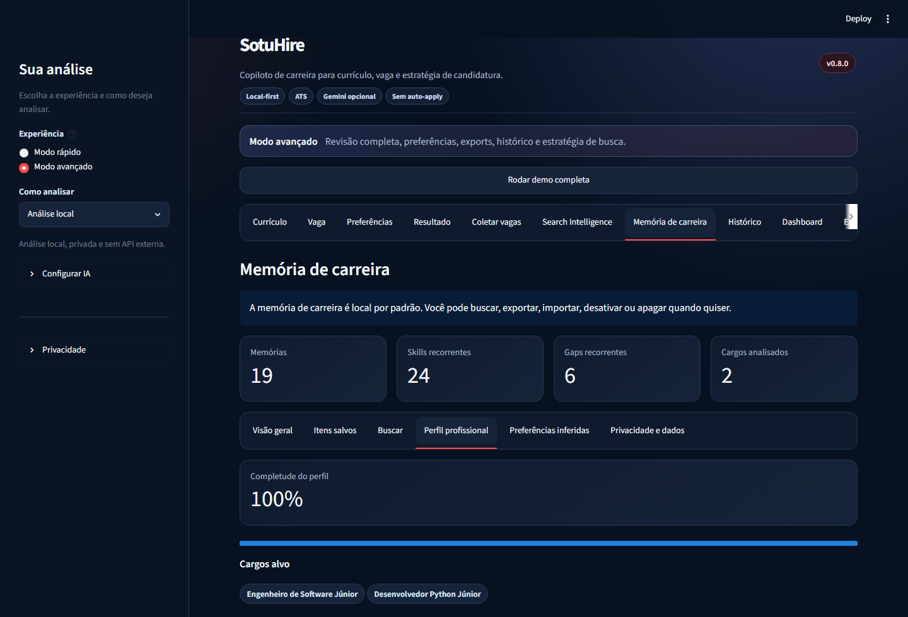
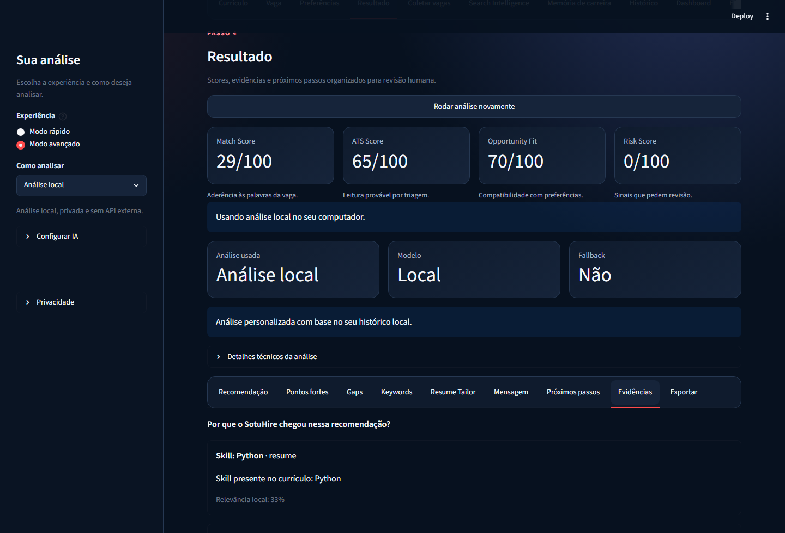
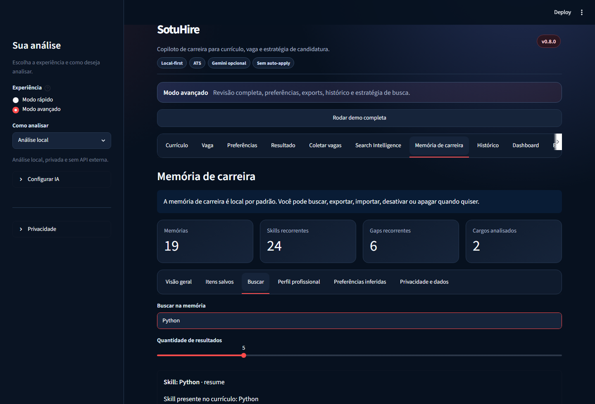

# v0.8.0 — Career Memory e RAG local

A v0.8.0 transforma o SotuHire em um copiloto que reaproveita evidências do histórico da pessoa
usuária sem depender de um banco externo ou de IA em nuvem.

## Entregas

- Career Memory local em JSONL;
- busca lexical com boosts por tags, tipo e recência;
- análise de vaga baseada em evidências recuperadas;
- perfil profissional persistente e score de completude;
- preferências inferidas, editáveis e removíveis;
- feedback de recomendação salvo como memória;
- exportação em JSON, JSONL e Markdown;
- importação e limpeza explícitas;
- Search Intelligence e Hidden Jobs Radar personalizados;
- registro de oportunidades e vagas já aplicadas no tracker.

## Fluxo principal

```text
currículo + vaga + preferências
        -> fatos locais de carreira
        -> recuperação das memórias relevantes
        -> análise local ou Gemini opcional
        -> evidências + recomendação
        -> feedback + tracker + nova memória
```

## Gemini

Gemini pode usar memória para aprimorar a análise quando houver API Key e a pessoa habilitar
**Enviar contexto relevante para Gemini**. O SotuHire envia somente um resumo das evidências
recuperadas para a vaga atual. A opção fica desabilitada por padrão.

## Limitações

- o retrieval é lexical e não usa embeddings nesta versão;
- inferências usam regras simples, não um modelo de aprendizado treinado;
- a qualidade depende dos fatos salvos e da revisão humana;
- memória não deve ser tratada como prova de competência fora das evidências fornecidas.

## Validação

A versão inclui testes de store, retrieval, evidências, análise com e sem memória, flags de
privacidade, feedback, perfil, export/import, busca personalizada, Radar Oculto e UI.

## Capturas da versão








