# v0.9.0 — Browser Companion e calibração de evidências

A v0.9.0 conecta a navegação manual ao fluxo local do SotuHire e melhora a qualidade das
evidências usadas nas recomendações.

## Entregas

- extensão assistiva Manifest V3 e multiportal;
- Local Companion API em `127.0.0.1:8765`;
- captura, análise e tracker para a vaga atual;
- importação paginada de candidaturas já realizadas;
- deduplicação entre portais e entre candidaturas antigas e análises futuras;
- todas as fontes da candidatura no tracker;
- ranking de requisitos recorrentes no dashboard;
- calibração da memória e feedback útil/não útil;
- perfil profissional com mais ações;
- extração opcional de currículo por Gemini com fallback local.
- análise de GitHub, repositórios, READMEs, commits, projetos e portfólios;
- modo standalone no navegador e modo conectado ao SotuHire.
- botão **SotuHire AI** e modal completo em páginas públicas do GitHub;
- pacote validado e materiais para publicação na Chrome Web Store.

## Fluxo

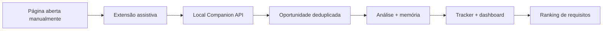

## Instalação rápida

```bash
pip install -r requirements.txt
streamlit run app.py
```

Na aba **Extensão**, inicie a Local API. Depois abra `chrome://extensions`, ative o modo
desenvolvedor, escolha **Carregar sem compactação** e selecione `browser-extension/`.

## Muitas candidaturas e múltiplos portais

Para históricos com centenas de vagas, a pessoa percorre as páginas e usa **Adicionar página ao
lote**; ao final, envia o lote acumulado. O mesmo fluxo funciona em LinkedIn, Gupy, Indeed,
InfoJobs, Nube e outros portais.

Quando uma vaga aparece primeiro em um agregador e depois no ATS da empresa, o SotuHire compara
empresa+título e preserva as duas fontes em um único cartão.

## IA opcional

O popup envia apenas `use_ai=true`. A API Key continua no SotuHire local. Também é possível
aprimorar a extração do currículo pelo Gemini após consentimento explícito; qualquer falha mantém o
perfil do parser local.

## GitHub e portfólio

O Browser Companion também reconhece páginas públicas de GitHub/projeto/portfólio. A extensão pode
gerar um relatório standalone ou enviar a captura ao SotuHire para criar memórias
`github_profile`, `github_repo`, `portfolio`, `project`, `commit_analysis`, `readme_analysis` e
`project_evidence`.

Consulte [Extension GitHub e Portfolio Full Analyzer](extension-github-portfolio-analysis.md).

Para gerar e publicar o pacote, consulte
[Publicação da extensão na Chrome Web Store](chrome-web-store-extension.md).

## Capturas


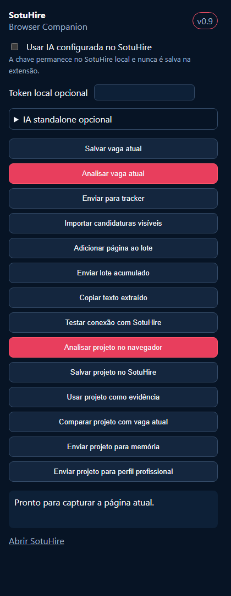

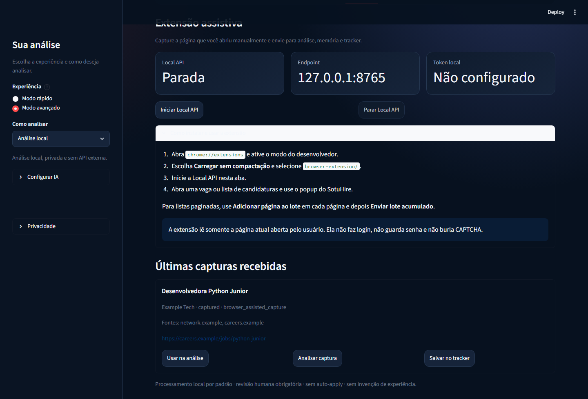

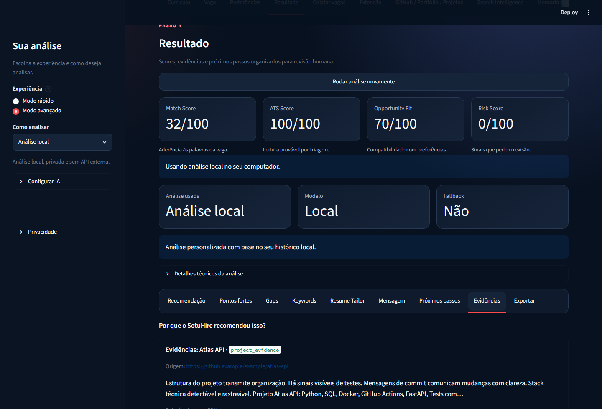

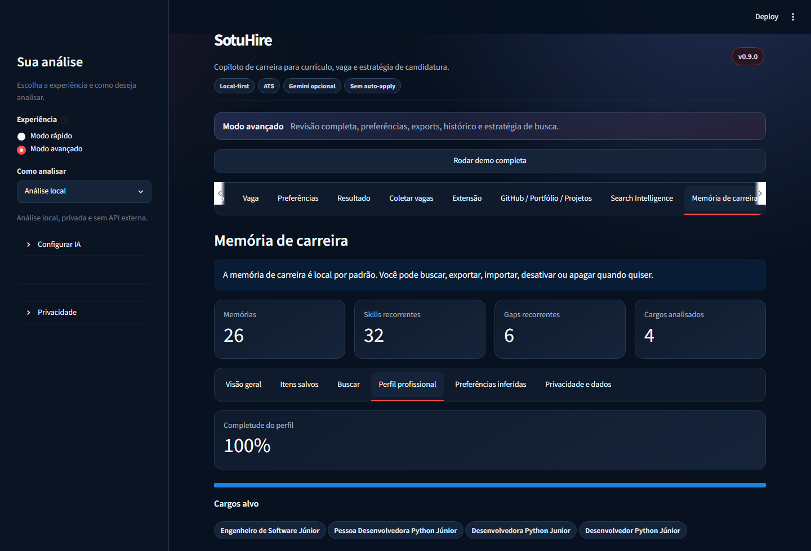


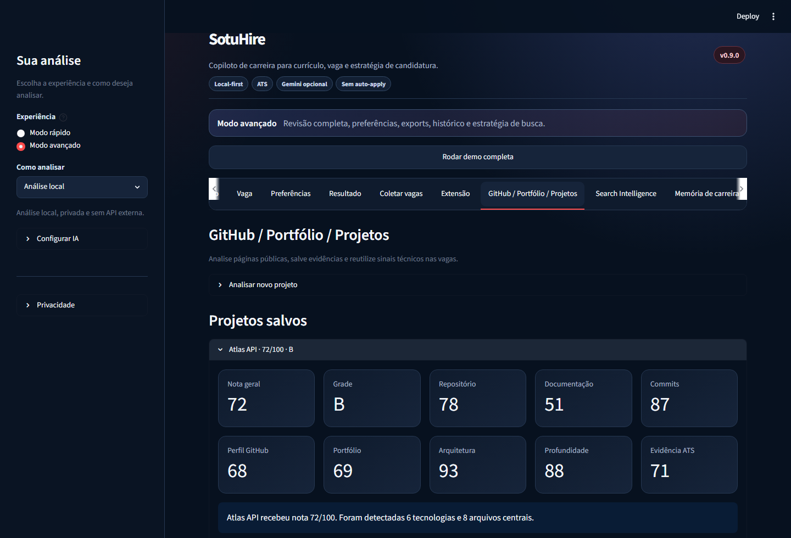


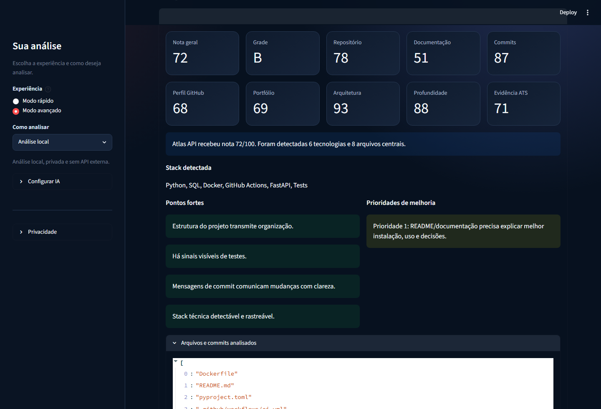

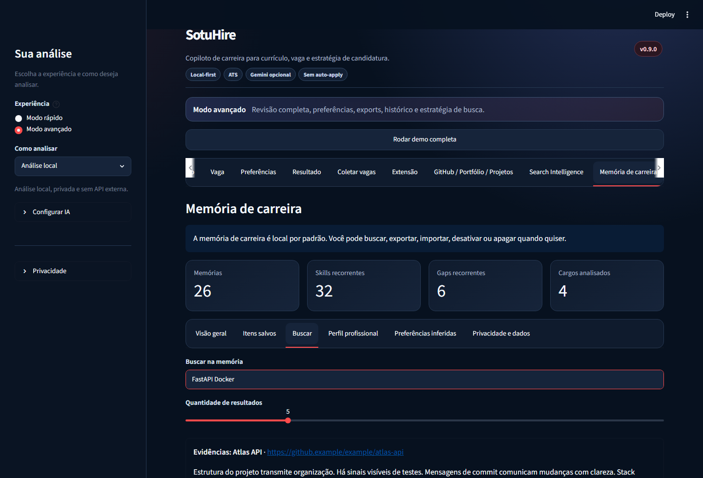

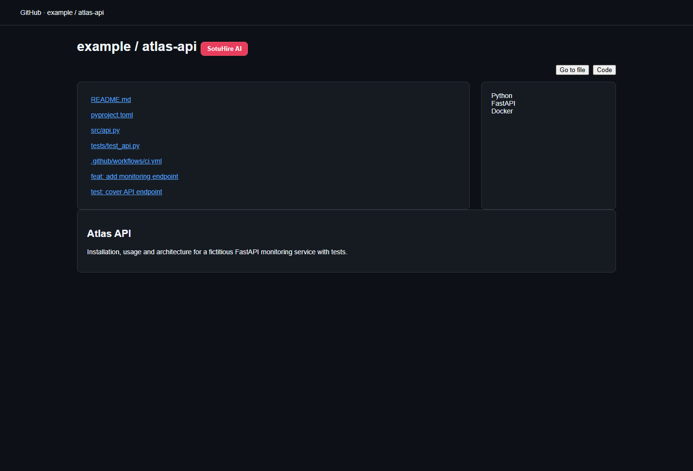


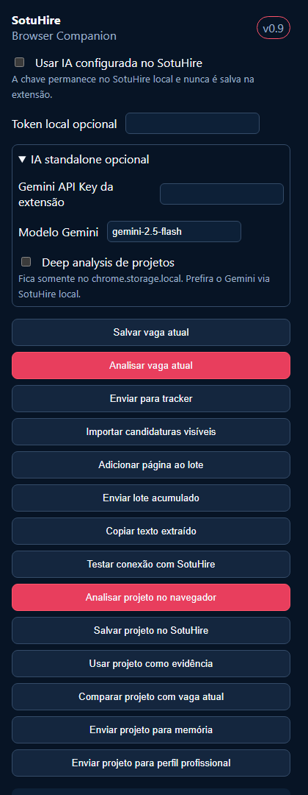

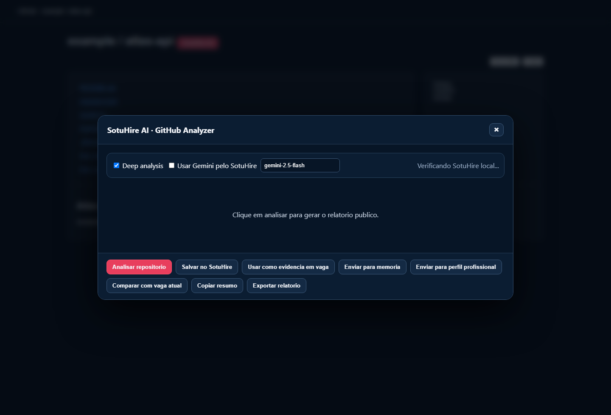

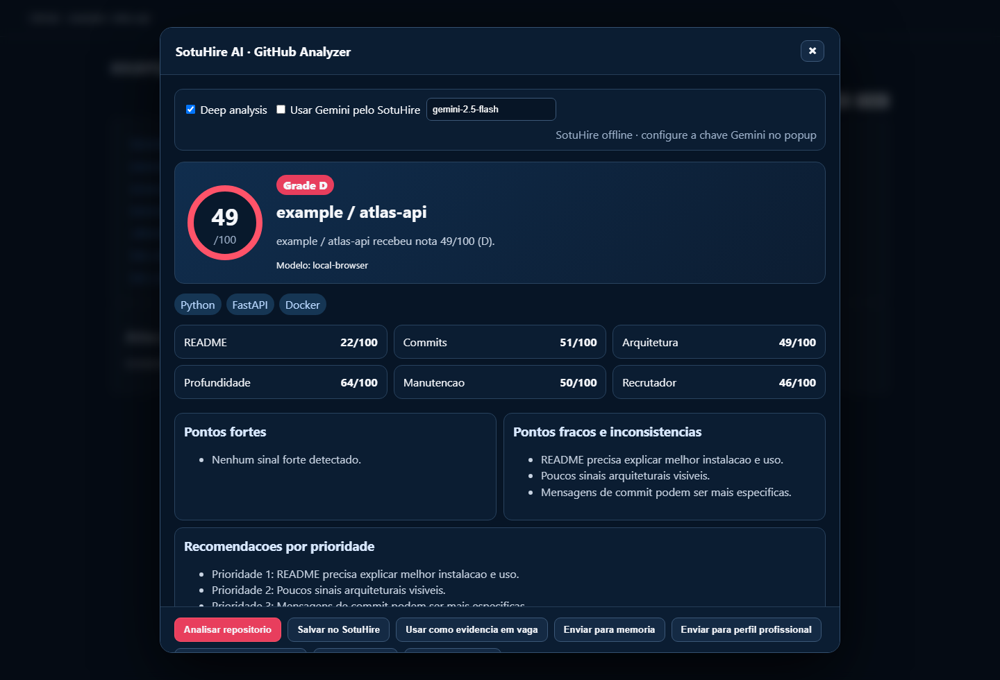

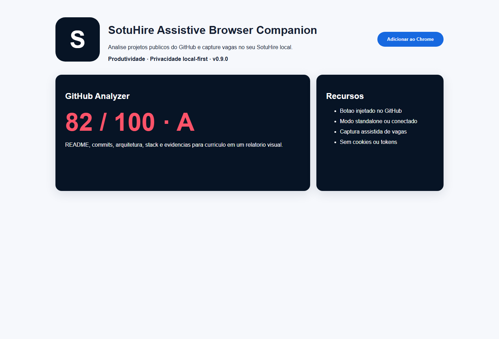
